# Final Project Submission

Please fill out:
* Student name: <strong>Michael Mahoney</strong>
* Student pace: self paced / <strong>part time</strong> / full time
* Scheduled project review date/time: 8/14/2020
* Instructor name: <strong>James Irving</strong>
* Blog post URL: https://docs.google.com/document/d/1Sb2msBnLlz9RUp_k776FQQZIitmep13zvM5o2G64R-0/edit


# Project Overview
## Scpoe
The purpose of this project is to explore the King County Housing data to discover what variables are the best predictors of sale price. The following elements will be considered to be the primary scope of the project.

###  Question 1: If I have space to add an additional room, what should I put in the space if I want to increase my home value?
###  Question 2: If I have space to add an additional room, what should I put in the space?
###  Question 3: I'm looking to buy a house in King County. I like a lot of space and don't really care about the neighborhood. What area should I look in to get the most space for my money if I can only spend 400,000 dollars.
###  Question 4: I'm looking to sell my house but I don't have much money for renovations. What should I do to squeeze a little extra money out of the sale

## Methodology: CRISP-DM
In general the method behind the madness for this project was CRISP-DM. While you won't find any specific callouts like "This is the Business Understanding part!" the premise behind CRISP-DM informed each pass at creating more successful models. For brevity sake, the many iterations of this process were omitted (and likely deleted in a fit of rage!). If you have specific questions about different approaches please feel free to ask me. I likely tried it at some point. 

# Package Dependancies
* Numpy
* Pandas
* Matplotlib.pyplot
* scipy.stats
* Seaborn
* statsmodels
* scikit-learn
* datetime
* math
* datetime
* customModule


```python
import numpy as np
import pandas as pd
import matplotlib.pyplot as plt
%matplotlib inline
import seaborn as sns
import scipy.stats as stats
import statsmodels
from statsmodels.formula.api import ols
import datetime
from statsmodels.formula.api import ols
import statsmodels.api as sm
import math
from sklearn.metrics import mean_squared_error
from sklearn.model_selection import cross_val_score
from sklearn.linear_model import LinearRegression

import customModule # As the name suggests, this is a custom module that can be found on the top level of this repo

```


```python
# Toggle the following line to show all columns
pd.set_option('display.max_columns', None)
```

# Baseline Data-Preprocessing

## First Look


```python
# Import the data set for pre-processing and save it to a variable
dfInitial = pd.DataFrame(pd.read_csv('kc_house_data.csv'))

#show some initial summary info
print(f'The DataFrame is of dimensions {dfInitial.shape} \n')
display(dfInitial.head())
display(dfInitial.describe())
display(dfInitial.info());

```

    The DataFrame is of dimensions (21597, 21) 
    
    


<div>
<style scoped>
    .dataframe tbody tr th:only-of-type {
        vertical-align: middle;
    }

    .dataframe tbody tr th {
        vertical-align: top;
    }

    .dataframe thead th {
        text-align: right;
    }
</style>
<table border="1" class="dataframe">
  <thead>
    <tr style="text-align: right;">
      <th></th>
      <th>id</th>
      <th>date</th>
      <th>price</th>
      <th>bedrooms</th>
      <th>bathrooms</th>
      <th>sqft_living</th>
      <th>sqft_lot</th>
      <th>floors</th>
      <th>waterfront</th>
      <th>view</th>
      <th>condition</th>
      <th>grade</th>
      <th>sqft_above</th>
      <th>sqft_basement</th>
      <th>yr_built</th>
      <th>yr_renovated</th>
      <th>zipcode</th>
      <th>lat</th>
      <th>long</th>
      <th>sqft_living15</th>
      <th>sqft_lot15</th>
    </tr>
  </thead>
  <tbody>
    <tr>
      <th>0</th>
      <td>7129300520</td>
      <td>10/13/2014</td>
      <td>221900.0</td>
      <td>3</td>
      <td>1.00</td>
      <td>1180</td>
      <td>5650</td>
      <td>1.0</td>
      <td>NaN</td>
      <td>0.0</td>
      <td>3</td>
      <td>7</td>
      <td>1180</td>
      <td>0.0</td>
      <td>1955</td>
      <td>0.0</td>
      <td>98178</td>
      <td>47.5112</td>
      <td>-122.257</td>
      <td>1340</td>
      <td>5650</td>
    </tr>
    <tr>
      <th>1</th>
      <td>6414100192</td>
      <td>12/9/2014</td>
      <td>538000.0</td>
      <td>3</td>
      <td>2.25</td>
      <td>2570</td>
      <td>7242</td>
      <td>2.0</td>
      <td>0.0</td>
      <td>0.0</td>
      <td>3</td>
      <td>7</td>
      <td>2170</td>
      <td>400.0</td>
      <td>1951</td>
      <td>1991.0</td>
      <td>98125</td>
      <td>47.7210</td>
      <td>-122.319</td>
      <td>1690</td>
      <td>7639</td>
    </tr>
    <tr>
      <th>2</th>
      <td>5631500400</td>
      <td>2/25/2015</td>
      <td>180000.0</td>
      <td>2</td>
      <td>1.00</td>
      <td>770</td>
      <td>10000</td>
      <td>1.0</td>
      <td>0.0</td>
      <td>0.0</td>
      <td>3</td>
      <td>6</td>
      <td>770</td>
      <td>0.0</td>
      <td>1933</td>
      <td>NaN</td>
      <td>98028</td>
      <td>47.7379</td>
      <td>-122.233</td>
      <td>2720</td>
      <td>8062</td>
    </tr>
    <tr>
      <th>3</th>
      <td>2487200875</td>
      <td>12/9/2014</td>
      <td>604000.0</td>
      <td>4</td>
      <td>3.00</td>
      <td>1960</td>
      <td>5000</td>
      <td>1.0</td>
      <td>0.0</td>
      <td>0.0</td>
      <td>5</td>
      <td>7</td>
      <td>1050</td>
      <td>910.0</td>
      <td>1965</td>
      <td>0.0</td>
      <td>98136</td>
      <td>47.5208</td>
      <td>-122.393</td>
      <td>1360</td>
      <td>5000</td>
    </tr>
    <tr>
      <th>4</th>
      <td>1954400510</td>
      <td>2/18/2015</td>
      <td>510000.0</td>
      <td>3</td>
      <td>2.00</td>
      <td>1680</td>
      <td>8080</td>
      <td>1.0</td>
      <td>0.0</td>
      <td>0.0</td>
      <td>3</td>
      <td>8</td>
      <td>1680</td>
      <td>0.0</td>
      <td>1987</td>
      <td>0.0</td>
      <td>98074</td>
      <td>47.6168</td>
      <td>-122.045</td>
      <td>1800</td>
      <td>7503</td>
    </tr>
  </tbody>
</table>
</div>


<div>
<style scoped>
    .dataframe tbody tr th:only-of-type {
        vertical-align: middle;
    }

    .dataframe tbody tr th {
        vertical-align: top;
    }

    .dataframe thead th {
        text-align: right;
    }
</style>
<table border="1" class="dataframe">
  <thead>
    <tr style="text-align: right;">
      <th></th>
      <th>id</th>
      <th>price</th>
      <th>bedrooms</th>
      <th>bathrooms</th>
      <th>sqft_living</th>
      <th>sqft_lot</th>
      <th>floors</th>
      <th>waterfront</th>
      <th>view</th>
      <th>condition</th>
      <th>grade</th>
      <th>sqft_above</th>
      <th>yr_built</th>
      <th>yr_renovated</th>
      <th>zipcode</th>
      <th>lat</th>
      <th>long</th>
      <th>sqft_living15</th>
      <th>sqft_lot15</th>
    </tr>
  </thead>
  <tbody>
    <tr>
      <th>count</th>
      <td>2.159700e+04</td>
      <td>2.159700e+04</td>
      <td>21597.000000</td>
      <td>21597.000000</td>
      <td>21597.000000</td>
      <td>2.159700e+04</td>
      <td>21597.000000</td>
      <td>19221.000000</td>
      <td>21534.000000</td>
      <td>21597.000000</td>
      <td>21597.000000</td>
      <td>21597.000000</td>
      <td>21597.000000</td>
      <td>17755.000000</td>
      <td>21597.000000</td>
      <td>21597.000000</td>
      <td>21597.000000</td>
      <td>21597.000000</td>
      <td>21597.000000</td>
    </tr>
    <tr>
      <th>mean</th>
      <td>4.580474e+09</td>
      <td>5.402966e+05</td>
      <td>3.373200</td>
      <td>2.115826</td>
      <td>2080.321850</td>
      <td>1.509941e+04</td>
      <td>1.494096</td>
      <td>0.007596</td>
      <td>0.233863</td>
      <td>3.409825</td>
      <td>7.657915</td>
      <td>1788.596842</td>
      <td>1970.999676</td>
      <td>83.636778</td>
      <td>98077.951845</td>
      <td>47.560093</td>
      <td>-122.213982</td>
      <td>1986.620318</td>
      <td>12758.283512</td>
    </tr>
    <tr>
      <th>std</th>
      <td>2.876736e+09</td>
      <td>3.673681e+05</td>
      <td>0.926299</td>
      <td>0.768984</td>
      <td>918.106125</td>
      <td>4.141264e+04</td>
      <td>0.539683</td>
      <td>0.086825</td>
      <td>0.765686</td>
      <td>0.650546</td>
      <td>1.173200</td>
      <td>827.759761</td>
      <td>29.375234</td>
      <td>399.946414</td>
      <td>53.513072</td>
      <td>0.138552</td>
      <td>0.140724</td>
      <td>685.230472</td>
      <td>27274.441950</td>
    </tr>
    <tr>
      <th>min</th>
      <td>1.000102e+06</td>
      <td>7.800000e+04</td>
      <td>1.000000</td>
      <td>0.500000</td>
      <td>370.000000</td>
      <td>5.200000e+02</td>
      <td>1.000000</td>
      <td>0.000000</td>
      <td>0.000000</td>
      <td>1.000000</td>
      <td>3.000000</td>
      <td>370.000000</td>
      <td>1900.000000</td>
      <td>0.000000</td>
      <td>98001.000000</td>
      <td>47.155900</td>
      <td>-122.519000</td>
      <td>399.000000</td>
      <td>651.000000</td>
    </tr>
    <tr>
      <th>25%</th>
      <td>2.123049e+09</td>
      <td>3.220000e+05</td>
      <td>3.000000</td>
      <td>1.750000</td>
      <td>1430.000000</td>
      <td>5.040000e+03</td>
      <td>1.000000</td>
      <td>0.000000</td>
      <td>0.000000</td>
      <td>3.000000</td>
      <td>7.000000</td>
      <td>1190.000000</td>
      <td>1951.000000</td>
      <td>0.000000</td>
      <td>98033.000000</td>
      <td>47.471100</td>
      <td>-122.328000</td>
      <td>1490.000000</td>
      <td>5100.000000</td>
    </tr>
    <tr>
      <th>50%</th>
      <td>3.904930e+09</td>
      <td>4.500000e+05</td>
      <td>3.000000</td>
      <td>2.250000</td>
      <td>1910.000000</td>
      <td>7.618000e+03</td>
      <td>1.500000</td>
      <td>0.000000</td>
      <td>0.000000</td>
      <td>3.000000</td>
      <td>7.000000</td>
      <td>1560.000000</td>
      <td>1975.000000</td>
      <td>0.000000</td>
      <td>98065.000000</td>
      <td>47.571800</td>
      <td>-122.231000</td>
      <td>1840.000000</td>
      <td>7620.000000</td>
    </tr>
    <tr>
      <th>75%</th>
      <td>7.308900e+09</td>
      <td>6.450000e+05</td>
      <td>4.000000</td>
      <td>2.500000</td>
      <td>2550.000000</td>
      <td>1.068500e+04</td>
      <td>2.000000</td>
      <td>0.000000</td>
      <td>0.000000</td>
      <td>4.000000</td>
      <td>8.000000</td>
      <td>2210.000000</td>
      <td>1997.000000</td>
      <td>0.000000</td>
      <td>98118.000000</td>
      <td>47.678000</td>
      <td>-122.125000</td>
      <td>2360.000000</td>
      <td>10083.000000</td>
    </tr>
    <tr>
      <th>max</th>
      <td>9.900000e+09</td>
      <td>7.700000e+06</td>
      <td>33.000000</td>
      <td>8.000000</td>
      <td>13540.000000</td>
      <td>1.651359e+06</td>
      <td>3.500000</td>
      <td>1.000000</td>
      <td>4.000000</td>
      <td>5.000000</td>
      <td>13.000000</td>
      <td>9410.000000</td>
      <td>2015.000000</td>
      <td>2015.000000</td>
      <td>98199.000000</td>
      <td>47.777600</td>
      <td>-121.315000</td>
      <td>6210.000000</td>
      <td>871200.000000</td>
    </tr>
  </tbody>
</table>
</div>


    <class 'pandas.core.frame.DataFrame'>
    RangeIndex: 21597 entries, 0 to 21596
    Data columns (total 21 columns):
     #   Column         Non-Null Count  Dtype  
    ---  ------         --------------  -----  
     0   id             21597 non-null  int64  
     1   date           21597 non-null  object 
     2   price          21597 non-null  float64
     3   bedrooms       21597 non-null  int64  
     4   bathrooms      21597 non-null  float64
     5   sqft_living    21597 non-null  int64  
     6   sqft_lot       21597 non-null  int64  
     7   floors         21597 non-null  float64
     8   waterfront     19221 non-null  float64
     9   view           21534 non-null  float64
     10  condition      21597 non-null  int64  
     11  grade          21597 non-null  int64  
     12  sqft_above     21597 non-null  int64  
     13  sqft_basement  21597 non-null  object 
     14  yr_built       21597 non-null  int64  
     15  yr_renovated   17755 non-null  float64
     16  zipcode        21597 non-null  int64  
     17  lat            21597 non-null  float64
     18  long           21597 non-null  float64
     19  sqft_living15  21597 non-null  int64  
     20  sqft_lot15     21597 non-null  int64  
    dtypes: float64(8), int64(11), object(2)
    memory usage: 3.5+ MB
    


    None


From our info list we see that many of the data types have been imput incorrectly. We will now go through reassign the correct data types for use in the regression model.

## Changing Column Data Types

### Date-times

The date column appears to be the only datetime column. It is currectly assigned to dtype 'object' which is the string type in pandas. There is an approach that treats datetime objects as a linear flow in time. I'm rejecting that approach for this project. Time is very cyclic in human society and thus, in order to get the most information out of the data in the date column, we are going to seperate the date information into the three distinct columns: year, month and day of the week. Otherwise much of the information stored in the dates would be lost in a continuous numerical approach.  


```python
# Use the datetime module to create the new columns
dfInitial['day'] = pd.to_datetime(dfInitial['date']).dt.day_name()
dfInitial['month'] = pd.DatetimeIndex(pd.to_datetime(dfInitial['date'])).month
dfInitial['year'] = pd.DatetimeIndex(pd.to_datetime(dfInitial['date'])).year
dfInitial['date']

# We drop the original date column which has been parted out into multiple pieces
dfInitial.drop(columns = 'date', inplace = True)
```

### Numerical

There also only appear to be one mis-typed numerical column, being 'sqft_basement'. Because the column has null values encoded as the question mark symbol '?', we will replace this with the none type and address this later.


```python
# Divest the dataframe of the ? symbol in order to convert the column to a numeric type
dfInitial['sqft_basement'].loc[dfInitial['sqft_basement'] == '?'] = None
dfInitial['sqft_basement'].isna().sum()
dfInitial['sqft_basement'] = pd.to_numeric(dfInitial['sqft_basement'])
```

    C:\ProgramData\Anaconda3\lib\site-packages\pandas\core\indexing.py:670: SettingWithCopyWarning: 
    A value is trying to be set on a copy of a slice from a DataFrame
    
    See the caveats in the documentation: https://pandas.pydata.org/pandas-docs/stable/user_guide/indexing.html#returning-a-view-versus-a-copy
      self._setitem_with_indexer(indexer, value)
    

### Categorical

We now look to re-assign to categories. When looking at our columns, there are several instances of categories being coded as numerical columns. From the descrtiption of our columns as provided in the repository the following columns are better encoded as categories: 'waterfront', 'zipcode', 'day', 'month. Pandas has a specific dtype called 'category' for this type of encoding.


```python
# create a list of the columns in question and reassign their type
catCols = ['waterfront', 'zipcode', 'day', 'month']
dfInitial[catCols] = dfInitial[catCols].astype('category')

# A final check to make sure that everything took. 
dfInitial.info()

```

    <class 'pandas.core.frame.DataFrame'>
    RangeIndex: 21597 entries, 0 to 21596
    Data columns (total 23 columns):
     #   Column         Non-Null Count  Dtype   
    ---  ------         --------------  -----   
     0   id             21597 non-null  int64   
     1   price          21597 non-null  float64 
     2   bedrooms       21597 non-null  int64   
     3   bathrooms      21597 non-null  float64 
     4   sqft_living    21597 non-null  int64   
     5   sqft_lot       21597 non-null  int64   
     6   floors         21597 non-null  float64 
     7   waterfront     19221 non-null  category
     8   view           21534 non-null  float64 
     9   condition      21597 non-null  int64   
     10  grade          21597 non-null  int64   
     11  sqft_above     21597 non-null  int64   
     12  sqft_basement  21143 non-null  float64 
     13  yr_built       21597 non-null  int64   
     14  yr_renovated   17755 non-null  float64 
     15  zipcode        21597 non-null  category
     16  lat            21597 non-null  float64 
     17  long           21597 non-null  float64 
     18  sqft_living15  21597 non-null  int64   
     19  sqft_lot15     21597 non-null  int64   
     20  day            21597 non-null  category
     21  month          21597 non-null  category
     22  year           21597 non-null  int64   
    dtypes: category(4), float64(8), int64(11)
    memory usage: 3.2 MB
    

With everything typed correctly we now move on to cleaning the data

## Detecting and Managing Finding placeholder values


Place holder values are entries of non-null data that are meant to serve as null data. As we've seen, there has already been one instance of place holder values in the sqft_basement column that we changed to null in order to cast the column as a new data type. We now formally go through all columns and determine the method for dealing with these values (which cannot be present for regression techniques). A common way to find these values is to map the usage of values in each column to observe a much higher frequency than other values. 


```python
for x in dfInitial.columns:
    display(dfInitial[x].value_counts())
```


    795000620     3
    1825069031    2
    2019200220    2
    7129304540    2
    1781500435    2
                 ..
    7812801125    1
    4364700875    1
    3021059276    1
    880000205     1
    1777500160    1
    Name: id, Length: 21420, dtype: int64


    350000.0    172
    450000.0    172
    550000.0    159
    500000.0    152
    425000.0    150
               ... 
    870515.0      1
    336950.0      1
    386100.0      1
    176250.0      1
    884744.0      1
    Name: price, Length: 3622, dtype: int64


    3     9824
    4     6882
    2     2760
    5     1601
    6      272
    1      196
    7       38
    8       13
    9        6
    10       3
    11       1
    33       1
    Name: bedrooms, dtype: int64


    2.50    5377
    1.00    3851
    1.75    3048
    2.25    2047
    2.00    1930
    1.50    1445
    2.75    1185
    3.00     753
    3.50     731
    3.25     589
    3.75     155
    4.00     136
    4.50     100
    4.25      79
    0.75      71
    4.75      23
    5.00      21
    5.25      13
    5.50      10
    1.25       9
    6.00       6
    5.75       4
    0.50       4
    8.00       2
    6.25       2
    6.75       2
    6.50       2
    7.50       1
    7.75       1
    Name: bathrooms, dtype: int64


    1300    138
    1400    135
    1440    133
    1660    129
    1010    129
           ... 
    4970      1
    2905      1
    2793      1
    4810      1
    1975      1
    Name: sqft_living, Length: 1034, dtype: int64


    5000      358
    6000      290
    4000      251
    7200      220
    7500      119
             ... 
    1448        1
    38884       1
    17313       1
    35752       1
    315374      1
    Name: sqft_lot, Length: 9776, dtype: int64


    1.0    10673
    2.0     8235
    1.5     1910
    3.0      611
    2.5      161
    3.5        7
    Name: floors, dtype: int64


    0.0    19075
    1.0      146
    Name: waterfront, dtype: int64


    0.0    19422
    2.0      957
    3.0      508
    1.0      330
    4.0      317
    Name: view, dtype: int64


    3    14020
    4     5677
    5     1701
    2      170
    1       29
    Name: condition, dtype: int64


    7     8974
    8     6065
    9     2615
    6     2038
    10    1134
    11     399
    5      242
    12      89
    4       27
    13      13
    3        1
    Name: grade, dtype: int64


    1300    212
    1010    210
    1200    206
    1220    192
    1140    184
           ... 
    2601      1
    440       1
    2473      1
    2441      1
    1975      1
    Name: sqft_above, Length: 942, dtype: int64


    0.0       12826
    600.0       217
    500.0       209
    700.0       208
    800.0       201
              ...  
    915.0         1
    295.0         1
    1281.0        1
    2130.0        1
    906.0         1
    Name: sqft_basement, Length: 303, dtype: int64


    2014    559
    2006    453
    2005    450
    2004    433
    2003    420
           ... 
    1933     30
    1901     29
    1902     27
    1935     24
    1934     21
    Name: yr_built, Length: 116, dtype: int64


    0.0       17011
    2014.0       73
    2003.0       31
    2013.0       31
    2007.0       30
              ...  
    1946.0        1
    1959.0        1
    1971.0        1
    1951.0        1
    1954.0        1
    Name: yr_renovated, Length: 70, dtype: int64


    98103    602
    98038    589
    98115    583
    98052    574
    98117    553
            ... 
    98102    104
    98010    100
    98024     80
    98148     57
    98039     50
    Name: zipcode, Length: 70, dtype: int64


    47.6624    17
    47.5491    17
    47.5322    17
    47.6846    17
    47.6711    16
               ..
    47.2785     1
    47.4162     1
    47.3870     1
    47.2313     1
    47.2715     1
    Name: lat, Length: 5033, dtype: int64


    -122.290    115
    -122.300    111
    -122.362    104
    -122.291    100
    -122.372     99
               ... 
    -121.403      1
    -121.804      1
    -121.726      1
    -121.895      1
    -121.893      1
    Name: long, Length: 751, dtype: int64


    1540    197
    1440    195
    1560    192
    1500    180
    1460    169
           ... 
    4890      1
    2873      1
    952       1
    3193      1
    2049      1
    Name: sqft_living15, Length: 777, dtype: int64


    5000      427
    4000      356
    6000      288
    7200      210
    4800      145
             ... 
    11036       1
    8989        1
    871200      1
    809         1
    6147        1
    Name: sqft_lot15, Length: 8682, dtype: int64


    Tuesday      4710
    Wednesday    4600
    Monday       4097
    Thursday     3989
    Friday       3684
    Saturday      287
    Sunday        230
    Name: day, dtype: int64


    5     2414
    4     2229
    7     2211
    6     2178
    8     1939
    10    1876
    3     1875
    9     1771
    12    1470
    11    1409
    2     1247
    1      978
    Name: month, dtype: int64


    2014    14622
    2015     6975
    Name: year, dtype: int64


On a first pass the 'sqft_basement' column appears to have a placeholder value of 0. But becaues there's a real possbility that this might actually refer to having no basement, we will leave the placeholder as is and determine in the regression process whether or not the column should be dropped.

The other column with placeholder values is 'yr_renovated'. Unlike 'sqft_basement' having a 0 represent not having a renovation doesn't work as a continuous variable. Furthermore, it appears the placeholder is accounting for approximately 85% of the total data. This is extreme and warrants dropping the entire column. 


```python
dfInitial = dfInitial.drop('yr_renovated', axis = 1)
```

## Removing Outliers
We will begin with the approach of dropping all data points that lie 3-standard deviations ourside of the mean for each of the numeric columns. As for categorical, we've already observed the categorigal value counts and can conclude there are no outliers. 

This approach employed by the function dropNumericalOutliers will drop the entire row if in any given row, the number of outliers specified in the outliersPerRow parameter is reached. The function can be altered to be more stringant towards outliers. 


```python
dfInitial = customModule.dropNumericOutliers(dfInitial, stdRange = 3, outliersPerRow = 1)
dfInitial
```

    The input parameters caused a 3.58% drop of the total rows.
    


<div>
<style scoped>
    .dataframe tbody tr th:only-of-type {
        vertical-align: middle;
    }

    .dataframe tbody tr th {
        vertical-align: top;
    }

    .dataframe thead th {
        text-align: right;
    }
</style>
<table border="1" class="dataframe">
  <thead>
    <tr style="text-align: right;">
      <th></th>
      <th>id</th>
      <th>price</th>
      <th>bedrooms</th>
      <th>bathrooms</th>
      <th>sqft_living</th>
      <th>sqft_lot</th>
      <th>floors</th>
      <th>waterfront</th>
      <th>view</th>
      <th>condition</th>
      <th>grade</th>
      <th>sqft_above</th>
      <th>sqft_basement</th>
      <th>yr_built</th>
      <th>zipcode</th>
      <th>lat</th>
      <th>long</th>
      <th>sqft_living15</th>
      <th>sqft_lot15</th>
      <th>day</th>
      <th>month</th>
      <th>year</th>
    </tr>
  </thead>
  <tbody>
    <tr>
      <th>0</th>
      <td>7129300520</td>
      <td>221900.0</td>
      <td>3</td>
      <td>1.00</td>
      <td>1180</td>
      <td>5650</td>
      <td>1.0</td>
      <td>NaN</td>
      <td>0.0</td>
      <td>3</td>
      <td>7</td>
      <td>1180</td>
      <td>0.0</td>
      <td>1955</td>
      <td>98178</td>
      <td>47.5112</td>
      <td>-122.257</td>
      <td>1340</td>
      <td>5650</td>
      <td>Monday</td>
      <td>10</td>
      <td>2014</td>
    </tr>
    <tr>
      <th>1</th>
      <td>6414100192</td>
      <td>538000.0</td>
      <td>3</td>
      <td>2.25</td>
      <td>2570</td>
      <td>7242</td>
      <td>2.0</td>
      <td>0.0</td>
      <td>0.0</td>
      <td>3</td>
      <td>7</td>
      <td>2170</td>
      <td>400.0</td>
      <td>1951</td>
      <td>98125</td>
      <td>47.7210</td>
      <td>-122.319</td>
      <td>1690</td>
      <td>7639</td>
      <td>Tuesday</td>
      <td>12</td>
      <td>2014</td>
    </tr>
    <tr>
      <th>2</th>
      <td>5631500400</td>
      <td>180000.0</td>
      <td>2</td>
      <td>1.00</td>
      <td>770</td>
      <td>10000</td>
      <td>1.0</td>
      <td>0.0</td>
      <td>0.0</td>
      <td>3</td>
      <td>6</td>
      <td>770</td>
      <td>0.0</td>
      <td>1933</td>
      <td>98028</td>
      <td>47.7379</td>
      <td>-122.233</td>
      <td>2720</td>
      <td>8062</td>
      <td>Wednesday</td>
      <td>2</td>
      <td>2015</td>
    </tr>
    <tr>
      <th>3</th>
      <td>2487200875</td>
      <td>604000.0</td>
      <td>4</td>
      <td>3.00</td>
      <td>1960</td>
      <td>5000</td>
      <td>1.0</td>
      <td>0.0</td>
      <td>0.0</td>
      <td>5</td>
      <td>7</td>
      <td>1050</td>
      <td>910.0</td>
      <td>1965</td>
      <td>98136</td>
      <td>47.5208</td>
      <td>-122.393</td>
      <td>1360</td>
      <td>5000</td>
      <td>Tuesday</td>
      <td>12</td>
      <td>2014</td>
    </tr>
    <tr>
      <th>4</th>
      <td>1954400510</td>
      <td>510000.0</td>
      <td>3</td>
      <td>2.00</td>
      <td>1680</td>
      <td>8080</td>
      <td>1.0</td>
      <td>0.0</td>
      <td>0.0</td>
      <td>3</td>
      <td>8</td>
      <td>1680</td>
      <td>0.0</td>
      <td>1987</td>
      <td>98074</td>
      <td>47.6168</td>
      <td>-122.045</td>
      <td>1800</td>
      <td>7503</td>
      <td>Wednesday</td>
      <td>2</td>
      <td>2015</td>
    </tr>
    <tr>
      <th>...</th>
      <td>...</td>
      <td>...</td>
      <td>...</td>
      <td>...</td>
      <td>...</td>
      <td>...</td>
      <td>...</td>
      <td>...</td>
      <td>...</td>
      <td>...</td>
      <td>...</td>
      <td>...</td>
      <td>...</td>
      <td>...</td>
      <td>...</td>
      <td>...</td>
      <td>...</td>
      <td>...</td>
      <td>...</td>
      <td>...</td>
      <td>...</td>
      <td>...</td>
    </tr>
    <tr>
      <th>21592</th>
      <td>263000018</td>
      <td>360000.0</td>
      <td>3</td>
      <td>2.50</td>
      <td>1530</td>
      <td>1131</td>
      <td>3.0</td>
      <td>0.0</td>
      <td>0.0</td>
      <td>3</td>
      <td>8</td>
      <td>1530</td>
      <td>0.0</td>
      <td>2009</td>
      <td>98103</td>
      <td>47.6993</td>
      <td>-122.346</td>
      <td>1530</td>
      <td>1509</td>
      <td>Wednesday</td>
      <td>5</td>
      <td>2014</td>
    </tr>
    <tr>
      <th>21593</th>
      <td>6600060120</td>
      <td>400000.0</td>
      <td>4</td>
      <td>2.50</td>
      <td>2310</td>
      <td>5813</td>
      <td>2.0</td>
      <td>0.0</td>
      <td>0.0</td>
      <td>3</td>
      <td>8</td>
      <td>2310</td>
      <td>0.0</td>
      <td>2014</td>
      <td>98146</td>
      <td>47.5107</td>
      <td>-122.362</td>
      <td>1830</td>
      <td>7200</td>
      <td>Monday</td>
      <td>2</td>
      <td>2015</td>
    </tr>
    <tr>
      <th>21594</th>
      <td>1523300141</td>
      <td>402101.0</td>
      <td>2</td>
      <td>0.75</td>
      <td>1020</td>
      <td>1350</td>
      <td>2.0</td>
      <td>0.0</td>
      <td>0.0</td>
      <td>3</td>
      <td>7</td>
      <td>1020</td>
      <td>0.0</td>
      <td>2009</td>
      <td>98144</td>
      <td>47.5944</td>
      <td>-122.299</td>
      <td>1020</td>
      <td>2007</td>
      <td>Monday</td>
      <td>6</td>
      <td>2014</td>
    </tr>
    <tr>
      <th>21595</th>
      <td>291310100</td>
      <td>400000.0</td>
      <td>3</td>
      <td>2.50</td>
      <td>1600</td>
      <td>2388</td>
      <td>2.0</td>
      <td>NaN</td>
      <td>0.0</td>
      <td>3</td>
      <td>8</td>
      <td>1600</td>
      <td>0.0</td>
      <td>2004</td>
      <td>98027</td>
      <td>47.5345</td>
      <td>-122.069</td>
      <td>1410</td>
      <td>1287</td>
      <td>Friday</td>
      <td>1</td>
      <td>2015</td>
    </tr>
    <tr>
      <th>21596</th>
      <td>1523300157</td>
      <td>325000.0</td>
      <td>2</td>
      <td>0.75</td>
      <td>1020</td>
      <td>1076</td>
      <td>2.0</td>
      <td>0.0</td>
      <td>0.0</td>
      <td>3</td>
      <td>7</td>
      <td>1020</td>
      <td>0.0</td>
      <td>2008</td>
      <td>98144</td>
      <td>47.5941</td>
      <td>-122.299</td>
      <td>1020</td>
      <td>1357</td>
      <td>Wednesday</td>
      <td>10</td>
      <td>2014</td>
    </tr>
  </tbody>
</table>
<p>20823 rows × 22 columns</p>
</div>


## Addressing Null Values

The first question to answer is whether we should drop any columns, other than 'yr_renovated', outright based on missing data. We do a quick proportionality test for the null values as follows.


```python
dfInitial.isna().sum()/len(dfInitial['id'])
```


    id               0.000000
    price            0.000000
    bedrooms         0.000000
    bathrooms        0.000000
    sqft_living      0.000000
    sqft_lot         0.000000
    floors           0.000000
    waterfront       0.109927
    view             0.002833
    condition        0.000000
    grade            0.000000
    sqft_above       0.000000
    sqft_basement    0.021227
    yr_built         0.000000
    zipcode          0.000000
    lat              0.000000
    long             0.000000
    sqft_living15    0.000000
    sqft_lot15       0.000000
    day              0.000000
    month            0.000000
    year             0.000000
    dtype: float64


 Waterfront is missing approximately 11% which is high. As somewhat of A spoiler, we will leave this feature in as it will be determined as significan't for the model later down the line. 

#### Numerical Null Values

The numerical columns with null values are 'sqft_basement'. We proceed by finding the median of the non-null data and using this value as a fill in. 


```python
# nullNumeric = ['price', 'bedrooms','bathrooms','floors', 'sqft_living', 'sqft_lot', 'sqft_above', 'sqft_basement', 'long', 'lat', 'sqft_living15', 'sqft_lot15', 'condition', 'grade', 'yr_built', 'view', 'year']

# A function from the custom module was used in this cell. Please see the docstring or source code for more info. 
nullNumeric = dfInitial.select_dtypes(['number'])
customModule.fillNull(dfInitial, nullNumeric, showInfo = True)        

```


    'Column id now has 0 null values'


    'The median of column id = 3964400160.0'


    795000620     3
    4345000510    2
    9407110710    2
    5101405604    2
    5101402435    2
                 ..
    2768100545    1
    3324069058    1
    1931300035    1
    2607740100    1
    1777500160    1
    Name: id, Length: 20650, dtype: int64


    'Column price now has 0 null values'


    'The median of column price = 443750.0'


    450000.0    169
    350000.0    168
    550000.0    157
    500000.0    149
    425000.0    148
               ... 
    804995.0      1
    870515.0      1
    336950.0      1
    386100.0      1
    884744.0      1
    Name: price, Length: 3517, dtype: int64


    'Column bedrooms now has 0 null values'


    'The median of column bedrooms = 3.0'


    3     9633
    4     6565
    2     2729
    5     1435
    6      233
    1      191
    7       23
    8        7
    9        3
    10       2
    11       1
    33       1
    Name: bedrooms, dtype: int64


    'Column bathrooms now has 0 null values'


    'The median of column bathrooms = 2.25'


    2.50    5266
    1.00    3829
    1.75    3008
    2.25    2017
    2.00    1896
    1.50    1435
    2.75    1141
    3.00     711
    3.50     639
    3.25     504
    3.75     120
    4.00      88
    0.75      71
    4.25      39
    4.50      37
    1.25       9
    5.00       6
    0.50       4
    5.25       2
    4.75       1
    Name: bathrooms, dtype: int64


    'Column sqft_living now has 0 null values'


    'The median of column sqft_living = 1880.0'


    1300    137
    1400    134
    1440    132
    1660    129
    1010    128
           ... 
    1275      1
    3274      1
    3732      1
    1131      1
    2031      1
    Name: sqft_living, Length: 865, dtype: int64


    'Column sqft_lot now has 0 null values'


    'The median of column sqft_lot = 7500.0'


    5000     355
    6000     285
    4000     251
    7200     217
    4800     119
            ... 
    11315      1
    857        1
    4987       1
    11132      1
    26571      1
    Name: sqft_lot, Length: 9292, dtype: int64


    'Column floors now has 0 null values'


    'The median of column floors = 1.0'


    1.0    10472
    2.0     7765
    1.5     1858
    3.0      592
    2.5      130
    3.5        6
    Name: floors, dtype: int64


    'Column view now has 0 null values'


    'The median of column view = 0.0'


    0.0    19089
    2.0      875
    3.0      369
    1.0      314
    4.0      176
    Name: view, dtype: int64


    'Column condition now has 0 null values'


    'The median of column condition = 3.0'


    3    13473
    4     5521
    5     1639
    2      165
    1       25
    Name: condition, dtype: int64


    'Column grade now has 0 null values'


    'The median of column grade = 7.0'


    7     8900
    8     5977
    9     2480
    6     2022
    10     960
    5      236
    11     218
    4       26
    12       3
    3        1
    Name: grade, dtype: int64


    'Column sqft_above now has 0 null values'


    'The median of column sqft_above = 1540.0'


    1300    210
    1010    207
    1200    206
    1220    192
    1140    184
           ... 
    1595      1
    1451      1
    1605      1
    1435      1
    2031      1
    Name: sqft_above, Length: 811, dtype: int64


    'Column sqft_basement now has 0 null values'


    'The median of column sqft_basement = 0.0'


    0.0       12904
    600.0       216
    500.0       207
    700.0       206
    800.0       200
              ...  
    652.0         1
    915.0         1
    1740.0        1
    1820.0        1
    1798.0        1
    Name: sqft_basement, Length: 257, dtype: int64


    'Column yr_built now has 0 null values'


    'The median of column yr_built = 1974.0'


    2014    543
    2005    429
    2006    423
    1977    404
    2003    402
           ... 
    1901     29
    1933     26
    1902     26
    1935     24
    1934     20
    Name: yr_built, Length: 116, dtype: int64


    'Column lat now has 0 null values'


    'The median of column lat = 47.5715'


    47.6846    17
    47.5322    17
    47.6886    16
    47.6955    16
    47.6711    16
               ..
    47.2683     1
    47.5290     1
    47.3991     1
    47.2057     1
    47.2715     1
    Name: lat, Length: 4980, dtype: int64


    'Column long now has 0 null values'


    'The median of column long = -122.236'


    -122.290    112
    -122.300    111
    -122.362    101
    -122.372     97
    -122.363     97
               ... 
    -121.833      1
    -121.952      1
    -121.754      1
    -122.432      1
    -121.893      1
    Name: long, Length: 723, dtype: int64


    'Column sqft_living15 now has 0 null values'


    'The median of column sqft_living15 = 1820.0'


    1540    197
    1440    193
    1560    190
    1500    179
    1460    167
           ... 
    952       1
    3193      1
    1304      1
    1336      1
    2049      1
    Name: sqft_living15, Length: 712, dtype: int64


    'Column sqft_lot15 now has 0 null values'


    'The median of column sqft_lot15 = 7520.0'


    5000     422
    4000     356
    6000     285
    7200     203
    4800     145
            ... 
    8909       1
    23250      1
    6874       1
    15070      1
    6147       1
    Name: sqft_lot15, Length: 8257, dtype: int64


    'Column year now has 0 null values'


    'The median of column year = 2014.0'


    2014    14076
    2015     6747
    Name: year, dtype: int64


#### Null categorical data

The catagorical columns with nulls are: 'waterfront'and 'view'. As catagorical variables, we will make the null values their own column. 


```python
customModule.fillNull(dfInitial, dfInitial.select_dtypes('category'),numericalData = False, showInfo = True)
```


    'Column waterfront now has 0 null values'


    'The median of column waterfront = Null'


    0.0     18463
    Null     2289
    1.0        71
    Name: waterfront, dtype: int64


    'Column zipcode now has 0 null values'


    'The median of column zipcode = Null'


    98103    601
    98115    580
    98052    570
    98038    564
    98117    550
            ... 
    98070     96
    98010     87
    98024     61
    98148     57
    98039     31
    Name: zipcode, Length: 70, dtype: int64


    'Column day now has 0 null values'


    'The median of column day = Null'


    Tuesday      4545
    Wednesday    4428
    Monday       3947
    Thursday     3858
    Friday       3542
    Saturday      278
    Sunday        225
    Name: day, dtype: int64


    'Column month now has 0 null values'


    'The median of column month = Null'


    5     2302
    4     2161
    7     2130
    6     2105
    8     1870
    3     1818
    10    1804
    9     1716
    12    1413
    11    1352
    2     1214
    1      938
    Name: month, dtype: int64


```python
# We do a final check to make sure all the null values were dealt with. 
dfInitial.isna().sum()
```


    id               0
    price            0
    bedrooms         0
    bathrooms        0
    sqft_living      0
    sqft_lot         0
    floors           0
    waterfront       0
    view             0
    condition        0
    grade            0
    sqft_above       0
    sqft_basement    0
    yr_built         0
    zipcode          0
    lat              0
    long             0
    sqft_living15    0
    sqft_lot15       0
    day              0
    month            0
    year             0
    dtype: int64


## Removing Duplicated

Now that all null values have been dealt with we will do one final processing step to make sure there aren't any duplicates that will skew our regression analysis. Because there is an id column we will use that as the primary seperator. However, becuase a house can be sold multiple times, an id duplicate doesn't necessarily mean a duplicate row. The following code checks whether duplicate id entries are duplicate rows in the dataframe. 


```python
dfInitial[dfInitial.duplicated(subset = 'id', keep = False)].duplicated().sum()
```


    0


There appear to be no duplicates. We will fianlize our preprocessing.
# The Cleaned Data Set


```python
dfPreprocessed = dfInitial.copy()
dfPreprocessed.info()
```

    <class 'pandas.core.frame.DataFrame'>
    Int64Index: 20823 entries, 0 to 21596
    Data columns (total 22 columns):
     #   Column         Non-Null Count  Dtype   
    ---  ------         --------------  -----   
     0   id             20823 non-null  int64   
     1   price          20823 non-null  float64 
     2   bedrooms       20823 non-null  int64   
     3   bathrooms      20823 non-null  float64 
     4   sqft_living    20823 non-null  int64   
     5   sqft_lot       20823 non-null  int64   
     6   floors         20823 non-null  float64 
     7   waterfront     20823 non-null  category
     8   view           20823 non-null  float64 
     9   condition      20823 non-null  int64   
     10  grade          20823 non-null  int64   
     11  sqft_above     20823 non-null  int64   
     12  sqft_basement  20823 non-null  float64 
     13  yr_built       20823 non-null  int64   
     14  zipcode        20823 non-null  category
     15  lat            20823 non-null  float64 
     16  long           20823 non-null  float64 
     17  sqft_living15  20823 non-null  int64   
     18  sqft_lot15     20823 non-null  int64   
     19  day            20823 non-null  category
     20  month          20823 non-null  category
     21  year           20823 non-null  int64   
    dtypes: category(4), float64(7), int64(11)
    memory usage: 3.1 MB
    

# Building The Baseline Model

## Validating Assumptions of Linear Regression

We begin the modeling process with our numerical data. As this project is concerned with linear regression, our first question to answer is whether the data meets the assumptions of a linear model.

#### Linearity


```python
sns.pairplot(dfPreprocessed)
```


    <seaborn.axisgrid.PairGrid at 0x22cb020d6c8>


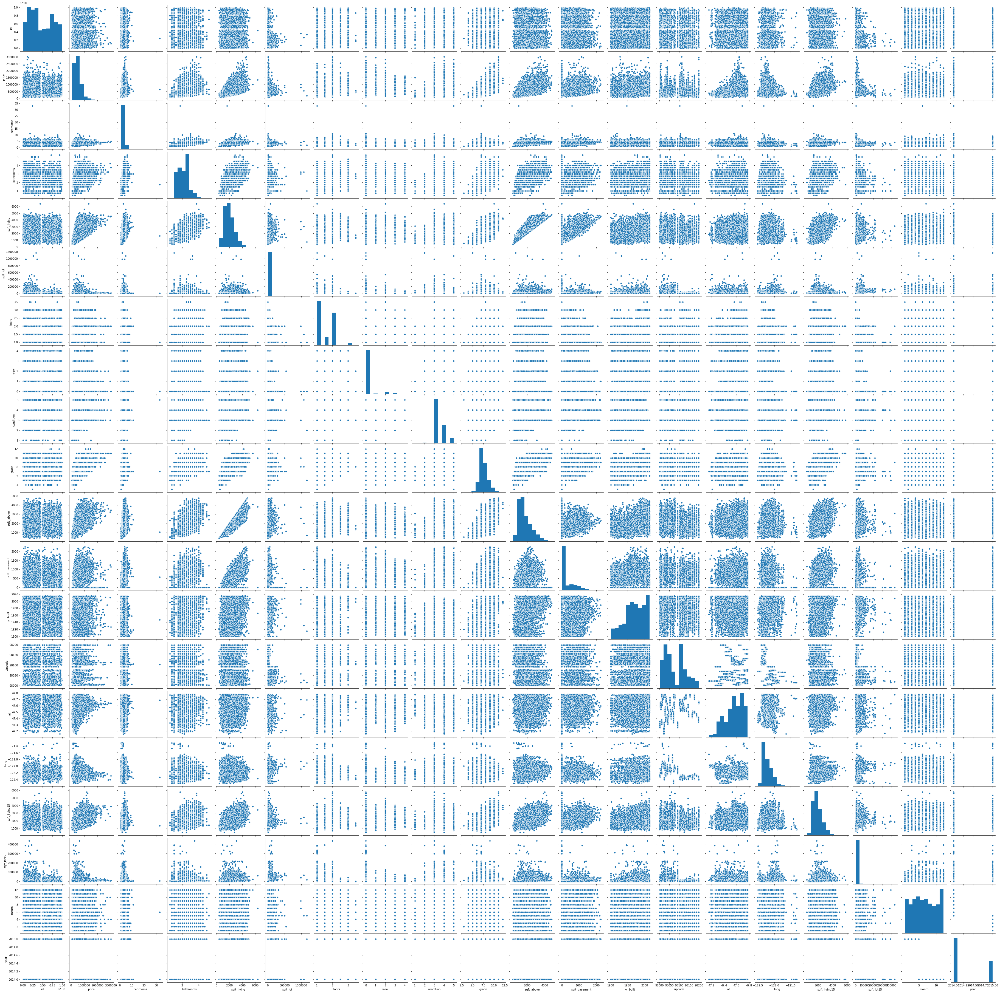


This are looking linear in general. Nothing appears to exhibit any clearly identifiable non-linear behavior. We will proceed with the baseline model as though the linear assumption is satisfied.  

#### Normality Of Numerical Data

We are going to do some initial data distribution exploration. This will include log transforming the columns that showed a reletively normal distribution before any alterations. 


```python
# Here we drop the id column as it will not be used in our model
dfNumeric = dfPreprocessed.select_dtypes(['int64','float64']).drop(labels = 'id', axis = 1).copy()

# We have identified the columns that will benefit from log transformation under the hood. Running this code block
# without the transformation will show as much. 
locColumns = ['price', 'sqft_living', 'sqft_living15', 'sqft_above', 'sqft_lot', 'sqft_lot15']
dfNumeric[locColumns] = dfNumeric[locColumns].applymap(lambda x: np.log(x))

# we now plot the distribution for each column and display a dataframe with the pvalues from a rigorous normal test
plt.figure(figsize=(20,10))
plotNum = 1
pvalueDict = {}
for x in dfNumeric.columns:
    try:
        axes = plt.subplot(4, 4, plotNum)
        sns.distplot(a = dfNumeric[x], ax = axes, norm_hist = True, color = 'purple')
        plotNum += 1
        plt.title(f'Distplot for {x}')
        plt.xlabel(f'{x.title()}')
        plt.ylabel(f'Probability')
        pvalueDict[x] = stats.normaltest(dfNumeric[x])[1]
#         display(f'Column {x} has the following statistics: {stats.normaltest(dfNumeric[x])}')
    except:
        print(f'''
                  Column, {x}, did not yield a visual because
                  the vast majority of the entries are 0.
                  The seaborn.distplot method of plotting is
                  protected against outliers and hense does not 
                  detect out the non-zero data. However, for the
                  remainder of the analysis we want to keep this info,
                  thus we skip the visual but note that analysis
                  will contine without error
              ''')
        
# create the pvalues df from the various normal test preformed
dfTemp = pd.DataFrame(pvalueDict.values(), index = pvalueDict.keys())
dfTemp.columns = ['P-Values for Normality Test']
display(dfTemp)
plt.tight_layout()
```

    
                      Column, view, did not yield a visual because
                      the vast majority of the entries are 0.
                      The seaborn.distplot method of plotting is
                      protected against outliers and hense does not 
                      detect out the non-zero data. However, for the
                      remainder of the analysis we want to keep this info,
                      thus we skip the visual but note that analysis
                      will contine without error
                  
    

    C:\ProgramData\Anaconda3\lib\site-packages\ipykernel_launcher.py:15: MatplotlibDeprecationWarning: Adding an axes using the same arguments as a previous axes currently reuses the earlier instance.  In a future version, a new instance will always be created and returned.  Meanwhile, this warning can be suppressed, and the future behavior ensured, by passing a unique label to each axes instance.
      from ipykernel import kernelapp as app
    


<div>
<style scoped>
    .dataframe tbody tr th:only-of-type {
        vertical-align: middle;
    }

    .dataframe tbody tr th {
        vertical-align: top;
    }

    .dataframe thead th {
        text-align: right;
    }
</style>
<table border="1" class="dataframe">
  <thead>
    <tr style="text-align: right;">
      <th></th>
      <th>P-Values for Normality Test</th>
    </tr>
  </thead>
  <tbody>
    <tr>
      <th>price</th>
      <td>3.649511e-14</td>
    </tr>
    <tr>
      <th>bedrooms</th>
      <td>0.000000e+00</td>
    </tr>
    <tr>
      <th>bathrooms</th>
      <td>5.500371e-30</td>
    </tr>
    <tr>
      <th>sqft_living</th>
      <td>4.370312e-59</td>
    </tr>
    <tr>
      <th>sqft_lot</th>
      <td>0.000000e+00</td>
    </tr>
    <tr>
      <th>floors</th>
      <td>0.000000e+00</td>
    </tr>
    <tr>
      <th>condition</th>
      <td>0.000000e+00</td>
    </tr>
    <tr>
      <th>grade</th>
      <td>9.328445e-259</td>
    </tr>
    <tr>
      <th>sqft_above</th>
      <td>4.167471e-117</td>
    </tr>
    <tr>
      <th>sqft_basement</th>
      <td>0.000000e+00</td>
    </tr>
    <tr>
      <th>yr_built</th>
      <td>0.000000e+00</td>
    </tr>
    <tr>
      <th>lat</th>
      <td>0.000000e+00</td>
    </tr>
    <tr>
      <th>long</th>
      <td>0.000000e+00</td>
    </tr>
    <tr>
      <th>sqft_living15</th>
      <td>2.288108e-44</td>
    </tr>
    <tr>
      <th>sqft_lot15</th>
      <td>0.000000e+00</td>
    </tr>
    <tr>
      <th>year</th>
      <td>0.000000e+00</td>
    </tr>
  </tbody>
</table>
</div>


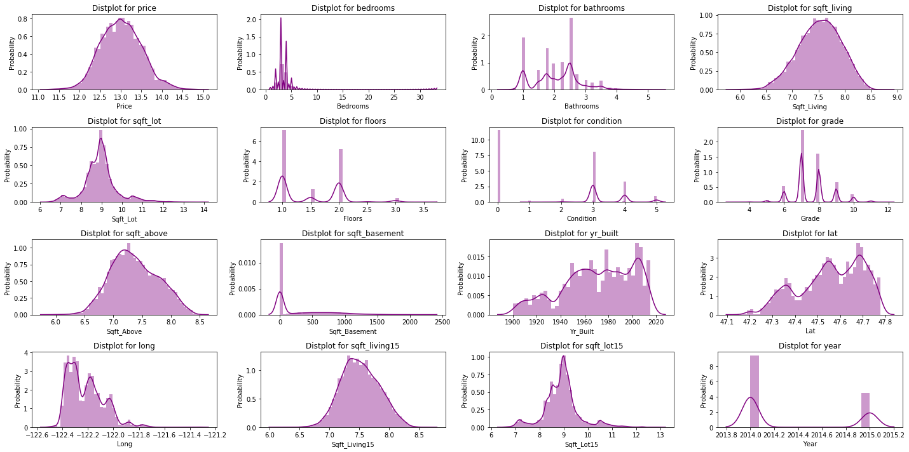


Alas, according to a rigorous test for normality, all numerical columns fail. While normal data would be beneficial, what we really need are for residuals to be normal.

#### Normality Of Residuals
This will be explored after the model has been created.

#### Heteroskewdacity
This will be explored after the model has been created. 

## Standardizing Numerical Data

In order for all our independent variable to be clearly represented in the analysis they must be normalized. For the model we will use z-score standardization. Note that we can only standardize out numerical data.


```python
dfNumericLog = dfNumeric.copy()
```


```python
for x in dfNumeric.columns:
    mean = dfNumeric[x].mean()
    std = dfNumeric[x].std()
    dfNumeric[x] = dfNumeric[x].apply(lambda x: (x - mean)/std)
dfNumeric.describe()
```


<div>
<style scoped>
    .dataframe tbody tr th:only-of-type {
        vertical-align: middle;
    }

    .dataframe tbody tr th {
        vertical-align: top;
    }

    .dataframe thead th {
        text-align: right;
    }
</style>
<table border="1" class="dataframe">
  <thead>
    <tr style="text-align: right;">
      <th></th>
      <th>price</th>
      <th>bedrooms</th>
      <th>bathrooms</th>
      <th>sqft_living</th>
      <th>sqft_lot</th>
      <th>floors</th>
      <th>view</th>
      <th>condition</th>
      <th>grade</th>
      <th>sqft_above</th>
      <th>sqft_basement</th>
      <th>yr_built</th>
      <th>lat</th>
      <th>long</th>
      <th>sqft_living15</th>
      <th>sqft_lot15</th>
      <th>year</th>
    </tr>
  </thead>
  <tbody>
    <tr>
      <th>count</th>
      <td>2.082300e+04</td>
      <td>2.082300e+04</td>
      <td>2.082300e+04</td>
      <td>2.082300e+04</td>
      <td>2.082300e+04</td>
      <td>2.082300e+04</td>
      <td>2.082300e+04</td>
      <td>2.082300e+04</td>
      <td>2.082300e+04</td>
      <td>2.082300e+04</td>
      <td>2.082300e+04</td>
      <td>2.082300e+04</td>
      <td>2.082300e+04</td>
      <td>2.082300e+04</td>
      <td>2.082300e+04</td>
      <td>2.082300e+04</td>
      <td>2.082300e+04</td>
    </tr>
    <tr>
      <th>mean</th>
      <td>6.971231e-14</td>
      <td>1.412979e-15</td>
      <td>6.380463e-15</td>
      <td>1.645558e-13</td>
      <td>-3.172752e-14</td>
      <td>-3.251074e-14</td>
      <td>-1.325464e-15</td>
      <td>-1.422448e-15</td>
      <td>1.128647e-14</td>
      <td>2.413107e-13</td>
      <td>4.649863e-15</td>
      <td>1.114680e-15</td>
      <td>1.451505e-13</td>
      <td>-4.543766e-12</td>
      <td>3.114173e-13</td>
      <td>-6.882110e-14</td>
      <td>1.597002e-13</td>
    </tr>
    <tr>
      <th>std</th>
      <td>1.000000e+00</td>
      <td>1.000000e+00</td>
      <td>1.000000e+00</td>
      <td>1.000000e+00</td>
      <td>1.000000e+00</td>
      <td>1.000000e+00</td>
      <td>1.000000e+00</td>
      <td>1.000000e+00</td>
      <td>1.000000e+00</td>
      <td>1.000000e+00</td>
      <td>1.000000e+00</td>
      <td>1.000000e+00</td>
      <td>1.000000e+00</td>
      <td>1.000000e+00</td>
      <td>1.000000e+00</td>
      <td>1.000000e+00</td>
      <td>1.000000e+00</td>
    </tr>
    <tr>
      <th>min</th>
      <td>-3.591133e+00</td>
      <td>-2.589216e+00</td>
      <td>-2.197559e+00</td>
      <td>-4.015288e+00</td>
      <td>-3.282271e+00</td>
      <td>-8.994903e-01</td>
      <td>-2.795061e-01</td>
      <td>-3.709854e+00</td>
      <td>-4.246013e+00</td>
      <td>-3.579447e+00</td>
      <td>-6.587022e-01</td>
      <td>-2.401115e+00</td>
      <td>-2.915730e+00</td>
      <td>-2.125388e+00</td>
      <td>-4.428113e+00</td>
      <td>-3.313938e+00</td>
      <td>-6.923175e-01</td>
    </tr>
    <tr>
      <th>25%</th>
      <td>-7.008130e-01</td>
      <td>-3.825593e-01</td>
      <td>-7.990542e-01</td>
      <td>-6.817101e-01</td>
      <td>-5.046420e-01</td>
      <td>-8.994903e-01</td>
      <td>-2.795061e-01</td>
      <td>-6.339914e-01</td>
      <td>-5.396735e-01</td>
      <td>-7.311662e-01</td>
      <td>-6.587022e-01</td>
      <td>-6.658999e-01</td>
      <td>-6.488925e-01</td>
      <td>-8.137387e-01</td>
      <td>-7.079482e-01</td>
      <td>-5.201818e-01</td>
      <td>-6.923175e-01</td>
    </tr>
    <tr>
      <th>50%</th>
      <td>-2.184506e-02</td>
      <td>-3.825593e-01</td>
      <td>2.498241e-01</td>
      <td>3.512387e-02</td>
      <td>-7.050110e-03</td>
      <td>-8.994903e-01</td>
      <td>-2.795061e-01</td>
      <td>-6.339914e-01</td>
      <td>-5.396735e-01</td>
      <td>-7.723649e-02</td>
      <td>-6.587022e-01</td>
      <td>1.166480e-01</td>
      <td>8.076384e-02</td>
      <td>-1.362933e-01</td>
      <td>-4.961475e-02</td>
      <td>2.605157e-02</td>
      <td>-6.923175e-01</td>
    </tr>
    <tr>
      <th>75%</th>
      <td>6.812953e-01</td>
      <td>7.207692e-01</td>
      <td>5.994502e-01</td>
      <td>7.253078e-01</td>
      <td>3.737832e-01</td>
      <td>9.571796e-01</td>
      <td>-2.795061e-01</td>
      <td>9.039399e-01</td>
      <td>3.869113e-01</td>
      <td>7.308148e-01</td>
      <td>6.120576e-01</td>
      <td>8.651720e-01</td>
      <td>8.565645e-01</td>
      <td>6.348414e-01</td>
      <td>7.093707e-01</td>
      <td>3.905965e-01</td>
      <td>1.444355e+00</td>
    </tr>
    <tr>
      <th>max</th>
      <td>3.901699e+00</td>
      <td>3.271729e+01</td>
      <td>4.445337e+00</td>
      <td>3.087592e+00</td>
      <td>6.184724e+00</td>
      <td>3.742184e+00</td>
      <td>5.728397e+00</td>
      <td>2.441871e+00</td>
      <td>4.093251e+00</td>
      <td>2.704468e+00</td>
      <td>4.839778e+00</td>
      <td>1.511624e+00</td>
      <td>1.566754e+00</td>
      <td>6.501231e+00</td>
      <td>3.634656e+00</td>
      <td>5.564219e+00</td>
      <td>1.444355e+00</td>
    </tr>
  </tbody>
</table>
</div>


## Encoding Categorical Data

Moving on, we need to encode our categorical data. The approach we will be using in one-hot encoding.


```python
dfcatCols = dfPreprocessed.select_dtypes('category').copy()
encodedCatCols = pd.get_dummies(dfcatCols, drop_first = True)
```

## The Final Dateframe


```python
#combine the numerical data and one-hot encoded data for the final dataframe. 
dfFinal = pd.concat([dfNumeric,encodedCatCols], axis = 1)
dfFinal.describe()
```


<div>
<style scoped>
    .dataframe tbody tr th:only-of-type {
        vertical-align: middle;
    }

    .dataframe tbody tr th {
        vertical-align: top;
    }

    .dataframe thead th {
        text-align: right;
    }
</style>
<table border="1" class="dataframe">
  <thead>
    <tr style="text-align: right;">
      <th></th>
      <th>price</th>
      <th>bedrooms</th>
      <th>bathrooms</th>
      <th>sqft_living</th>
      <th>sqft_lot</th>
      <th>floors</th>
      <th>view</th>
      <th>condition</th>
      <th>grade</th>
      <th>sqft_above</th>
      <th>sqft_basement</th>
      <th>yr_built</th>
      <th>lat</th>
      <th>long</th>
      <th>sqft_living15</th>
      <th>sqft_lot15</th>
      <th>year</th>
      <th>waterfront_1.0</th>
      <th>waterfront_Null</th>
      <th>zipcode_98002</th>
      <th>zipcode_98003</th>
      <th>zipcode_98004</th>
      <th>zipcode_98005</th>
      <th>zipcode_98006</th>
      <th>zipcode_98007</th>
      <th>zipcode_98008</th>
      <th>zipcode_98010</th>
      <th>zipcode_98011</th>
      <th>zipcode_98014</th>
      <th>zipcode_98019</th>
      <th>zipcode_98022</th>
      <th>zipcode_98023</th>
      <th>zipcode_98024</th>
      <th>zipcode_98027</th>
      <th>zipcode_98028</th>
      <th>zipcode_98029</th>
      <th>zipcode_98030</th>
      <th>zipcode_98031</th>
      <th>zipcode_98032</th>
      <th>zipcode_98033</th>
      <th>zipcode_98034</th>
      <th>zipcode_98038</th>
      <th>zipcode_98039</th>
      <th>zipcode_98040</th>
      <th>zipcode_98042</th>
      <th>zipcode_98045</th>
      <th>zipcode_98052</th>
      <th>zipcode_98053</th>
      <th>zipcode_98055</th>
      <th>zipcode_98056</th>
      <th>zipcode_98058</th>
      <th>zipcode_98059</th>
      <th>zipcode_98065</th>
      <th>zipcode_98070</th>
      <th>zipcode_98072</th>
      <th>zipcode_98074</th>
      <th>zipcode_98075</th>
      <th>zipcode_98077</th>
      <th>zipcode_98092</th>
      <th>zipcode_98102</th>
      <th>zipcode_98103</th>
      <th>zipcode_98105</th>
      <th>zipcode_98106</th>
      <th>zipcode_98107</th>
      <th>zipcode_98108</th>
      <th>zipcode_98109</th>
      <th>zipcode_98112</th>
      <th>zipcode_98115</th>
      <th>zipcode_98116</th>
      <th>zipcode_98117</th>
      <th>zipcode_98118</th>
      <th>zipcode_98119</th>
      <th>zipcode_98122</th>
      <th>zipcode_98125</th>
      <th>zipcode_98126</th>
      <th>zipcode_98133</th>
      <th>zipcode_98136</th>
      <th>zipcode_98144</th>
      <th>zipcode_98146</th>
      <th>zipcode_98148</th>
      <th>zipcode_98155</th>
      <th>zipcode_98166</th>
      <th>zipcode_98168</th>
      <th>zipcode_98177</th>
      <th>zipcode_98178</th>
      <th>zipcode_98188</th>
      <th>zipcode_98198</th>
      <th>zipcode_98199</th>
      <th>day_Monday</th>
      <th>day_Saturday</th>
      <th>day_Sunday</th>
      <th>day_Thursday</th>
      <th>day_Tuesday</th>
      <th>day_Wednesday</th>
      <th>month_2</th>
      <th>month_3</th>
      <th>month_4</th>
      <th>month_5</th>
      <th>month_6</th>
      <th>month_7</th>
      <th>month_8</th>
      <th>month_9</th>
      <th>month_10</th>
      <th>month_11</th>
      <th>month_12</th>
    </tr>
  </thead>
  <tbody>
    <tr>
      <th>count</th>
      <td>2.082300e+04</td>
      <td>2.082300e+04</td>
      <td>2.082300e+04</td>
      <td>2.082300e+04</td>
      <td>2.082300e+04</td>
      <td>2.082300e+04</td>
      <td>2.082300e+04</td>
      <td>2.082300e+04</td>
      <td>2.082300e+04</td>
      <td>2.082300e+04</td>
      <td>2.082300e+04</td>
      <td>2.082300e+04</td>
      <td>2.082300e+04</td>
      <td>2.082300e+04</td>
      <td>2.082300e+04</td>
      <td>2.082300e+04</td>
      <td>2.082300e+04</td>
      <td>20823.000000</td>
      <td>20823.000000</td>
      <td>20823.000000</td>
      <td>20823.000000</td>
      <td>20823.000000</td>
      <td>20823.000000</td>
      <td>20823.000000</td>
      <td>20823.000000</td>
      <td>20823.000000</td>
      <td>20823.000000</td>
      <td>20823.000000</td>
      <td>20823.000000</td>
      <td>20823.000000</td>
      <td>20823.000000</td>
      <td>20823.000000</td>
      <td>20823.000000</td>
      <td>20823.000000</td>
      <td>20823.000000</td>
      <td>20823.000000</td>
      <td>20823.000000</td>
      <td>20823.000000</td>
      <td>20823.000000</td>
      <td>20823.000000</td>
      <td>20823.000000</td>
      <td>20823.000000</td>
      <td>20823.000000</td>
      <td>20823.000000</td>
      <td>20823.000000</td>
      <td>20823.000000</td>
      <td>20823.000000</td>
      <td>20823.000000</td>
      <td>20823.000000</td>
      <td>20823.000000</td>
      <td>20823.000000</td>
      <td>20823.000000</td>
      <td>20823.000000</td>
      <td>20823.000000</td>
      <td>20823.000000</td>
      <td>20823.000000</td>
      <td>20823.000000</td>
      <td>20823.000000</td>
      <td>20823.000000</td>
      <td>20823.000000</td>
      <td>20823.000000</td>
      <td>20823.000000</td>
      <td>20823.000000</td>
      <td>20823.000000</td>
      <td>20823.000000</td>
      <td>20823.000000</td>
      <td>20823.000000</td>
      <td>20823.000000</td>
      <td>20823.000000</td>
      <td>20823.000000</td>
      <td>20823.000000</td>
      <td>20823.000000</td>
      <td>20823.000000</td>
      <td>20823.000000</td>
      <td>20823.000000</td>
      <td>20823.000000</td>
      <td>20823.000000</td>
      <td>20823.000000</td>
      <td>20823.000000</td>
      <td>20823.000000</td>
      <td>20823.000000</td>
      <td>20823.000000</td>
      <td>20823.000000</td>
      <td>20823.000000</td>
      <td>20823.000000</td>
      <td>20823.000000</td>
      <td>20823.000000</td>
      <td>20823.000000</td>
      <td>20823.000000</td>
      <td>20823.000000</td>
      <td>20823.000000</td>
      <td>20823.000000</td>
      <td>20823.000000</td>
      <td>20823.000000</td>
      <td>20823.000000</td>
      <td>20823.000000</td>
      <td>20823.000000</td>
      <td>20823.000000</td>
      <td>20823.000000</td>
      <td>20823.000000</td>
      <td>20823.000000</td>
      <td>20823.000000</td>
      <td>20823.000000</td>
      <td>20823.000000</td>
      <td>20823.000000</td>
    </tr>
    <tr>
      <th>mean</th>
      <td>6.971231e-14</td>
      <td>1.412979e-15</td>
      <td>6.380463e-15</td>
      <td>1.645558e-13</td>
      <td>-3.172752e-14</td>
      <td>-3.251074e-14</td>
      <td>-1.325464e-15</td>
      <td>-1.422448e-15</td>
      <td>1.128647e-14</td>
      <td>2.413107e-13</td>
      <td>4.649863e-15</td>
      <td>1.114680e-15</td>
      <td>1.451505e-13</td>
      <td>-4.543766e-12</td>
      <td>3.114173e-13</td>
      <td>-6.882110e-14</td>
      <td>1.597002e-13</td>
      <td>0.003410</td>
      <td>0.109927</td>
      <td>0.009557</td>
      <td>0.013255</td>
      <td>0.012438</td>
      <td>0.007588</td>
      <td>0.020842</td>
      <td>0.006771</td>
      <td>0.013207</td>
      <td>0.004178</td>
      <td>0.009269</td>
      <td>0.004898</td>
      <td>0.008308</td>
      <td>0.009461</td>
      <td>0.023820</td>
      <td>0.002929</td>
      <td>0.018633</td>
      <td>0.013447</td>
      <td>0.015079</td>
      <td>0.012246</td>
      <td>0.013062</td>
      <td>0.005955</td>
      <td>0.019930</td>
      <td>0.025693</td>
      <td>0.027085</td>
      <td>0.001489</td>
      <td>0.011526</td>
      <td>0.025933</td>
      <td>0.009221</td>
      <td>0.027374</td>
      <td>0.017769</td>
      <td>0.012870</td>
      <td>0.019402</td>
      <td>0.021515</td>
      <td>0.021899</td>
      <td>0.014071</td>
      <td>0.004610</td>
      <td>0.012822</td>
      <td>0.020122</td>
      <td>0.016184</td>
      <td>0.008596</td>
      <td>0.015416</td>
      <td>0.004754</td>
      <td>0.028862</td>
      <td>0.010469</td>
      <td>0.016040</td>
      <td>0.012630</td>
      <td>0.008932</td>
      <td>0.005091</td>
      <td>0.012102</td>
      <td>0.027854</td>
      <td>0.015368</td>
      <td>0.026413</td>
      <td>0.024108</td>
      <td>0.008404</td>
      <td>0.013687</td>
      <td>0.019402</td>
      <td>0.017000</td>
      <td>0.023676</td>
      <td>0.012438</td>
      <td>0.015944</td>
      <td>0.013783</td>
      <td>0.002737</td>
      <td>0.021130</td>
      <td>0.011910</td>
      <td>0.012870</td>
      <td>0.011622</td>
      <td>0.012486</td>
      <td>0.006531</td>
      <td>0.013399</td>
      <td>0.014647</td>
      <td>0.189550</td>
      <td>0.013351</td>
      <td>0.010805</td>
      <td>0.185276</td>
      <td>0.218268</td>
      <td>0.212649</td>
      <td>0.058301</td>
      <td>0.087307</td>
      <td>0.103779</td>
      <td>0.110551</td>
      <td>0.101090</td>
      <td>0.102291</td>
      <td>0.089805</td>
      <td>0.082409</td>
      <td>0.086635</td>
      <td>0.064928</td>
      <td>0.067858</td>
    </tr>
    <tr>
      <th>std</th>
      <td>1.000000e+00</td>
      <td>1.000000e+00</td>
      <td>1.000000e+00</td>
      <td>1.000000e+00</td>
      <td>1.000000e+00</td>
      <td>1.000000e+00</td>
      <td>1.000000e+00</td>
      <td>1.000000e+00</td>
      <td>1.000000e+00</td>
      <td>1.000000e+00</td>
      <td>1.000000e+00</td>
      <td>1.000000e+00</td>
      <td>1.000000e+00</td>
      <td>1.000000e+00</td>
      <td>1.000000e+00</td>
      <td>1.000000e+00</td>
      <td>1.000000e+00</td>
      <td>0.058294</td>
      <td>0.312806</td>
      <td>0.097293</td>
      <td>0.114366</td>
      <td>0.110833</td>
      <td>0.086779</td>
      <td>0.142860</td>
      <td>0.082011</td>
      <td>0.114161</td>
      <td>0.064504</td>
      <td>0.095829</td>
      <td>0.069819</td>
      <td>0.090772</td>
      <td>0.096807</td>
      <td>0.152491</td>
      <td>0.054046</td>
      <td>0.135229</td>
      <td>0.115180</td>
      <td>0.121872</td>
      <td>0.109985</td>
      <td>0.113545</td>
      <td>0.076940</td>
      <td>0.139763</td>
      <td>0.158221</td>
      <td>0.162336</td>
      <td>0.038556</td>
      <td>0.106740</td>
      <td>0.158939</td>
      <td>0.095582</td>
      <td>0.163173</td>
      <td>0.132113</td>
      <td>0.112718</td>
      <td>0.137935</td>
      <td>0.145096</td>
      <td>0.146357</td>
      <td>0.117786</td>
      <td>0.067744</td>
      <td>0.112510</td>
      <td>0.140421</td>
      <td>0.126186</td>
      <td>0.092319</td>
      <td>0.123202</td>
      <td>0.068789</td>
      <td>0.167424</td>
      <td>0.101785</td>
      <td>0.125632</td>
      <td>0.111675</td>
      <td>0.094091</td>
      <td>0.071168</td>
      <td>0.109344</td>
      <td>0.164558</td>
      <td>0.123013</td>
      <td>0.160364</td>
      <td>0.153388</td>
      <td>0.091290</td>
      <td>0.116190</td>
      <td>0.137935</td>
      <td>0.129276</td>
      <td>0.152040</td>
      <td>0.110833</td>
      <td>0.125262</td>
      <td>0.116591</td>
      <td>0.052249</td>
      <td>0.143823</td>
      <td>0.108483</td>
      <td>0.112718</td>
      <td>0.107179</td>
      <td>0.111044</td>
      <td>0.080554</td>
      <td>0.114977</td>
      <td>0.120139</td>
      <td>0.391954</td>
      <td>0.114774</td>
      <td>0.103388</td>
      <td>0.388531</td>
      <td>0.413080</td>
      <td>0.409192</td>
      <td>0.234317</td>
      <td>0.282292</td>
      <td>0.304982</td>
      <td>0.313583</td>
      <td>0.301455</td>
      <td>0.303038</td>
      <td>0.285908</td>
      <td>0.274993</td>
      <td>0.281306</td>
      <td>0.246405</td>
      <td>0.251508</td>
    </tr>
    <tr>
      <th>min</th>
      <td>-3.591133e+00</td>
      <td>-2.589216e+00</td>
      <td>-2.197559e+00</td>
      <td>-4.015288e+00</td>
      <td>-3.282271e+00</td>
      <td>-8.994903e-01</td>
      <td>-2.795061e-01</td>
      <td>-3.709854e+00</td>
      <td>-4.246013e+00</td>
      <td>-3.579447e+00</td>
      <td>-6.587022e-01</td>
      <td>-2.401115e+00</td>
      <td>-2.915730e+00</td>
      <td>-2.125388e+00</td>
      <td>-4.428113e+00</td>
      <td>-3.313938e+00</td>
      <td>-6.923175e-01</td>
      <td>0.000000</td>
      <td>0.000000</td>
      <td>0.000000</td>
      <td>0.000000</td>
      <td>0.000000</td>
      <td>0.000000</td>
      <td>0.000000</td>
      <td>0.000000</td>
      <td>0.000000</td>
      <td>0.000000</td>
      <td>0.000000</td>
      <td>0.000000</td>
      <td>0.000000</td>
      <td>0.000000</td>
      <td>0.000000</td>
      <td>0.000000</td>
      <td>0.000000</td>
      <td>0.000000</td>
      <td>0.000000</td>
      <td>0.000000</td>
      <td>0.000000</td>
      <td>0.000000</td>
      <td>0.000000</td>
      <td>0.000000</td>
      <td>0.000000</td>
      <td>0.000000</td>
      <td>0.000000</td>
      <td>0.000000</td>
      <td>0.000000</td>
      <td>0.000000</td>
      <td>0.000000</td>
      <td>0.000000</td>
      <td>0.000000</td>
      <td>0.000000</td>
      <td>0.000000</td>
      <td>0.000000</td>
      <td>0.000000</td>
      <td>0.000000</td>
      <td>0.000000</td>
      <td>0.000000</td>
      <td>0.000000</td>
      <td>0.000000</td>
      <td>0.000000</td>
      <td>0.000000</td>
      <td>0.000000</td>
      <td>0.000000</td>
      <td>0.000000</td>
      <td>0.000000</td>
      <td>0.000000</td>
      <td>0.000000</td>
      <td>0.000000</td>
      <td>0.000000</td>
      <td>0.000000</td>
      <td>0.000000</td>
      <td>0.000000</td>
      <td>0.000000</td>
      <td>0.000000</td>
      <td>0.000000</td>
      <td>0.000000</td>
      <td>0.000000</td>
      <td>0.000000</td>
      <td>0.000000</td>
      <td>0.000000</td>
      <td>0.000000</td>
      <td>0.000000</td>
      <td>0.000000</td>
      <td>0.000000</td>
      <td>0.000000</td>
      <td>0.000000</td>
      <td>0.000000</td>
      <td>0.000000</td>
      <td>0.000000</td>
      <td>0.000000</td>
      <td>0.000000</td>
      <td>0.000000</td>
      <td>0.000000</td>
      <td>0.000000</td>
      <td>0.000000</td>
      <td>0.000000</td>
      <td>0.000000</td>
      <td>0.000000</td>
      <td>0.000000</td>
      <td>0.000000</td>
      <td>0.000000</td>
      <td>0.000000</td>
      <td>0.000000</td>
      <td>0.000000</td>
      <td>0.000000</td>
    </tr>
    <tr>
      <th>25%</th>
      <td>-7.008130e-01</td>
      <td>-3.825593e-01</td>
      <td>-7.990542e-01</td>
      <td>-6.817101e-01</td>
      <td>-5.046420e-01</td>
      <td>-8.994903e-01</td>
      <td>-2.795061e-01</td>
      <td>-6.339914e-01</td>
      <td>-5.396735e-01</td>
      <td>-7.311662e-01</td>
      <td>-6.587022e-01</td>
      <td>-6.658999e-01</td>
      <td>-6.488925e-01</td>
      <td>-8.137387e-01</td>
      <td>-7.079482e-01</td>
      <td>-5.201818e-01</td>
      <td>-6.923175e-01</td>
      <td>0.000000</td>
      <td>0.000000</td>
      <td>0.000000</td>
      <td>0.000000</td>
      <td>0.000000</td>
      <td>0.000000</td>
      <td>0.000000</td>
      <td>0.000000</td>
      <td>0.000000</td>
      <td>0.000000</td>
      <td>0.000000</td>
      <td>0.000000</td>
      <td>0.000000</td>
      <td>0.000000</td>
      <td>0.000000</td>
      <td>0.000000</td>
      <td>0.000000</td>
      <td>0.000000</td>
      <td>0.000000</td>
      <td>0.000000</td>
      <td>0.000000</td>
      <td>0.000000</td>
      <td>0.000000</td>
      <td>0.000000</td>
      <td>0.000000</td>
      <td>0.000000</td>
      <td>0.000000</td>
      <td>0.000000</td>
      <td>0.000000</td>
      <td>0.000000</td>
      <td>0.000000</td>
      <td>0.000000</td>
      <td>0.000000</td>
      <td>0.000000</td>
      <td>0.000000</td>
      <td>0.000000</td>
      <td>0.000000</td>
      <td>0.000000</td>
      <td>0.000000</td>
      <td>0.000000</td>
      <td>0.000000</td>
      <td>0.000000</td>
      <td>0.000000</td>
      <td>0.000000</td>
      <td>0.000000</td>
      <td>0.000000</td>
      <td>0.000000</td>
      <td>0.000000</td>
      <td>0.000000</td>
      <td>0.000000</td>
      <td>0.000000</td>
      <td>0.000000</td>
      <td>0.000000</td>
      <td>0.000000</td>
      <td>0.000000</td>
      <td>0.000000</td>
      <td>0.000000</td>
      <td>0.000000</td>
      <td>0.000000</td>
      <td>0.000000</td>
      <td>0.000000</td>
      <td>0.000000</td>
      <td>0.000000</td>
      <td>0.000000</td>
      <td>0.000000</td>
      <td>0.000000</td>
      <td>0.000000</td>
      <td>0.000000</td>
      <td>0.000000</td>
      <td>0.000000</td>
      <td>0.000000</td>
      <td>0.000000</td>
      <td>0.000000</td>
      <td>0.000000</td>
      <td>0.000000</td>
      <td>0.000000</td>
      <td>0.000000</td>
      <td>0.000000</td>
      <td>0.000000</td>
      <td>0.000000</td>
      <td>0.000000</td>
      <td>0.000000</td>
      <td>0.000000</td>
      <td>0.000000</td>
      <td>0.000000</td>
      <td>0.000000</td>
      <td>0.000000</td>
      <td>0.000000</td>
    </tr>
    <tr>
      <th>50%</th>
      <td>-2.184506e-02</td>
      <td>-3.825593e-01</td>
      <td>2.498241e-01</td>
      <td>3.512387e-02</td>
      <td>-7.050110e-03</td>
      <td>-8.994903e-01</td>
      <td>-2.795061e-01</td>
      <td>-6.339914e-01</td>
      <td>-5.396735e-01</td>
      <td>-7.723649e-02</td>
      <td>-6.587022e-01</td>
      <td>1.166480e-01</td>
      <td>8.076384e-02</td>
      <td>-1.362933e-01</td>
      <td>-4.961475e-02</td>
      <td>2.605157e-02</td>
      <td>-6.923175e-01</td>
      <td>0.000000</td>
      <td>0.000000</td>
      <td>0.000000</td>
      <td>0.000000</td>
      <td>0.000000</td>
      <td>0.000000</td>
      <td>0.000000</td>
      <td>0.000000</td>
      <td>0.000000</td>
      <td>0.000000</td>
      <td>0.000000</td>
      <td>0.000000</td>
      <td>0.000000</td>
      <td>0.000000</td>
      <td>0.000000</td>
      <td>0.000000</td>
      <td>0.000000</td>
      <td>0.000000</td>
      <td>0.000000</td>
      <td>0.000000</td>
      <td>0.000000</td>
      <td>0.000000</td>
      <td>0.000000</td>
      <td>0.000000</td>
      <td>0.000000</td>
      <td>0.000000</td>
      <td>0.000000</td>
      <td>0.000000</td>
      <td>0.000000</td>
      <td>0.000000</td>
      <td>0.000000</td>
      <td>0.000000</td>
      <td>0.000000</td>
      <td>0.000000</td>
      <td>0.000000</td>
      <td>0.000000</td>
      <td>0.000000</td>
      <td>0.000000</td>
      <td>0.000000</td>
      <td>0.000000</td>
      <td>0.000000</td>
      <td>0.000000</td>
      <td>0.000000</td>
      <td>0.000000</td>
      <td>0.000000</td>
      <td>0.000000</td>
      <td>0.000000</td>
      <td>0.000000</td>
      <td>0.000000</td>
      <td>0.000000</td>
      <td>0.000000</td>
      <td>0.000000</td>
      <td>0.000000</td>
      <td>0.000000</td>
      <td>0.000000</td>
      <td>0.000000</td>
      <td>0.000000</td>
      <td>0.000000</td>
      <td>0.000000</td>
      <td>0.000000</td>
      <td>0.000000</td>
      <td>0.000000</td>
      <td>0.000000</td>
      <td>0.000000</td>
      <td>0.000000</td>
      <td>0.000000</td>
      <td>0.000000</td>
      <td>0.000000</td>
      <td>0.000000</td>
      <td>0.000000</td>
      <td>0.000000</td>
      <td>0.000000</td>
      <td>0.000000</td>
      <td>0.000000</td>
      <td>0.000000</td>
      <td>0.000000</td>
      <td>0.000000</td>
      <td>0.000000</td>
      <td>0.000000</td>
      <td>0.000000</td>
      <td>0.000000</td>
      <td>0.000000</td>
      <td>0.000000</td>
      <td>0.000000</td>
      <td>0.000000</td>
      <td>0.000000</td>
      <td>0.000000</td>
      <td>0.000000</td>
    </tr>
    <tr>
      <th>75%</th>
      <td>6.812953e-01</td>
      <td>7.207692e-01</td>
      <td>5.994502e-01</td>
      <td>7.253078e-01</td>
      <td>3.737832e-01</td>
      <td>9.571796e-01</td>
      <td>-2.795061e-01</td>
      <td>9.039399e-01</td>
      <td>3.869113e-01</td>
      <td>7.308148e-01</td>
      <td>6.120576e-01</td>
      <td>8.651720e-01</td>
      <td>8.565645e-01</td>
      <td>6.348414e-01</td>
      <td>7.093707e-01</td>
      <td>3.905965e-01</td>
      <td>1.444355e+00</td>
      <td>0.000000</td>
      <td>0.000000</td>
      <td>0.000000</td>
      <td>0.000000</td>
      <td>0.000000</td>
      <td>0.000000</td>
      <td>0.000000</td>
      <td>0.000000</td>
      <td>0.000000</td>
      <td>0.000000</td>
      <td>0.000000</td>
      <td>0.000000</td>
      <td>0.000000</td>
      <td>0.000000</td>
      <td>0.000000</td>
      <td>0.000000</td>
      <td>0.000000</td>
      <td>0.000000</td>
      <td>0.000000</td>
      <td>0.000000</td>
      <td>0.000000</td>
      <td>0.000000</td>
      <td>0.000000</td>
      <td>0.000000</td>
      <td>0.000000</td>
      <td>0.000000</td>
      <td>0.000000</td>
      <td>0.000000</td>
      <td>0.000000</td>
      <td>0.000000</td>
      <td>0.000000</td>
      <td>0.000000</td>
      <td>0.000000</td>
      <td>0.000000</td>
      <td>0.000000</td>
      <td>0.000000</td>
      <td>0.000000</td>
      <td>0.000000</td>
      <td>0.000000</td>
      <td>0.000000</td>
      <td>0.000000</td>
      <td>0.000000</td>
      <td>0.000000</td>
      <td>0.000000</td>
      <td>0.000000</td>
      <td>0.000000</td>
      <td>0.000000</td>
      <td>0.000000</td>
      <td>0.000000</td>
      <td>0.000000</td>
      <td>0.000000</td>
      <td>0.000000</td>
      <td>0.000000</td>
      <td>0.000000</td>
      <td>0.000000</td>
      <td>0.000000</td>
      <td>0.000000</td>
      <td>0.000000</td>
      <td>0.000000</td>
      <td>0.000000</td>
      <td>0.000000</td>
      <td>0.000000</td>
      <td>0.000000</td>
      <td>0.000000</td>
      <td>0.000000</td>
      <td>0.000000</td>
      <td>0.000000</td>
      <td>0.000000</td>
      <td>0.000000</td>
      <td>0.000000</td>
      <td>0.000000</td>
      <td>0.000000</td>
      <td>0.000000</td>
      <td>0.000000</td>
      <td>0.000000</td>
      <td>0.000000</td>
      <td>0.000000</td>
      <td>0.000000</td>
      <td>0.000000</td>
      <td>0.000000</td>
      <td>0.000000</td>
      <td>0.000000</td>
      <td>0.000000</td>
      <td>0.000000</td>
      <td>0.000000</td>
      <td>0.000000</td>
      <td>0.000000</td>
      <td>0.000000</td>
    </tr>
    <tr>
      <th>max</th>
      <td>3.901699e+00</td>
      <td>3.271729e+01</td>
      <td>4.445337e+00</td>
      <td>3.087592e+00</td>
      <td>6.184724e+00</td>
      <td>3.742184e+00</td>
      <td>5.728397e+00</td>
      <td>2.441871e+00</td>
      <td>4.093251e+00</td>
      <td>2.704468e+00</td>
      <td>4.839778e+00</td>
      <td>1.511624e+00</td>
      <td>1.566754e+00</td>
      <td>6.501231e+00</td>
      <td>3.634656e+00</td>
      <td>5.564219e+00</td>
      <td>1.444355e+00</td>
      <td>1.000000</td>
      <td>1.000000</td>
      <td>1.000000</td>
      <td>1.000000</td>
      <td>1.000000</td>
      <td>1.000000</td>
      <td>1.000000</td>
      <td>1.000000</td>
      <td>1.000000</td>
      <td>1.000000</td>
      <td>1.000000</td>
      <td>1.000000</td>
      <td>1.000000</td>
      <td>1.000000</td>
      <td>1.000000</td>
      <td>1.000000</td>
      <td>1.000000</td>
      <td>1.000000</td>
      <td>1.000000</td>
      <td>1.000000</td>
      <td>1.000000</td>
      <td>1.000000</td>
      <td>1.000000</td>
      <td>1.000000</td>
      <td>1.000000</td>
      <td>1.000000</td>
      <td>1.000000</td>
      <td>1.000000</td>
      <td>1.000000</td>
      <td>1.000000</td>
      <td>1.000000</td>
      <td>1.000000</td>
      <td>1.000000</td>
      <td>1.000000</td>
      <td>1.000000</td>
      <td>1.000000</td>
      <td>1.000000</td>
      <td>1.000000</td>
      <td>1.000000</td>
      <td>1.000000</td>
      <td>1.000000</td>
      <td>1.000000</td>
      <td>1.000000</td>
      <td>1.000000</td>
      <td>1.000000</td>
      <td>1.000000</td>
      <td>1.000000</td>
      <td>1.000000</td>
      <td>1.000000</td>
      <td>1.000000</td>
      <td>1.000000</td>
      <td>1.000000</td>
      <td>1.000000</td>
      <td>1.000000</td>
      <td>1.000000</td>
      <td>1.000000</td>
      <td>1.000000</td>
      <td>1.000000</td>
      <td>1.000000</td>
      <td>1.000000</td>
      <td>1.000000</td>
      <td>1.000000</td>
      <td>1.000000</td>
      <td>1.000000</td>
      <td>1.000000</td>
      <td>1.000000</td>
      <td>1.000000</td>
      <td>1.000000</td>
      <td>1.000000</td>
      <td>1.000000</td>
      <td>1.000000</td>
      <td>1.000000</td>
      <td>1.000000</td>
      <td>1.000000</td>
      <td>1.000000</td>
      <td>1.000000</td>
      <td>1.000000</td>
      <td>1.000000</td>
      <td>1.000000</td>
      <td>1.000000</td>
      <td>1.000000</td>
      <td>1.000000</td>
      <td>1.000000</td>
      <td>1.000000</td>
      <td>1.000000</td>
      <td>1.000000</td>
      <td>1.000000</td>
      <td>1.000000</td>
    </tr>
  </tbody>
</table>
</div>


## Treating Multi-Coolinearity

With our final representation of both numerical and categorical columns.  we now will go through the process of removing coolinear columns. For the purposese of this investigation we will use a correlation value of .75 as the threshold of what columns we should remove for being coolinear. 


```python
# Create a true false table based on the dfFinal correlation matrix output
colinearCorrelations = np.abs(dfFinal.corr())>.75

# Instantiate a figure and create a heatmap of the correlations matrix
plt.figure(figsize=(100,100))
sns.heatmap(colinearCorrelations.iloc[:, 0:]);
```


This representaion isn't remotely useful for presentation but it does show that we are only concerned with the columns in top left corner. 


```python
plt.figure(figsize=(10,10))
sns.heatmap(colinearCorrelations.iloc[:20, :20])
```


    <matplotlib.axes._subplots.AxesSubplot at 0x22ccfc82888>


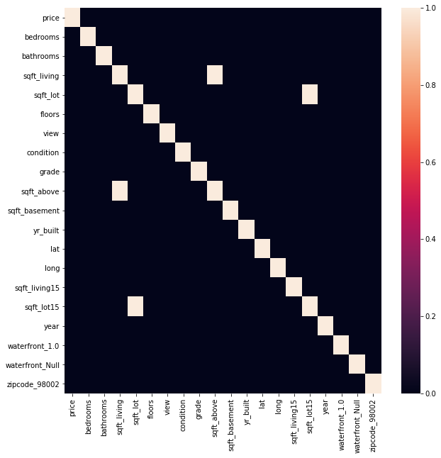


We're detected a co-linear relationship between the following pairs:
* sqft_lot15 : sqft_lot
* sqft_living : sqft_above

we will drop one column from each pair to reduce the incluence of nulti-colinearity on our model.


```python
dfFinal.drop(labels = ['sqft_above', 'sqft_lot15'], axis = 1, inplace = True)
```

## Creating The Model

With all the data preped we move forward with creating out baseline model.


```python
# The following code creates a linear model using ordinary least squares. for more info see statsmodels.OLS
Y = dfFinal['price']
X = dfFinal.drop(labels = ['price'], axis = 1)
X = sm.add_constant(X)
model = sm.OLS(endog = Y, exog = X).fit()
model.summary()
```


<table class="simpletable">
<caption>OLS Regression Results</caption>
<tr>
  <th>Dep. Variable:</th>          <td>price</td>      <th>  R-squared:         </th> <td>   0.871</td> 
</tr>
<tr>
  <th>Model:</th>                   <td>OLS</td>       <th>  Adj. R-squared:    </th> <td>   0.870</td> 
</tr>
<tr>
  <th>Method:</th>             <td>Least Squares</td>  <th>  F-statistic:       </th> <td>   1373.</td> 
</tr>
<tr>
  <th>Date:</th>             <td>Mon, 10 Aug 2020</td> <th>  Prob (F-statistic):</th>  <td>  0.00</td>  
</tr>
<tr>
  <th>Time:</th>                 <td>23:55:04</td>     <th>  Log-Likelihood:    </th> <td> -8215.4</td> 
</tr>
<tr>
  <th>No. Observations:</th>      <td> 20823</td>      <th>  AIC:               </th> <td>1.664e+04</td>
</tr>
<tr>
  <th>Df Residuals:</th>          <td> 20720</td>      <th>  BIC:               </th> <td>1.745e+04</td>
</tr>
<tr>
  <th>Df Model:</th>              <td>   102</td>      <th>                     </th>     <td> </td>    
</tr>
<tr>
  <th>Covariance Type:</th>      <td>nonrobust</td>    <th>                     </th>     <td> </td>    
</tr>
</table>
<table class="simpletable">
<tr>
         <td></td>            <th>coef</th>     <th>std err</th>      <th>t</th>      <th>P>|t|</th>  <th>[0.025</th>    <th>0.975]</th>  
</tr>
<tr>
  <th>const</th>           <td>   -0.9491</td> <td>    0.046</td> <td>  -20.834</td> <td> 0.000</td> <td>   -1.038</td> <td>   -0.860</td>
</tr>
<tr>
  <th>bedrooms</th>        <td>   -0.0228</td> <td>    0.003</td> <td>   -6.866</td> <td> 0.000</td> <td>   -0.029</td> <td>   -0.016</td>
</tr>
<tr>
  <th>bathrooms</th>       <td>    0.0640</td> <td>    0.004</td> <td>   14.492</td> <td> 0.000</td> <td>    0.055</td> <td>    0.073</td>
</tr>
<tr>
  <th>sqft_living</th>     <td>    0.3494</td> <td>    0.006</td> <td>   57.106</td> <td> 0.000</td> <td>    0.337</td> <td>    0.361</td>
</tr>
<tr>
  <th>sqft_lot</th>        <td>    0.0952</td> <td>    0.004</td> <td>   24.687</td> <td> 0.000</td> <td>    0.088</td> <td>    0.103</td>
</tr>
<tr>
  <th>floors</th>          <td>   -0.0100</td> <td>    0.004</td> <td>   -2.450</td> <td> 0.014</td> <td>   -0.018</td> <td>   -0.002</td>
</tr>
<tr>
  <th>view</th>            <td>    0.0840</td> <td>    0.003</td> <td>   29.176</td> <td> 0.000</td> <td>    0.078</td> <td>    0.090</td>
</tr>
<tr>
  <th>condition</th>       <td>    0.0666</td> <td>    0.003</td> <td>   23.640</td> <td> 0.000</td> <td>    0.061</td> <td>    0.072</td>
</tr>
<tr>
  <th>grade</th>           <td>    0.2057</td> <td>    0.004</td> <td>   46.067</td> <td> 0.000</td> <td>    0.197</td> <td>    0.214</td>
</tr>
<tr>
  <th>sqft_basement</th>   <td>   -0.0617</td> <td>    0.004</td> <td>  -17.201</td> <td> 0.000</td> <td>   -0.069</td> <td>   -0.055</td>
</tr>
<tr>
  <th>yr_built</th>        <td>   -0.0298</td> <td>    0.004</td> <td>   -6.964</td> <td> 0.000</td> <td>   -0.038</td> <td>   -0.021</td>
</tr>
<tr>
  <th>lat</th>             <td>    0.1392</td> <td>    0.020</td> <td>    6.820</td> <td> 0.000</td> <td>    0.099</td> <td>    0.179</td>
</tr>
<tr>
  <th>long</th>            <td>   -0.1183</td> <td>    0.015</td> <td>   -7.988</td> <td> 0.000</td> <td>   -0.147</td> <td>   -0.089</td>
</tr>
<tr>
  <th>sqft_living15</th>   <td>    0.0957</td> <td>    0.004</td> <td>   22.252</td> <td> 0.000</td> <td>    0.087</td> <td>    0.104</td>
</tr>
<tr>
  <th>year</th>            <td>    0.0975</td> <td>    0.008</td> <td>   12.253</td> <td> 0.000</td> <td>    0.082</td> <td>    0.113</td>
</tr>
<tr>
  <th>waterfront_1.0</th>  <td>    0.9071</td> <td>    0.046</td> <td>   19.675</td> <td> 0.000</td> <td>    0.817</td> <td>    0.997</td>
</tr>
<tr>
  <th>waterfront_Null</th> <td>   -0.0050</td> <td>    0.008</td> <td>   -0.630</td> <td> 0.529</td> <td>   -0.021</td> <td>    0.011</td>
</tr>
<tr>
  <th>zipcode_98002</th>   <td>    0.0472</td> <td>    0.033</td> <td>    1.448</td> <td> 0.148</td> <td>   -0.017</td> <td>    0.111</td>
</tr>
<tr>
  <th>zipcode_98003</th>   <td>   -0.0049</td> <td>    0.029</td> <td>   -0.170</td> <td> 0.865</td> <td>   -0.062</td> <td>    0.052</td>
</tr>
<tr>
  <th>zipcode_98004</th>   <td>    2.0392</td> <td>    0.055</td> <td>   37.291</td> <td> 0.000</td> <td>    1.932</td> <td>    2.146</td>
</tr>
<tr>
  <th>zipcode_98005</th>   <td>    1.2920</td> <td>    0.058</td> <td>   22.297</td> <td> 0.000</td> <td>    1.178</td> <td>    1.406</td>
</tr>
<tr>
  <th>zipcode_98006</th>   <td>    1.1816</td> <td>    0.048</td> <td>   24.789</td> <td> 0.000</td> <td>    1.088</td> <td>    1.275</td>
</tr>
<tr>
  <th>zipcode_98007</th>   <td>    1.1438</td> <td>    0.059</td> <td>   19.240</td> <td> 0.000</td> <td>    1.027</td> <td>    1.260</td>
</tr>
<tr>
  <th>zipcode_98008</th>   <td>    1.1633</td> <td>    0.057</td> <td>   20.455</td> <td> 0.000</td> <td>    1.052</td> <td>    1.275</td>
</tr>
<tr>
  <th>zipcode_98010</th>   <td>    0.7174</td> <td>    0.052</td> <td>   13.870</td> <td> 0.000</td> <td>    0.616</td> <td>    0.819</td>
</tr>
<tr>
  <th>zipcode_98011</th>   <td>    0.5376</td> <td>    0.074</td> <td>    7.270</td> <td> 0.000</td> <td>    0.393</td> <td>    0.683</td>
</tr>
<tr>
  <th>zipcode_98014</th>   <td>    0.6202</td> <td>    0.084</td> <td>    7.408</td> <td> 0.000</td> <td>    0.456</td> <td>    0.784</td>
</tr>
<tr>
  <th>zipcode_98019</th>   <td>    0.4843</td> <td>    0.081</td> <td>    6.014</td> <td> 0.000</td> <td>    0.326</td> <td>    0.642</td>
</tr>
<tr>
  <th>zipcode_98022</th>   <td>    0.3996</td> <td>    0.045</td> <td>    8.811</td> <td> 0.000</td> <td>    0.311</td> <td>    0.488</td>
</tr>
<tr>
  <th>zipcode_98023</th>   <td>   -0.1294</td> <td>    0.027</td> <td>   -4.814</td> <td> 0.000</td> <td>   -0.182</td> <td>   -0.077</td>
</tr>
<tr>
  <th>zipcode_98024</th>   <td>    0.8960</td> <td>    0.075</td> <td>   12.019</td> <td> 0.000</td> <td>    0.750</td> <td>    1.042</td>
</tr>
<tr>
  <th>zipcode_98027</th>   <td>    1.0480</td> <td>    0.049</td> <td>   21.508</td> <td> 0.000</td> <td>    0.952</td> <td>    1.143</td>
</tr>
<tr>
  <th>zipcode_98028</th>   <td>    0.4263</td> <td>    0.072</td> <td>    5.933</td> <td> 0.000</td> <td>    0.285</td> <td>    0.567</td>
</tr>
<tr>
  <th>zipcode_98029</th>   <td>    1.2302</td> <td>    0.056</td> <td>   22.067</td> <td> 0.000</td> <td>    1.121</td> <td>    1.339</td>
</tr>
<tr>
  <th>zipcode_98030</th>   <td>    0.1069</td> <td>    0.032</td> <td>    3.326</td> <td> 0.001</td> <td>    0.044</td> <td>    0.170</td>
</tr>
<tr>
  <th>zipcode_98031</th>   <td>    0.1151</td> <td>    0.034</td> <td>    3.429</td> <td> 0.001</td> <td>    0.049</td> <td>    0.181</td>
</tr>
<tr>
  <th>zipcode_98032</th>   <td>   -0.1005</td> <td>    0.039</td> <td>   -2.593</td> <td> 0.010</td> <td>   -0.177</td> <td>   -0.025</td>
</tr>
<tr>
  <th>zipcode_98033</th>   <td>    1.3113</td> <td>    0.062</td> <td>   21.237</td> <td> 0.000</td> <td>    1.190</td> <td>    1.432</td>
</tr>
<tr>
  <th>zipcode_98034</th>   <td>    0.7568</td> <td>    0.066</td> <td>   11.433</td> <td> 0.000</td> <td>    0.627</td> <td>    0.886</td>
</tr>
<tr>
  <th>zipcode_98038</th>   <td>    0.4781</td> <td>    0.037</td> <td>   13.003</td> <td> 0.000</td> <td>    0.406</td> <td>    0.550</td>
</tr>
<tr>
  <th>zipcode_98039</th>   <td>    2.3629</td> <td>    0.082</td> <td>   28.669</td> <td> 0.000</td> <td>    2.201</td> <td>    2.524</td>
</tr>
<tr>
  <th>zipcode_98040</th>   <td>    1.5949</td> <td>    0.048</td> <td>   32.924</td> <td> 0.000</td> <td>    1.500</td> <td>    1.690</td>
</tr>
<tr>
  <th>zipcode_98042</th>   <td>    0.2032</td> <td>    0.031</td> <td>    6.537</td> <td> 0.000</td> <td>    0.142</td> <td>    0.264</td>
</tr>
<tr>
  <th>zipcode_98045</th>   <td>    0.9520</td> <td>    0.069</td> <td>   13.831</td> <td> 0.000</td> <td>    0.817</td> <td>    1.087</td>
</tr>
<tr>
  <th>zipcode_98052</th>   <td>    1.0679</td> <td>    0.063</td> <td>   16.955</td> <td> 0.000</td> <td>    0.944</td> <td>    1.191</td>
</tr>
<tr>
  <th>zipcode_98053</th>   <td>    1.0614</td> <td>    0.068</td> <td>   15.645</td> <td> 0.000</td> <td>    0.928</td> <td>    1.194</td>
</tr>
<tr>
  <th>zipcode_98055</th>   <td>    0.2220</td> <td>    0.038</td> <td>    5.909</td> <td> 0.000</td> <td>    0.148</td> <td>    0.296</td>
</tr>
<tr>
  <th>zipcode_98056</th>   <td>    0.5510</td> <td>    0.041</td> <td>   13.414</td> <td> 0.000</td> <td>    0.470</td> <td>    0.631</td>
</tr>
<tr>
  <th>zipcode_98058</th>   <td>    0.2976</td> <td>    0.036</td> <td>    8.346</td> <td> 0.000</td> <td>    0.228</td> <td>    0.368</td>
</tr>
<tr>
  <th>zipcode_98059</th>   <td>    0.6263</td> <td>    0.040</td> <td>   15.536</td> <td> 0.000</td> <td>    0.547</td> <td>    0.705</td>
</tr>
<tr>
  <th>zipcode_98065</th>   <td>    0.9854</td> <td>    0.063</td> <td>   15.599</td> <td> 0.000</td> <td>    0.862</td> <td>    1.109</td>
</tr>
<tr>
  <th>zipcode_98070</th>   <td>    0.3220</td> <td>    0.050</td> <td>    6.470</td> <td> 0.000</td> <td>    0.224</td> <td>    0.420</td>
</tr>
<tr>
  <th>zipcode_98072</th>   <td>    0.6438</td> <td>    0.074</td> <td>    8.736</td> <td> 0.000</td> <td>    0.499</td> <td>    0.788</td>
</tr>
<tr>
  <th>zipcode_98074</th>   <td>    1.0143</td> <td>    0.060</td> <td>   16.980</td> <td> 0.000</td> <td>    0.897</td> <td>    1.131</td>
</tr>
<tr>
  <th>zipcode_98075</th>   <td>    1.0937</td> <td>    0.057</td> <td>   19.060</td> <td> 0.000</td> <td>    0.981</td> <td>    1.206</td>
</tr>
<tr>
  <th>zipcode_98077</th>   <td>    0.6213</td> <td>    0.077</td> <td>    8.085</td> <td> 0.000</td> <td>    0.471</td> <td>    0.772</td>
</tr>
<tr>
  <th>zipcode_98092</th>   <td>    0.1015</td> <td>    0.030</td> <td>    3.427</td> <td> 0.001</td> <td>    0.043</td> <td>    0.160</td>
</tr>
<tr>
  <th>zipcode_98102</th>   <td>    1.6920</td> <td>    0.064</td> <td>   26.584</td> <td> 0.000</td> <td>    1.567</td> <td>    1.817</td>
</tr>
<tr>
  <th>zipcode_98103</th>   <td>    1.3472</td> <td>    0.060</td> <td>   22.579</td> <td> 0.000</td> <td>    1.230</td> <td>    1.464</td>
</tr>
<tr>
  <th>zipcode_98105</th>   <td>    1.6206</td> <td>    0.061</td> <td>   26.427</td> <td> 0.000</td> <td>    1.500</td> <td>    1.741</td>
</tr>
<tr>
  <th>zipcode_98106</th>   <td>    0.4983</td> <td>    0.044</td> <td>   11.340</td> <td> 0.000</td> <td>    0.412</td> <td>    0.584</td>
</tr>
<tr>
  <th>zipcode_98107</th>   <td>    1.3622</td> <td>    0.061</td> <td>   22.180</td> <td> 0.000</td> <td>    1.242</td> <td>    1.483</td>
</tr>
<tr>
  <th>zipcode_98108</th>   <td>    0.5367</td> <td>    0.048</td> <td>   11.108</td> <td> 0.000</td> <td>    0.442</td> <td>    0.631</td>
</tr>
<tr>
  <th>zipcode_98109</th>   <td>    1.7099</td> <td>    0.063</td> <td>   27.075</td> <td> 0.000</td> <td>    1.586</td> <td>    1.834</td>
</tr>
<tr>
  <th>zipcode_98112</th>   <td>    1.8594</td> <td>    0.056</td> <td>   32.997</td> <td> 0.000</td> <td>    1.749</td> <td>    1.970</td>
</tr>
<tr>
  <th>zipcode_98115</th>   <td>    1.3339</td> <td>    0.061</td> <td>   22.000</td> <td> 0.000</td> <td>    1.215</td> <td>    1.453</td>
</tr>
<tr>
  <th>zipcode_98116</th>   <td>    1.2618</td> <td>    0.049</td> <td>   25.637</td> <td> 0.000</td> <td>    1.165</td> <td>    1.358</td>
</tr>
<tr>
  <th>zipcode_98117</th>   <td>    1.2773</td> <td>    0.061</td> <td>   20.804</td> <td> 0.000</td> <td>    1.157</td> <td>    1.398</td>
</tr>
<tr>
  <th>zipcode_98118</th>   <td>    0.7732</td> <td>    0.043</td> <td>   18.008</td> <td> 0.000</td> <td>    0.689</td> <td>    0.857</td>
</tr>
<tr>
  <th>zipcode_98119</th>   <td>    1.6435</td> <td>    0.060</td> <td>   27.425</td> <td> 0.000</td> <td>    1.526</td> <td>    1.761</td>
</tr>
<tr>
  <th>zipcode_98122</th>   <td>    1.4166</td> <td>    0.053</td> <td>   26.557</td> <td> 0.000</td> <td>    1.312</td> <td>    1.521</td>
</tr>
<tr>
  <th>zipcode_98125</th>   <td>    0.7676</td> <td>    0.065</td> <td>   11.726</td> <td> 0.000</td> <td>    0.639</td> <td>    0.896</td>
</tr>
<tr>
  <th>zipcode_98126</th>   <td>    0.8954</td> <td>    0.045</td> <td>   19.868</td> <td> 0.000</td> <td>    0.807</td> <td>    0.984</td>
</tr>
<tr>
  <th>zipcode_98133</th>   <td>    0.4998</td> <td>    0.068</td> <td>    7.392</td> <td> 0.000</td> <td>    0.367</td> <td>    0.632</td>
</tr>
<tr>
  <th>zipcode_98136</th>   <td>    1.1390</td> <td>    0.046</td> <td>   24.672</td> <td> 0.000</td> <td>    1.048</td> <td>    1.229</td>
</tr>
<tr>
  <th>zipcode_98144</th>   <td>    1.1491</td> <td>    0.050</td> <td>   23.147</td> <td> 0.000</td> <td>    1.052</td> <td>    1.246</td>
</tr>
<tr>
  <th>zipcode_98146</th>   <td>    0.3547</td> <td>    0.041</td> <td>    8.643</td> <td> 0.000</td> <td>    0.274</td> <td>    0.435</td>
</tr>
<tr>
  <th>zipcode_98148</th>   <td>    0.1580</td> <td>    0.055</td> <td>    2.874</td> <td> 0.004</td> <td>    0.050</td> <td>    0.266</td>
</tr>
<tr>
  <th>zipcode_98155</th>   <td>    0.4260</td> <td>    0.070</td> <td>    6.055</td> <td> 0.000</td> <td>    0.288</td> <td>    0.564</td>
</tr>
<tr>
  <th>zipcode_98166</th>   <td>    0.4472</td> <td>    0.038</td> <td>   11.922</td> <td> 0.000</td> <td>    0.374</td> <td>    0.521</td>
</tr>
<tr>
  <th>zipcode_98168</th>   <td>   -0.0167</td> <td>    0.040</td> <td>   -0.421</td> <td> 0.674</td> <td>   -0.094</td> <td>    0.061</td>
</tr>
<tr>
  <th>zipcode_98177</th>   <td>    0.7095</td> <td>    0.071</td> <td>   10.042</td> <td> 0.000</td> <td>    0.571</td> <td>    0.848</td>
</tr>
<tr>
  <th>zipcode_98178</th>   <td>    0.1790</td> <td>    0.041</td> <td>    4.367</td> <td> 0.000</td> <td>    0.099</td> <td>    0.259</td>
</tr>
<tr>
  <th>zipcode_98188</th>   <td>    0.0690</td> <td>    0.042</td> <td>    1.658</td> <td> 0.097</td> <td>   -0.013</td> <td>    0.151</td>
</tr>
<tr>
  <th>zipcode_98198</th>   <td>    0.0302</td> <td>    0.032</td> <td>    0.959</td> <td> 0.338</td> <td>   -0.032</td> <td>    0.092</td>
</tr>
<tr>
  <th>zipcode_98199</th>   <td>    1.3776</td> <td>    0.058</td> <td>   23.622</td> <td> 0.000</td> <td>    1.263</td> <td>    1.492</td>
</tr>
<tr>
  <th>day_Monday</th>      <td>   -0.0051</td> <td>    0.008</td> <td>   -0.612</td> <td> 0.541</td> <td>   -0.022</td> <td>    0.011</td>
</tr>
<tr>
  <th>day_Saturday</th>    <td>    0.0226</td> <td>    0.022</td> <td>    1.004</td> <td> 0.315</td> <td>   -0.021</td> <td>    0.067</td>
</tr>
<tr>
  <th>day_Sunday</th>      <td>   -0.0247</td> <td>    0.025</td> <td>   -0.994</td> <td> 0.320</td> <td>   -0.073</td> <td>    0.024</td>
</tr>
<tr>
  <th>day_Thursday</th>    <td>   -0.0068</td> <td>    0.008</td> <td>   -0.805</td> <td> 0.421</td> <td>   -0.023</td> <td>    0.010</td>
</tr>
<tr>
  <th>day_Tuesday</th>     <td>   -0.0084</td> <td>    0.008</td> <td>   -1.033</td> <td> 0.302</td> <td>   -0.024</td> <td>    0.008</td>
</tr>
<tr>
  <th>day_Wednesday</th>   <td>   -0.0102</td> <td>    0.008</td> <td>   -1.253</td> <td> 0.210</td> <td>   -0.026</td> <td>    0.006</td>
</tr>
<tr>
  <th>month_2</th>         <td>    0.0496</td> <td>    0.016</td> <td>    3.160</td> <td> 0.002</td> <td>    0.019</td> <td>    0.080</td>
</tr>
<tr>
  <th>month_3</th>         <td>    0.1051</td> <td>    0.015</td> <td>    7.250</td> <td> 0.000</td> <td>    0.077</td> <td>    0.134</td>
</tr>
<tr>
  <th>month_4</th>         <td>    0.1461</td> <td>    0.014</td> <td>   10.353</td> <td> 0.000</td> <td>    0.118</td> <td>    0.174</td>
</tr>
<tr>
  <th>month_5</th>         <td>    0.1789</td> <td>    0.019</td> <td>    9.554</td> <td> 0.000</td> <td>    0.142</td> <td>    0.216</td>
</tr>
<tr>
  <th>month_6</th>         <td>    0.2180</td> <td>    0.022</td> <td>    9.845</td> <td> 0.000</td> <td>    0.175</td> <td>    0.261</td>
</tr>
<tr>
  <th>month_7</th>         <td>    0.2057</td> <td>    0.022</td> <td>    9.301</td> <td> 0.000</td> <td>    0.162</td> <td>    0.249</td>
</tr>
<tr>
  <th>month_8</th>         <td>    0.2034</td> <td>    0.022</td> <td>    9.116</td> <td> 0.000</td> <td>    0.160</td> <td>    0.247</td>
</tr>
<tr>
  <th>month_9</th>         <td>    0.1917</td> <td>    0.022</td> <td>    8.542</td> <td> 0.000</td> <td>    0.148</td> <td>    0.236</td>
</tr>
<tr>
  <th>month_10</th>        <td>    0.1947</td> <td>    0.022</td> <td>    8.707</td> <td> 0.000</td> <td>    0.151</td> <td>    0.239</td>
</tr>
<tr>
  <th>month_11</th>        <td>    0.1912</td> <td>    0.023</td> <td>    8.348</td> <td> 0.000</td> <td>    0.146</td> <td>    0.236</td>
</tr>
<tr>
  <th>month_12</th>        <td>    0.2095</td> <td>    0.023</td> <td>    9.179</td> <td> 0.000</td> <td>    0.165</td> <td>    0.254</td>
</tr>
</table>
<table class="simpletable">
<tr>
  <th>Omnibus:</th>       <td>1649.961</td> <th>  Durbin-Watson:     </th> <td>   2.003</td>
</tr>
<tr>
  <th>Prob(Omnibus):</th>  <td> 0.000</td>  <th>  Jarque-Bera (JB):  </th> <td>7423.759</td>
</tr>
<tr>
  <th>Skew:</th>           <td>-0.266</td>  <th>  Prob(JB):          </th> <td>    0.00</td>
</tr>
<tr>
  <th>Kurtosis:</th>       <td> 5.876</td>  <th>  Cond. No.          </th> <td>    315.</td>
</tr>
</table><br/><br/>Warnings:<br/>[1] Standard Errors assume that the covariance matrix of the errors is correctly specified.


### we will now preform a QQ-plot and heterskewdacity test


```python
# get the residual data from the model object
residuals = model.resid

# Instantiate a figure and axes objects
plt.figure(figsize=(15,8))
axes1 = plt.subplot(1,2,1)
axes2 = plt.subplot(1,2,2)

#Cretae the plots
sm.graphics.qqplot(residuals, dist=stats.norm, line='45', fit=True, ax = axes1)
sns.scatterplot(data = residuals, ax = axes2)

# Customize the figure
axes1.set_title("Residual Normal Plot")
axes2.set_title("Heteroskewdacity Test")
axes2.set_xlabel('Number Of Samples')
axes2.set_ylabel('Standard Devs From Mean')

#plotting options
plt.tight_layout()
plt.show()
```


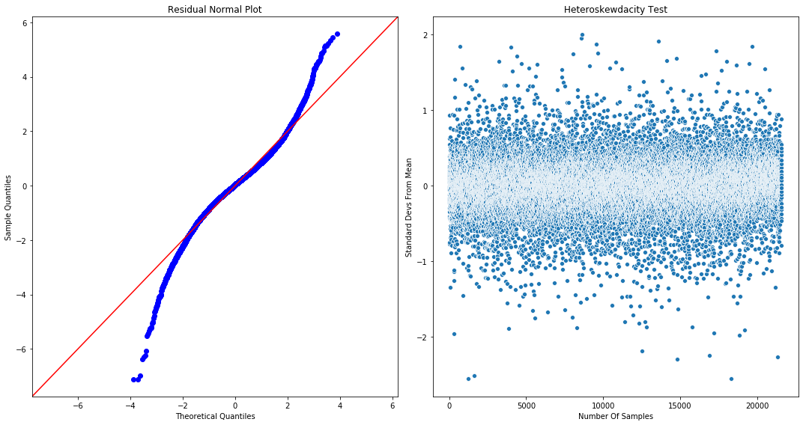


## Base Model Conclusions

As far as base models go, this was a great first attempt. From the R-squared it appears we've been able to capture most of the King County Housing data set's variation.

A note the QQ-plot and heteroskewdacity test. The residuals are clearly homoskewdastic as shown in the plot on the right, thus satisfying that portion of our modeling assumptions. The QQ-plot is less clear just from the graph. Reading the plot on the left we can conclude that the residuals are too steep for a standard normal distribution. This means that more of the residuals lie in the center of the distribution (or the tails are thinner) than would be expected in a standard normal. In a sense, the residuals are displaying less varience than a typical normal. With this finding, we can feel confident about the model's conclusions because the residuals are more centrally clustered than a typical normal, meaning our confidence in each of the predicted coefficients should be higher than that predicted by our model.

# Improving The Baseline Model

Taking a close look at our baseline there are several points to pay attention to. In general it seems as though our approach of leaving all available information in the model has paid off rather significantly, no pun intended. Yet, there are still a number of the independant variables or features of the model that have failed to meet our p-value threshold. We will now go through and eliminate these features.

## Feature Analysis

Our selection process has brought us this far. The following function is taken from the customModule in this repo. It will loop through all the features in the model and remove the ones which don't meet the p-value standard we set (.05 in this case). After removing the insignificant p-values, the function reruns the model and once again checks whether or not the new list of features passes the p-value threshold. This will continue until all the remaining features pass the test.


```python
# for more info on reduceModel, see the docstring or source code in this repo
finalModel, excludedCols = customModule.reduceModel(dfFinal, 
                                                    features = [x for x in dfFinal.drop(columns = 'price').columns], 
                                                    target = 'price', 
                                                    pThreshold = .05)
```

     The starting R-value for the model is 0.8711054845918104
    
    
    The following columns have p-values above the threshold of 0.05: ['waterfront_Null', 'zipcode_98002', 'zipcode_98003', 'zipcode_98168', 'zipcode_98188', 'zipcode_98198', 'day_Monday', 'day_Saturday', 'day_Sunday', 'day_Thursday', 'day_Tuesday', 'day_Wednesday']
    
    

## Improved Model Summary


```python
finalModel.summary()
```


<table class="simpletable">
<caption>OLS Regression Results</caption>
<tr>
  <th>Dep. Variable:</th>          <td>price</td>      <th>  R-squared:         </th> <td>   0.871</td> 
</tr>
<tr>
  <th>Model:</th>                   <td>OLS</td>       <th>  Adj. R-squared:    </th> <td>   0.870</td> 
</tr>
<tr>
  <th>Method:</th>             <td>Least Squares</td>  <th>  F-statistic:       </th> <td>   1556.</td> 
</tr>
<tr>
  <th>Date:</th>             <td>Mon, 10 Aug 2020</td> <th>  Prob (F-statistic):</th>  <td>  0.00</td>  
</tr>
<tr>
  <th>Time:</th>                 <td>23:55:05</td>     <th>  Log-Likelihood:    </th> <td> -8221.9</td> 
</tr>
<tr>
  <th>No. Observations:</th>      <td> 20823</td>      <th>  AIC:               </th> <td>1.663e+04</td>
</tr>
<tr>
  <th>Df Residuals:</th>          <td> 20732</td>      <th>  BIC:               </th> <td>1.735e+04</td>
</tr>
<tr>
  <th>Df Model:</th>              <td>    90</td>      <th>                     </th>     <td> </td>    
</tr>
<tr>
  <th>Covariance Type:</th>      <td>nonrobust</td>    <th>                     </th>     <td> </td>    
</tr>
</table>
<table class="simpletable">
<tr>
         <td></td>           <th>coef</th>     <th>std err</th>      <th>t</th>      <th>P>|t|</th>  <th>[0.025</th>    <th>0.975]</th>  
</tr>
<tr>
  <th>const</th>          <td>   -0.9395</td> <td>    0.028</td> <td>  -33.221</td> <td> 0.000</td> <td>   -0.995</td> <td>   -0.884</td>
</tr>
<tr>
  <th>bedrooms</th>       <td>   -0.0227</td> <td>    0.003</td> <td>   -6.820</td> <td> 0.000</td> <td>   -0.029</td> <td>   -0.016</td>
</tr>
<tr>
  <th>bathrooms</th>      <td>    0.0642</td> <td>    0.004</td> <td>   14.545</td> <td> 0.000</td> <td>    0.056</td> <td>    0.073</td>
</tr>
<tr>
  <th>sqft_living</th>    <td>    0.3495</td> <td>    0.006</td> <td>   57.161</td> <td> 0.000</td> <td>    0.338</td> <td>    0.362</td>
</tr>
<tr>
  <th>sqft_lot</th>       <td>    0.0946</td> <td>    0.004</td> <td>   24.640</td> <td> 0.000</td> <td>    0.087</td> <td>    0.102</td>
</tr>
<tr>
  <th>floors</th>         <td>   -0.0102</td> <td>    0.004</td> <td>   -2.515</td> <td> 0.012</td> <td>   -0.018</td> <td>   -0.002</td>
</tr>
<tr>
  <th>view</th>           <td>    0.0842</td> <td>    0.003</td> <td>   29.310</td> <td> 0.000</td> <td>    0.079</td> <td>    0.090</td>
</tr>
<tr>
  <th>condition</th>      <td>    0.0669</td> <td>    0.003</td> <td>   23.780</td> <td> 0.000</td> <td>    0.061</td> <td>    0.072</td>
</tr>
<tr>
  <th>grade</th>          <td>    0.2057</td> <td>    0.004</td> <td>   46.117</td> <td> 0.000</td> <td>    0.197</td> <td>    0.214</td>
</tr>
<tr>
  <th>sqft_basement</th>  <td>   -0.0618</td> <td>    0.004</td> <td>  -17.263</td> <td> 0.000</td> <td>   -0.069</td> <td>   -0.055</td>
</tr>
<tr>
  <th>yr_built</th>       <td>   -0.0298</td> <td>    0.004</td> <td>   -6.995</td> <td> 0.000</td> <td>   -0.038</td> <td>   -0.021</td>
</tr>
<tr>
  <th>lat</th>            <td>    0.1386</td> <td>    0.014</td> <td>   10.078</td> <td> 0.000</td> <td>    0.112</td> <td>    0.166</td>
</tr>
<tr>
  <th>long</th>           <td>   -0.1114</td> <td>    0.014</td> <td>   -7.955</td> <td> 0.000</td> <td>   -0.139</td> <td>   -0.084</td>
</tr>
<tr>
  <th>sqft_living15</th>  <td>    0.0955</td> <td>    0.004</td> <td>   22.239</td> <td> 0.000</td> <td>    0.087</td> <td>    0.104</td>
</tr>
<tr>
  <th>year</th>           <td>    0.0977</td> <td>    0.008</td> <td>   12.293</td> <td> 0.000</td> <td>    0.082</td> <td>    0.113</td>
</tr>
<tr>
  <th>waterfront_1.0</th> <td>    0.9097</td> <td>    0.046</td> <td>   19.756</td> <td> 0.000</td> <td>    0.819</td> <td>    1.000</td>
</tr>
<tr>
  <th>zipcode_98004</th>  <td>    2.0224</td> <td>    0.037</td> <td>   55.199</td> <td> 0.000</td> <td>    1.951</td> <td>    2.094</td>
</tr>
<tr>
  <th>zipcode_98005</th>  <td>    1.2734</td> <td>    0.042</td> <td>   30.435</td> <td> 0.000</td> <td>    1.191</td> <td>    1.355</td>
</tr>
<tr>
  <th>zipcode_98006</th>  <td>    1.1616</td> <td>    0.032</td> <td>   35.777</td> <td> 0.000</td> <td>    1.098</td> <td>    1.225</td>
</tr>
<tr>
  <th>zipcode_98007</th>  <td>    1.1234</td> <td>    0.044</td> <td>   25.604</td> <td> 0.000</td> <td>    1.037</td> <td>    1.209</td>
</tr>
<tr>
  <th>zipcode_98008</th>  <td>    1.1418</td> <td>    0.040</td> <td>   28.592</td> <td> 0.000</td> <td>    1.063</td> <td>    1.220</td>
</tr>
<tr>
  <th>zipcode_98010</th>  <td>    0.6888</td> <td>    0.049</td> <td>   14.192</td> <td> 0.000</td> <td>    0.594</td> <td>    0.784</td>
</tr>
<tr>
  <th>zipcode_98011</th>  <td>    0.5208</td> <td>    0.049</td> <td>   10.577</td> <td> 0.000</td> <td>    0.424</td> <td>    0.617</td>
</tr>
<tr>
  <th>zipcode_98014</th>  <td>    0.5853</td> <td>    0.069</td> <td>    8.458</td> <td> 0.000</td> <td>    0.450</td> <td>    0.721</td>
</tr>
<tr>
  <th>zipcode_98019</th>  <td>    0.4564</td> <td>    0.061</td> <td>    7.522</td> <td> 0.000</td> <td>    0.337</td> <td>    0.575</td>
</tr>
<tr>
  <th>zipcode_98022</th>  <td>    0.3707</td> <td>    0.041</td> <td>    8.972</td> <td> 0.000</td> <td>    0.290</td> <td>    0.452</td>
</tr>
<tr>
  <th>zipcode_98023</th>  <td>   -0.1397</td> <td>    0.022</td> <td>   -6.495</td> <td> 0.000</td> <td>   -0.182</td> <td>   -0.098</td>
</tr>
<tr>
  <th>zipcode_98024</th>  <td>    0.8646</td> <td>    0.066</td> <td>   13.191</td> <td> 0.000</td> <td>    0.736</td> <td>    0.993</td>
</tr>
<tr>
  <th>zipcode_98027</th>  <td>    1.0235</td> <td>    0.037</td> <td>   27.486</td> <td> 0.000</td> <td>    0.951</td> <td>    1.097</td>
</tr>
<tr>
  <th>zipcode_98028</th>  <td>    0.4120</td> <td>    0.046</td> <td>    9.011</td> <td> 0.000</td> <td>    0.322</td> <td>    0.502</td>
</tr>
<tr>
  <th>zipcode_98029</th>  <td>    1.2033</td> <td>    0.043</td> <td>   27.774</td> <td> 0.000</td> <td>    1.118</td> <td>    1.288</td>
</tr>
<tr>
  <th>zipcode_98030</th>  <td>    0.0884</td> <td>    0.026</td> <td>    3.363</td> <td> 0.001</td> <td>    0.037</td> <td>    0.140</td>
</tr>
<tr>
  <th>zipcode_98031</th>  <td>    0.0966</td> <td>    0.026</td> <td>    3.688</td> <td> 0.000</td> <td>    0.045</td> <td>    0.148</td>
</tr>
<tr>
  <th>zipcode_98032</th>  <td>   -0.1148</td> <td>    0.034</td> <td>   -3.408</td> <td> 0.001</td> <td>   -0.181</td> <td>   -0.049</td>
</tr>
<tr>
  <th>zipcode_98033</th>  <td>    1.2935</td> <td>    0.040</td> <td>   32.628</td> <td> 0.000</td> <td>    1.216</td> <td>    1.371</td>
</tr>
<tr>
  <th>zipcode_98034</th>  <td>    0.7405</td> <td>    0.041</td> <td>   17.924</td> <td> 0.000</td> <td>    0.660</td> <td>    0.822</td>
</tr>
<tr>
  <th>zipcode_98038</th>  <td>    0.4520</td> <td>    0.031</td> <td>   14.437</td> <td> 0.000</td> <td>    0.391</td> <td>    0.513</td>
</tr>
<tr>
  <th>zipcode_98039</th>  <td>    2.3485</td> <td>    0.071</td> <td>   33.080</td> <td> 0.000</td> <td>    2.209</td> <td>    2.488</td>
</tr>
<tr>
  <th>zipcode_98040</th>  <td>    1.5792</td> <td>    0.033</td> <td>   47.478</td> <td> 0.000</td> <td>    1.514</td> <td>    1.644</td>
</tr>
<tr>
  <th>zipcode_98042</th>  <td>    0.1808</td> <td>    0.025</td> <td>    7.240</td> <td> 0.000</td> <td>    0.132</td> <td>    0.230</td>
</tr>
<tr>
  <th>zipcode_98045</th>  <td>    0.9130</td> <td>    0.062</td> <td>   14.740</td> <td> 0.000</td> <td>    0.792</td> <td>    1.034</td>
</tr>
<tr>
  <th>zipcode_98052</th>  <td>    1.0473</td> <td>    0.042</td> <td>   25.043</td> <td> 0.000</td> <td>    0.965</td> <td>    1.129</td>
</tr>
<tr>
  <th>zipcode_98053</th>  <td>    1.0362</td> <td>    0.049</td> <td>   21.163</td> <td> 0.000</td> <td>    0.940</td> <td>    1.132</td>
</tr>
<tr>
  <th>zipcode_98055</th>  <td>    0.2037</td> <td>    0.027</td> <td>    7.457</td> <td> 0.000</td> <td>    0.150</td> <td>    0.257</td>
</tr>
<tr>
  <th>zipcode_98056</th>  <td>    0.5325</td> <td>    0.028</td> <td>   19.228</td> <td> 0.000</td> <td>    0.478</td> <td>    0.587</td>
</tr>
<tr>
  <th>zipcode_98058</th>  <td>    0.2767</td> <td>    0.026</td> <td>   10.683</td> <td> 0.000</td> <td>    0.226</td> <td>    0.327</td>
</tr>
<tr>
  <th>zipcode_98059</th>  <td>    0.6058</td> <td>    0.029</td> <td>   21.207</td> <td> 0.000</td> <td>    0.550</td> <td>    0.662</td>
</tr>
<tr>
  <th>zipcode_98065</th>  <td>    0.9517</td> <td>    0.054</td> <td>   17.736</td> <td> 0.000</td> <td>    0.847</td> <td>    1.057</td>
</tr>
<tr>
  <th>zipcode_98070</th>  <td>    0.3173</td> <td>    0.043</td> <td>    7.378</td> <td> 0.000</td> <td>    0.233</td> <td>    0.402</td>
</tr>
<tr>
  <th>zipcode_98072</th>  <td>    0.6248</td> <td>    0.050</td> <td>   12.594</td> <td> 0.000</td> <td>    0.528</td> <td>    0.722</td>
</tr>
<tr>
  <th>zipcode_98074</th>  <td>    0.9899</td> <td>    0.043</td> <td>   22.916</td> <td> 0.000</td> <td>    0.905</td> <td>    1.075</td>
</tr>
<tr>
  <th>zipcode_98075</th>  <td>    1.0684</td> <td>    0.043</td> <td>   24.591</td> <td> 0.000</td> <td>    0.983</td> <td>    1.154</td>
</tr>
<tr>
  <th>zipcode_98077</th>  <td>    0.5987</td> <td>    0.055</td> <td>   10.870</td> <td> 0.000</td> <td>    0.491</td> <td>    0.707</td>
</tr>
<tr>
  <th>zipcode_98092</th>  <td>    0.0820</td> <td>    0.025</td> <td>    3.233</td> <td> 0.001</td> <td>    0.032</td> <td>    0.132</td>
</tr>
<tr>
  <th>zipcode_98102</th>  <td>    1.6799</td> <td>    0.046</td> <td>   36.303</td> <td> 0.000</td> <td>    1.589</td> <td>    1.771</td>
</tr>
<tr>
  <th>zipcode_98103</th>  <td>    1.3368</td> <td>    0.035</td> <td>   38.009</td> <td> 0.000</td> <td>    1.268</td> <td>    1.406</td>
</tr>
<tr>
  <th>zipcode_98105</th>  <td>    1.6077</td> <td>    0.040</td> <td>   40.455</td> <td> 0.000</td> <td>    1.530</td> <td>    1.686</td>
</tr>
<tr>
  <th>zipcode_98106</th>  <td>    0.4881</td> <td>    0.028</td> <td>   17.646</td> <td> 0.000</td> <td>    0.434</td> <td>    0.542</td>
</tr>
<tr>
  <th>zipcode_98107</th>  <td>    1.3538</td> <td>    0.039</td> <td>   35.066</td> <td> 0.000</td> <td>    1.278</td> <td>    1.430</td>
</tr>
<tr>
  <th>zipcode_98108</th>  <td>    0.5238</td> <td>    0.033</td> <td>   15.762</td> <td> 0.000</td> <td>    0.459</td> <td>    0.589</td>
</tr>
<tr>
  <th>zipcode_98109</th>  <td>    1.6992</td> <td>    0.045</td> <td>   37.568</td> <td> 0.000</td> <td>    1.611</td> <td>    1.788</td>
</tr>
<tr>
  <th>zipcode_98112</th>  <td>    1.8469</td> <td>    0.036</td> <td>   50.729</td> <td> 0.000</td> <td>    1.776</td> <td>    1.918</td>
</tr>
<tr>
  <th>zipcode_98115</th>  <td>    1.3220</td> <td>    0.036</td> <td>   36.790</td> <td> 0.000</td> <td>    1.252</td> <td>    1.392</td>
</tr>
<tr>
  <th>zipcode_98116</th>  <td>    1.2534</td> <td>    0.031</td> <td>   40.374</td> <td> 0.000</td> <td>    1.193</td> <td>    1.314</td>
</tr>
<tr>
  <th>zipcode_98117</th>  <td>    1.2688</td> <td>    0.036</td> <td>   35.017</td> <td> 0.000</td> <td>    1.198</td> <td>    1.340</td>
</tr>
<tr>
  <th>zipcode_98118</th>  <td>    0.7592</td> <td>    0.026</td> <td>   29.492</td> <td> 0.000</td> <td>    0.709</td> <td>    0.810</td>
</tr>
<tr>
  <th>zipcode_98119</th>  <td>    1.6338</td> <td>    0.040</td> <td>   40.940</td> <td> 0.000</td> <td>    1.556</td> <td>    1.712</td>
</tr>
<tr>
  <th>zipcode_98122</th>  <td>    1.4031</td> <td>    0.034</td> <td>   41.316</td> <td> 0.000</td> <td>    1.337</td> <td>    1.470</td>
</tr>
<tr>
  <th>zipcode_98125</th>  <td>    0.7558</td> <td>    0.040</td> <td>   19.045</td> <td> 0.000</td> <td>    0.678</td> <td>    0.834</td>
</tr>
<tr>
  <th>zipcode_98126</th>  <td>    0.8865</td> <td>    0.028</td> <td>   31.490</td> <td> 0.000</td> <td>    0.831</td> <td>    0.942</td>
</tr>
<tr>
  <th>zipcode_98133</th>  <td>    0.4893</td> <td>    0.040</td> <td>   12.116</td> <td> 0.000</td> <td>    0.410</td> <td>    0.568</td>
</tr>
<tr>
  <th>zipcode_98136</th>  <td>    1.1300</td> <td>    0.030</td> <td>   37.099</td> <td> 0.000</td> <td>    1.070</td> <td>    1.190</td>
</tr>
<tr>
  <th>zipcode_98144</th>  <td>    1.1361</td> <td>    0.031</td> <td>   36.552</td> <td> 0.000</td> <td>    1.075</td> <td>    1.197</td>
</tr>
<tr>
  <th>zipcode_98146</th>  <td>    0.3444</td> <td>    0.027</td> <td>   12.743</td> <td> 0.000</td> <td>    0.291</td> <td>    0.397</td>
</tr>
<tr>
  <th>zipcode_98148</th>  <td>    0.1464</td> <td>    0.049</td> <td>    2.977</td> <td> 0.003</td> <td>    0.050</td> <td>    0.243</td>
</tr>
<tr>
  <th>zipcode_98155</th>  <td>    0.4143</td> <td>    0.043</td> <td>    9.716</td> <td> 0.000</td> <td>    0.331</td> <td>    0.498</td>
</tr>
<tr>
  <th>zipcode_98166</th>  <td>    0.4364</td> <td>    0.027</td> <td>   16.395</td> <td> 0.000</td> <td>    0.384</td> <td>    0.489</td>
</tr>
<tr>
  <th>zipcode_98177</th>  <td>    0.7014</td> <td>    0.044</td> <td>   15.835</td> <td> 0.000</td> <td>    0.615</td> <td>    0.788</td>
</tr>
<tr>
  <th>zipcode_98178</th>  <td>    0.1633</td> <td>    0.028</td> <td>    5.819</td> <td> 0.000</td> <td>    0.108</td> <td>    0.218</td>
</tr>
<tr>
  <th>zipcode_98199</th>  <td>    1.3697</td> <td>    0.036</td> <td>   37.733</td> <td> 0.000</td> <td>    1.299</td> <td>    1.441</td>
</tr>
<tr>
  <th>month_2</th>        <td>    0.0493</td> <td>    0.016</td> <td>    3.148</td> <td> 0.002</td> <td>    0.019</td> <td>    0.080</td>
</tr>
<tr>
  <th>month_3</th>        <td>    0.1053</td> <td>    0.014</td> <td>    7.268</td> <td> 0.000</td> <td>    0.077</td> <td>    0.134</td>
</tr>
<tr>
  <th>month_4</th>        <td>    0.1459</td> <td>    0.014</td> <td>   10.348</td> <td> 0.000</td> <td>    0.118</td> <td>    0.174</td>
</tr>
<tr>
  <th>month_5</th>        <td>    0.1793</td> <td>    0.019</td> <td>    9.582</td> <td> 0.000</td> <td>    0.143</td> <td>    0.216</td>
</tr>
<tr>
  <th>month_6</th>        <td>    0.2183</td> <td>    0.022</td> <td>    9.873</td> <td> 0.000</td> <td>    0.175</td> <td>    0.262</td>
</tr>
<tr>
  <th>month_7</th>        <td>    0.2058</td> <td>    0.022</td> <td>    9.314</td> <td> 0.000</td> <td>    0.162</td> <td>    0.249</td>
</tr>
<tr>
  <th>month_8</th>        <td>    0.2040</td> <td>    0.022</td> <td>    9.155</td> <td> 0.000</td> <td>    0.160</td> <td>    0.248</td>
</tr>
<tr>
  <th>month_9</th>        <td>    0.1918</td> <td>    0.022</td> <td>    8.555</td> <td> 0.000</td> <td>    0.148</td> <td>    0.236</td>
</tr>
<tr>
  <th>month_10</th>       <td>    0.1951</td> <td>    0.022</td> <td>    8.728</td> <td> 0.000</td> <td>    0.151</td> <td>    0.239</td>
</tr>
<tr>
  <th>month_11</th>       <td>    0.1917</td> <td>    0.023</td> <td>    8.381</td> <td> 0.000</td> <td>    0.147</td> <td>    0.237</td>
</tr>
<tr>
  <th>month_12</th>       <td>    0.2100</td> <td>    0.023</td> <td>    9.216</td> <td> 0.000</td> <td>    0.165</td> <td>    0.255</td>
</tr>
</table>
<table class="simpletable">
<tr>
  <th>Omnibus:</th>       <td>1647.603</td> <th>  Durbin-Watson:     </th> <td>   2.002</td>
</tr>
<tr>
  <th>Prob(Omnibus):</th>  <td> 0.000</td>  <th>  Jarque-Bera (JB):  </th> <td>7411.841</td>
</tr>
<tr>
  <th>Skew:</th>           <td>-0.266</td>  <th>  Prob(JB):          </th> <td>    0.00</td>
</tr>
<tr>
  <th>Kurtosis:</th>       <td> 5.874</td>  <th>  Cond. No.          </th> <td>    186.</td>
</tr>
</table><br/><br/>Warnings:<br/>[1] Standard Errors assume that the covariance matrix of the errors is correctly specified.


```python
# Pull the rediduals for the model from the finalModel object
residuals = finalModel.resid

# Initialize a figure
plt.figure(figsize=(15,8))
axes1 = plt.subplot(1,2,1)
axes2 = plt.subplot(1,2,2)
sm.graphics.qqplot(residuals, dist=stats.norm, line='45', fit=True, ax = axes1)
sns.scatterplot(data = residuals, ax = axes2)

# Plot formatting
plt.style.use('ggplot')
axes1.set_title("Residual Normal Plot")
axes2.set_title("Heteroskewdacity Test")
axes2.set_xlabel('Number Of Samples')
axes2.set_ylabel('Standard Devs From Mean')
plt.tight_layout()
plt.show()
```


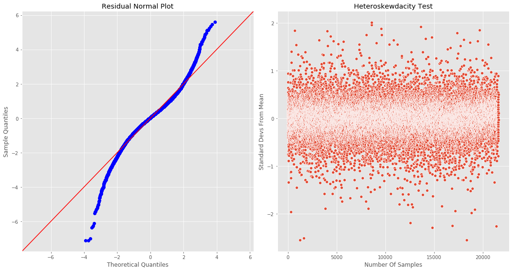


Because we didn't remove any rows from the dataset, the QQ-plot is identical to the above version. Ultimately, improving upon the normality of the residuals can be adjusted by dropping more data from the set in the preprocessing section. We will conclude that the residuals are sufficiently normal and most definately homoskewdastic. We can move forward with answering the original questions with confidence in our model's conclusions. 

If you would like to see all the columns that were removed by the reduceModel funtion then uncomment the following cell


```python
# excludedCols.sort()
# display(excludedCols)
```


```python
sigFeatures = finalModel.params.index[1:]
sigFeaturesFinal = [x for x in sigFeatures]
```

There are some interesting revelations that come out of the unscaled model that we will comment on in the conclusions secion.

## Cross Validating The Model
As a final exercise to test the validity of our model, we will preform a 20 fold cross validation in order to test our models ability to predict the data in each fold, given that it's been trained on the remainder. 


```python
# Because scikit-learn has way better cross-validation build ins we use theirs

# Use the linearRegression class to preform the regression all features determined to be significant. 
linreg = LinearRegression()
cv_20_results = cross_val_score(linreg, dfFinal[sigFeaturesFinal], dfFinal['price'], cv=20, scoring='r2')
display(cv_20_results)
print(f'The median of the cross validation was {np.median(cv_20_results)}')
```


    array([0.88249284, 0.86261438, 0.86960893, 0.87035279, 0.85999201,
           0.86785112, 0.88166402, 0.84859183, 0.85898835, 0.87804441,
           0.87869826, 0.86338673, 0.87081199, 0.87442952, 0.86865441,
           0.87787841, 0.85309918, 0.87760999, 0.86215041, 0.86059339])


    The median of the cross validation was 0.8691316663366389
    

Our cross validation has confirmed the stbility of our model accross various subsets, increasing our confidence in it's ability to accurately reflect the data. 

# Conclusions

## Overview

In general, every feature that remains in the model should be considered significant (the actual statistics definition) predictors of saleprice. That being said, being statistically significant and being one of the most impactful features is not the same. We graph their relationships against each other as follows.


```python
#Pre-sort the values for the visual
dfplot = finalModel.params[1:].sort_values(axis = 0, ascending = True).copy().reset_index()
dfplot.columns = ['Features', 'Coefficient Values']

# Initialize a figure
plt.figure(figsize=(25,15))
sns.barplot(x = 'Features', y = 'Coefficient Values', data = dfplot)

# Plot formatting
plt.title("Relative Feature Impact",size = 'xx-large')
plt.xlabel('Features', size = 'xx-large')
plt.ylabel('Linear Regression Coefficient', size = 'xx-large')
plt.xticks(rotation = 90);
plt.tight_layout()
plt.show()

```


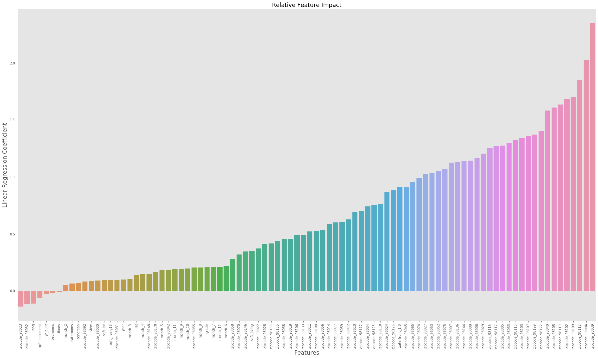


From the visual I think it's fair to conclude there is something to the old addage, location, location, location. We can see the incredible power of a homes zipcode in the following visual. 

### Top Three Features
* 1. Zipcode
* 2. Waterfront Property
* 3. Living Area Square Footage

## Question Answers

###  Question 1: What is the one thing I can do to increase my house value the most?
#### Answer:
If the end goal is to increase your homes price then the best option is to increase the square footage. In the bar graph above, square footage is the only feature that can readily be changed (short of picking the house up and moving it or building a lake). 


###  Question 2: If I have space to add an additional room, what should I put in the space if I want to increase my home value?
#### Answer:
Bathroom without question! According to the model adding a bedroom has a slightly <strong>negative</strong> impact on a homes sale price. Bathrooms on the other hand have a slightly <strong>positive</strong> impact on home price. The following visual explains more clearly.


```python
# Create a copy of the preprocesses data
dfTemp = dfPreprocessed.copy()

# Initialize a Figure
plt.figure(figsize=(12,10))

axes2 = sns.lineplot(x = 'bedrooms', y = 'price', data = dfTemp.loc[dfTemp['bedrooms'] < 15], palette = 'Blues')
axes1 = sns.lineplot(x = 'bathrooms', y = 'price', data = dfTemp.loc[dfTemp['bedrooms'] < 15], palette = 'Reds')

# Plot formatting
axes1.legend(['Bedrooms', 'Bathrooms'])
plt.xlabel('Number Of Rooms')
plt.ylabel('Price (US Dollars)')
plt.title('Home Sale Price Vs Number Of Rooms')
```


    Text(0.5, 1.0, 'Home Sale Price Vs Number Of Rooms')


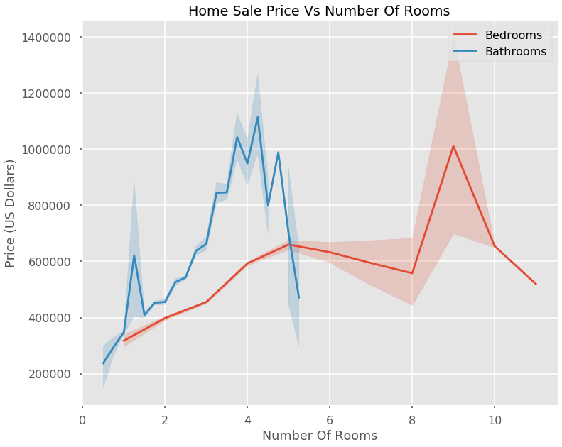


###  Question 3: I'm looking to buy a house in King County. I like a lot of space and don't really care about the neighborhood. What area should I look in to get the most space for my money if I can only spend 400,000 dollars.
#### Answer:
Look in the one of the following areas zipcodes: 98032, 98023, 98030, 98030, 98092, 98148, 98178
##### Answer Explanation:
The model hands us the answer. Becuase all entries are standardized, the magitude of the coefficients say which zip codes have the least impact on home price. To demonstrate the effectiveness, below is a plot of all the homes under 400,000 brocken out by zip code. 


```python
# Initialize a figure
plt.figure(figsize=(25,32))
sns.scatterplot(x = dfPreprocessed['sqft_living'].loc[dfPreprocessed['price'] < 400000],
                y = dfPreprocessed['price'].loc[dfPreprocessed['price'] < 400000],
                hue = dfPreprocessed['zipcode'].loc[(dfPreprocessed['zipcode'] == 98032)| 
                                                    (dfPreprocessed['zipcode'] == 98023) |
                                                    (dfPreprocessed['zipcode'] == 98030) |
                                                    (dfPreprocessed['zipcode'] == 98031) | 
                                                    (dfPreprocessed['zipcode'] == 98092) |
                                                    (dfPreprocessed['zipcode'] == 98148) |
                                                    (dfPreprocessed['zipcode'] == 98178)],
               palette = 'Reds')
sns.scatterplot(x = dfPreprocessed['sqft_living'].loc[dfPreprocessed['price'] < 400000],
                y = dfPreprocessed['price'].loc[dfPreprocessed['price'] < 400000],
                hue = dfPreprocessed['zipcode'].loc[(dfPreprocessed['zipcode'] != 98032) & 
                                                    (dfPreprocessed['zipcode'] != 98023) &
                                                    (dfPreprocessed['zipcode'] != 98030) &
                                                    (dfPreprocessed['zipcode'] != 98031) &
                                                    (dfPreprocessed['zipcode'] != 98092) &
                                                    (dfPreprocessed['zipcode'] != 98148) &
                                                    (dfPreprocessed['zipcode'] != 98178)],
               palette = 'binary')

# Plot Formatting
plt.style.use('seaborn-poster')
plt.title('Price vs Square Feet', size = 'xx-large')
plt.xlabel('Square Feet Of Living Space', size = 'xx-large')
plt.ylabel('Price (US Dollars)', size = 'xx-large')
```


    Text(0, 0.5, 'Price (US Dollars)')


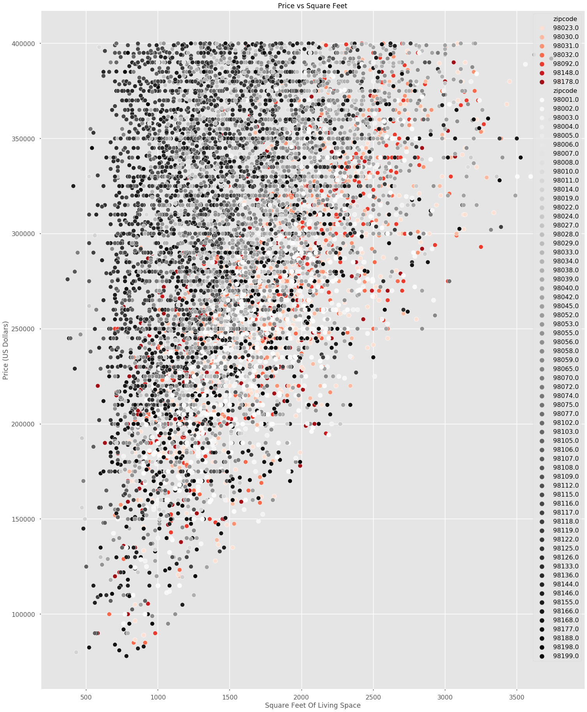


The mentioned zipcodes do not account for all the large and cheap housing stock, but they are the locations with the highest density. 

### Qestion 4: I'm looking to sell my house but I don't have much money for renovations. What should I do to squeeze a little extra money out of the sale?
#### Answer:
Sell your house in June. Highly effective and has no associated cost. 

##### Answer Explanation:
The reason for this isn't clear from an overhead look.


```python
# copy the preprocessed data for manipulation without fear of altering the original data
dfTemp = dfPreprocessed.copy()

# Create new column grouping square footage by the thousand
dfTemp['sqft_living_1000'] = dfTemp['sqft_living'].apply(lambda x: math.floor(x/1000))
dfTemp['control'] = ['Control' for x in range(dfTemp.shape[0])]

# Initialize a figure
plt.figure(figsize=(12,12))
axes = sns.pointplot(x ='month',
                     y ='price',
                     hue = 'month',
                     data = dfTemp);
# Plot formatting adjustments
plt.xticks([0,1,2,3,4,5,6,7,8,9,10,11], 
           ['January', 'February', 'March', 'April', 'May', 
            'June','July','August','September','October',
            'November','December'],
           rotation = 90)
plt.title('Price Vs Month Of Sale', size = 'xx-large')
plt.ylabel('Price (US Dollars)', size = 'x-large')
plt.xlabel('Month Of Sale', size = 'x-large')
plt.legend('')

# Initialize a figure
plt.figure(figsize=(15,15))
axes = sns.boxenplot(x ='sqft_living_1000',
                     y ='price',
                     hue = 'month',
                     data = dfTemp);
axes1 = sns.pointplot(x ='sqft_living_1000',
                      y ='price',hue ='control',  
                      data = dfTemp.loc[dfTemp['sqft_living_1000'] < 5], 
                      color = 'black');
# Plot formatting adjustments
plt.title('Price Vs Sqft Of Living Area: Broken Out By Month Of Sale', size = 'xx-large')
plt.ylabel('Price (US Dollars)', size = 'x-large')
plt.xlabel('House Size (Sqft)', size = 'x-large')
plt.legend('')

```


    <matplotlib.legend.Legend at 0x22ccf478bc8>


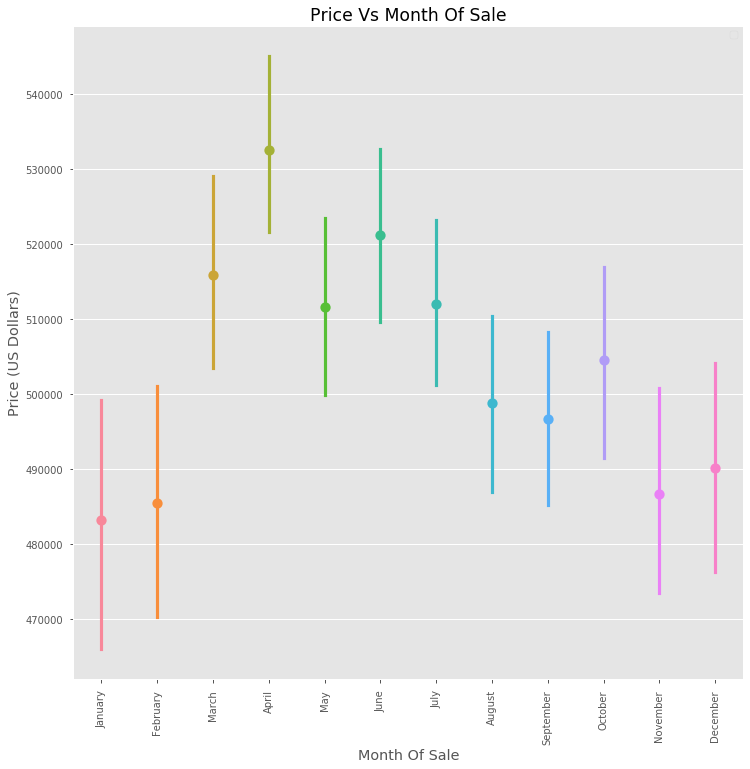


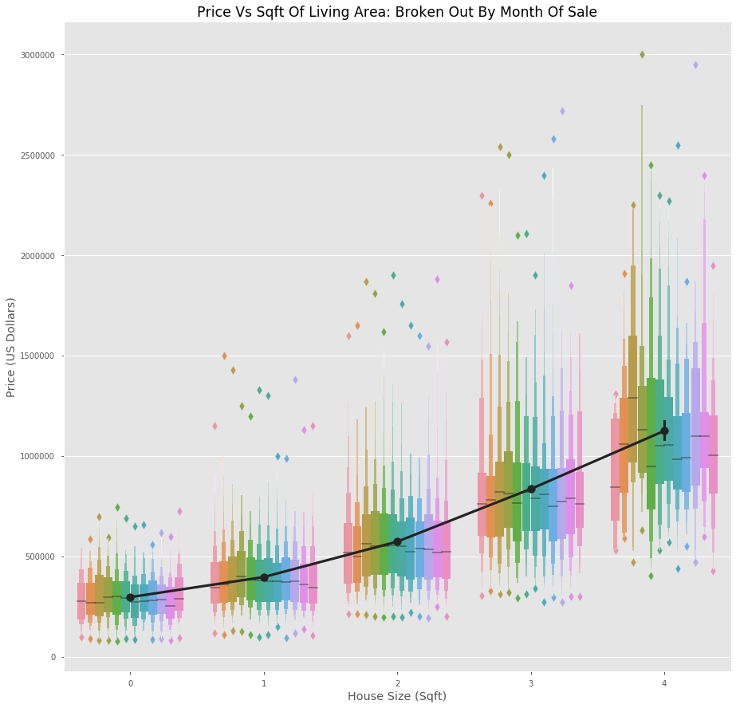


This is why you model! From the above two graphs, it isn't entirely clear as to why June is a great month to sell. It is second in the highest average sale price overall. When breaking the field out into different home sizes, June also fails to be a standout. Does this mean the model is wrong?! 

The model isn't wrong. It expresses each of the features we feed into it interms of a coefficient that engenders the majority of said feature's varience. If this is true then why is what we're seeing not what the model is saying? The reason is the least satisfying kind. It's complicated. While the above graphs use visuals to tease out the relationship between sale month and sale price, the model uses substantially more nuainced methods that take each individual data point into account. Just because we can't find a visual that verifies the assigned value of a feature's coefficient doesn't mean the model is wrong. It means the graph isn't taking into account other factors that might be working under the hood.

# Appendix

## Various Feature Visuals
### Zipcode


```python
# Initialize a figure
plt.figure(figsize=(15,10))
axes = sns.pointplot(x = 'zipcode' , y = 'price', data = dfPreprocessed)

# Plot formatting adjustments
plt.xticks(rotation = 90);
plt.title('Average Sale Price By Zipcode', size = 'xx-large')
plt.ylabel('Price (US Dollars)', size = 'x-large')
plt.xlabel('Zipcode', size = 'x-large')
plt.style.use('seaborn-notebook')
plt.tight_layout()
```


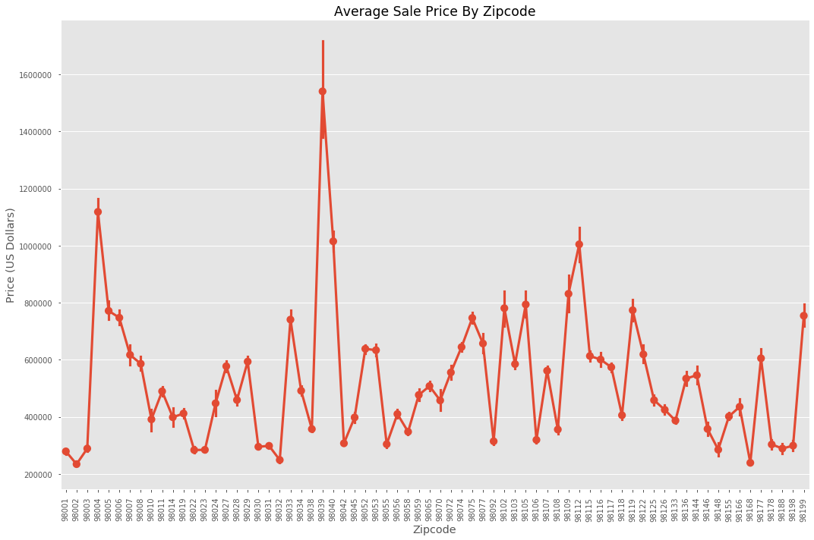


## Number Of Views


```python
# copy the preprocessed data for manipulation without fear of altering the original data
dfTemp = dfPreprocessed.copy()

# Create new column for plotting the unaltered data
dfTemp['control'] = ['Control' for x in range(dfTemp.shape[0])]

# Create new column grouping square footage by the thousand
dfTemp['sqft_living_1000'] = dfTemp['sqft_living'].apply(lambda x: math.floor(x/1000))

# Initialize a figure
plt.figure(figsize=(12,12))
axes = sns.boxenplot(x ='sqft_living_1000',y ='price',hue = 'view', data = dfTemp.loc[dfTemp['sqft_living_1000'] < 5]);
axes1 = sns.pointplot(x ='sqft_living_1000',
                      y ='price',hue ='control',  
                      data = dfTemp.loc[dfTemp['sqft_living_1000'] < 5], 
                      color = 'black');

# Plot formatting adjustments
plt.title('Price Vs Sqft Of Living Area: Broken Out By View Number', size = 'xx-large')
plt.ylabel('Price (US Dollars)', size = 'x-large')
plt.xlabel('House Size (Sqft)', size = 'x-large')
axes.set_xticklabels(['0 - 1000', '1001 - 2000', '2001 - 3000', '3001 - 4000', '4001 - 5000']);
```


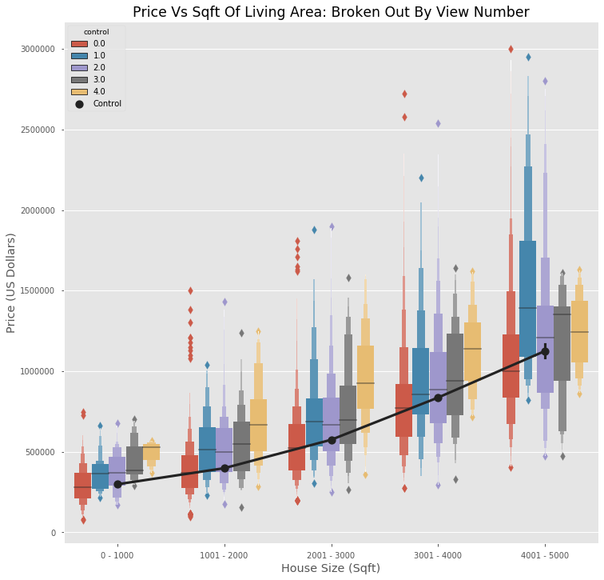


While there is significant overlap, the general trend show by the visual confirms that increased number of views has a positive outcome on sale price. Because of this advertising should be a priority as a relatively low cost solution that will have a boost on your home price.

### Whether Of Not The Property Is On A Waterfront


```python
# copy the preprocessed data for manipulation without fear of altering the original data
dfTemp = dfPreprocessed.copy()

# Create new column grouping square footage by the thousand
dfTemp['sqft_living_1000'] = dfTemp['sqft_living'].apply(lambda x: math.floor(x/1000))

# Create new column for plotting the unaltered data
dfTemp['control'] = ['Control' for x in range(dfTemp.shape[0])]

# Initialize a figure and plot axes
plt.figure(figsize=(10,10))
axes = sns.pointplot(x ='sqft_living_1000',
                     y ='price',hue = 'waterfront', 
                     data = dfTemp.loc[dfTemp['sqft_living_1000'] < 5]);
axes1 = sns.pointplot(x ='sqft_living_1000',
                      y ='price',hue ='control',  
                      data = dfTemp.loc[dfTemp['sqft_living_1000'] < 5], 
                      color = 'black');

# Plot formatting adjustments
plt.title('Price Vs Sqft Of Living Area: Broken Out By Waterfront', size = 'xx-large')
plt.ylabel('Price (US Dollars)', size = 'x-large')
plt.xlabel('House Size (Sqft)', size = 'x-large')
plt.legend()
axes.set_xticklabels(['0 - 1000', '1001 - 2000', '2001 - 3000', '3001 - 4000', '4001 - 5000']);
```


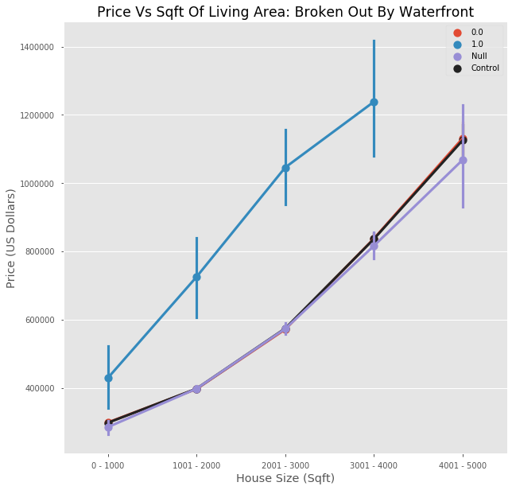


## Correlation Matrix


```python
correlations = np.abs(dfFinal.corr())
correlations
```


<div>
<style scoped>
    .dataframe tbody tr th:only-of-type {
        vertical-align: middle;
    }

    .dataframe tbody tr th {
        vertical-align: top;
    }

    .dataframe thead th {
        text-align: right;
    }
</style>
<table border="1" class="dataframe">
  <thead>
    <tr style="text-align: right;">
      <th></th>
      <th>price</th>
      <th>bedrooms</th>
      <th>bathrooms</th>
      <th>sqft_living</th>
      <th>sqft_lot</th>
      <th>floors</th>
      <th>view</th>
      <th>condition</th>
      <th>grade</th>
      <th>sqft_basement</th>
      <th>yr_built</th>
      <th>lat</th>
      <th>long</th>
      <th>sqft_living15</th>
      <th>year</th>
      <th>waterfront_1.0</th>
      <th>waterfront_Null</th>
      <th>zipcode_98002</th>
      <th>zipcode_98003</th>
      <th>zipcode_98004</th>
      <th>zipcode_98005</th>
      <th>zipcode_98006</th>
      <th>zipcode_98007</th>
      <th>zipcode_98008</th>
      <th>zipcode_98010</th>
      <th>zipcode_98011</th>
      <th>zipcode_98014</th>
      <th>zipcode_98019</th>
      <th>zipcode_98022</th>
      <th>zipcode_98023</th>
      <th>zipcode_98024</th>
      <th>zipcode_98027</th>
      <th>zipcode_98028</th>
      <th>zipcode_98029</th>
      <th>zipcode_98030</th>
      <th>zipcode_98031</th>
      <th>zipcode_98032</th>
      <th>zipcode_98033</th>
      <th>zipcode_98034</th>
      <th>zipcode_98038</th>
      <th>zipcode_98039</th>
      <th>zipcode_98040</th>
      <th>zipcode_98042</th>
      <th>zipcode_98045</th>
      <th>zipcode_98052</th>
      <th>zipcode_98053</th>
      <th>zipcode_98055</th>
      <th>zipcode_98056</th>
      <th>zipcode_98058</th>
      <th>zipcode_98059</th>
      <th>zipcode_98065</th>
      <th>zipcode_98070</th>
      <th>zipcode_98072</th>
      <th>zipcode_98074</th>
      <th>zipcode_98075</th>
      <th>zipcode_98077</th>
      <th>zipcode_98092</th>
      <th>zipcode_98102</th>
      <th>zipcode_98103</th>
      <th>zipcode_98105</th>
      <th>zipcode_98106</th>
      <th>zipcode_98107</th>
      <th>zipcode_98108</th>
      <th>zipcode_98109</th>
      <th>zipcode_98112</th>
      <th>zipcode_98115</th>
      <th>zipcode_98116</th>
      <th>zipcode_98117</th>
      <th>zipcode_98118</th>
      <th>zipcode_98119</th>
      <th>zipcode_98122</th>
      <th>zipcode_98125</th>
      <th>zipcode_98126</th>
      <th>zipcode_98133</th>
      <th>zipcode_98136</th>
      <th>zipcode_98144</th>
      <th>zipcode_98146</th>
      <th>zipcode_98148</th>
      <th>zipcode_98155</th>
      <th>zipcode_98166</th>
      <th>zipcode_98168</th>
      <th>zipcode_98177</th>
      <th>zipcode_98178</th>
      <th>zipcode_98188</th>
      <th>zipcode_98198</th>
      <th>zipcode_98199</th>
      <th>day_Monday</th>
      <th>day_Saturday</th>
      <th>day_Sunday</th>
      <th>day_Thursday</th>
      <th>day_Tuesday</th>
      <th>day_Wednesday</th>
      <th>month_2</th>
      <th>month_3</th>
      <th>month_4</th>
      <th>month_5</th>
      <th>month_6</th>
      <th>month_7</th>
      <th>month_8</th>
      <th>month_9</th>
      <th>month_10</th>
      <th>month_11</th>
      <th>month_12</th>
    </tr>
  </thead>
  <tbody>
    <tr>
      <th>price</th>
      <td>1.000000</td>
      <td>0.311906</td>
      <td>0.493911</td>
      <td>0.631876</td>
      <td>0.075238</td>
      <td>0.297400</td>
      <td>0.261021</td>
      <td>0.044766</td>
      <td>0.659319</td>
      <td>0.260963</td>
      <td>0.062326</td>
      <td>0.481016</td>
      <td>0.038839</td>
      <td>0.570565</td>
      <td>0.009037</td>
      <td>0.073209</td>
      <td>0.006398</td>
      <td>0.136321</td>
      <td>0.115491</td>
      <td>0.196671</td>
      <td>0.091666</td>
      <td>0.134166</td>
      <td>0.046225</td>
      <td>0.052681</td>
      <td>0.031127</td>
      <td>0.012009</td>
      <td>0.031602</td>
      <td>0.022770</td>
      <td>0.098954</td>
      <td>0.161843</td>
      <td>0.008623</td>
      <td>0.055941</td>
      <td>0.004668</td>
      <td>0.062513</td>
      <td>0.102311</td>
      <td>0.102252</td>
      <td>0.098840</td>
      <td>0.124791</td>
      <td>0.011878</td>
      <td>0.093354</td>
      <td>0.094112</td>
      <td>0.172007</td>
      <td>0.142385</td>
      <td>0.032799</td>
      <td>0.108541</td>
      <td>0.082014</td>
      <td>0.101864</td>
      <td>0.047694</td>
      <td>0.091204</td>
      <td>0.003480</td>
      <td>0.021154</td>
      <td>0.006384</td>
      <td>0.037667</td>
      <td>0.096561</td>
      <td>0.127309</td>
      <td>0.061087</td>
      <td>0.101582</td>
      <td>0.068527</td>
      <td>0.073690</td>
      <td>0.104297</td>
      <td>0.101397</td>
      <td>0.046322</td>
      <td>0.054266</td>
      <td>0.079224</td>
      <td>0.160061</td>
      <td>0.089747</td>
      <td>0.060434</td>
      <td>0.067573</td>
      <td>0.059588</td>
      <td>0.092757</td>
      <td>0.061614</td>
      <td>8.451697e-03</td>
      <td>0.031842</td>
      <td>0.057362</td>
      <td>0.026819</td>
      <td>0.027278</td>
      <td>0.087905</td>
      <td>0.053746</td>
      <td>0.046978</td>
      <td>0.029954</td>
      <td>0.157718</td>
      <td>0.049968</td>
      <td>0.107378</td>
      <td>0.082408</td>
      <td>0.116582</td>
      <td>0.110317</td>
      <td>0.012599</td>
      <td>0.006181</td>
      <td>0.011160</td>
      <td>0.010261</td>
      <td>0.003516</td>
      <td>0.006768</td>
      <td>0.022237</td>
      <td>0.005189</td>
      <td>0.037967</td>
      <td>0.007872</td>
      <td>0.020731</td>
      <td>0.007849</td>
      <td>0.004554</td>
      <td>0.005282</td>
      <td>0.005952</td>
      <td>0.021199</td>
      <td>0.018132</td>
    </tr>
    <tr>
      <th>bedrooms</th>
      <td>0.311906</td>
      <td>1.000000</td>
      <td>0.491019</td>
      <td>0.615513</td>
      <td>0.189445</td>
      <td>0.163479</td>
      <td>0.036882</td>
      <td>0.027598</td>
      <td>0.330964</td>
      <td>0.273950</td>
      <td>0.155579</td>
      <td>0.020268</td>
      <td>0.136280</td>
      <td>0.390201</td>
      <td>0.005480</td>
      <td>0.033285</td>
      <td>0.003671</td>
      <td>0.002178</td>
      <td>0.001713</td>
      <td>0.039297</td>
      <td>0.043486</td>
      <td>0.064731</td>
      <td>0.042715</td>
      <td>0.048109</td>
      <td>0.007529</td>
      <td>0.021610</td>
      <td>0.029118</td>
      <td>0.001760</td>
      <td>0.023704</td>
      <td>0.013212</td>
      <td>0.004069</td>
      <td>0.023694</td>
      <td>0.016063</td>
      <td>0.007446</td>
      <td>0.018589</td>
      <td>0.018055</td>
      <td>0.003447</td>
      <td>0.027717</td>
      <td>0.021601</td>
      <td>0.018097</td>
      <td>0.015463</td>
      <td>0.071378</td>
      <td>0.009923</td>
      <td>0.011959</td>
      <td>0.049478</td>
      <td>0.026989</td>
      <td>0.015478</td>
      <td>0.014183</td>
      <td>0.026902</td>
      <td>0.060061</td>
      <td>0.023127</td>
      <td>0.046373</td>
      <td>0.009147</td>
      <td>0.041026</td>
      <td>0.065992</td>
      <td>0.024644</td>
      <td>0.023526</td>
      <td>0.012576</td>
      <td>0.056458</td>
      <td>0.019477</td>
      <td>0.036192</td>
      <td>0.047065</td>
      <td>0.014919</td>
      <td>0.015452</td>
      <td>0.006602</td>
      <td>0.027726</td>
      <td>0.041333</td>
      <td>0.061031</td>
      <td>0.040439</td>
      <td>0.017807</td>
      <td>0.027280</td>
      <td>2.307997e-02</td>
      <td>0.074084</td>
      <td>0.035876</td>
      <td>0.052496</td>
      <td>0.025007</td>
      <td>0.029320</td>
      <td>0.011930</td>
      <td>0.007576</td>
      <td>0.003424</td>
      <td>0.045094</td>
      <td>0.000539</td>
      <td>0.005798</td>
      <td>0.007791</td>
      <td>0.021540</td>
      <td>0.021944</td>
      <td>0.012647</td>
      <td>0.007568</td>
      <td>0.001033</td>
      <td>0.007816</td>
      <td>0.002066</td>
      <td>0.000346</td>
      <td>0.003829</td>
      <td>0.000871</td>
      <td>0.000992</td>
      <td>0.010845</td>
      <td>0.017776</td>
      <td>0.006375</td>
      <td>0.006744</td>
      <td>0.000965</td>
      <td>0.006123</td>
      <td>0.010275</td>
      <td>0.006967</td>
    </tr>
    <tr>
      <th>bathrooms</th>
      <td>0.493911</td>
      <td>0.491019</td>
      <td>1.000000</td>
      <td>0.738722</td>
      <td>0.035013</td>
      <td>0.508065</td>
      <td>0.109401</td>
      <td>0.129592</td>
      <td>0.629044</td>
      <td>0.227995</td>
      <td>0.528566</td>
      <td>0.013104</td>
      <td>0.227986</td>
      <td>0.545608</td>
      <td>0.023642</td>
      <td>0.002093</td>
      <td>0.004477</td>
      <td>0.031894</td>
      <td>0.007750</td>
      <td>0.028947</td>
      <td>0.034422</td>
      <td>0.062543</td>
      <td>0.011824</td>
      <td>0.003309</td>
      <td>0.011411</td>
      <td>0.027669</td>
      <td>0.014458</td>
      <td>0.027676</td>
      <td>0.026232</td>
      <td>0.003368</td>
      <td>0.011002</td>
      <td>0.066585</td>
      <td>0.009632</td>
      <td>0.081615</td>
      <td>0.013772</td>
      <td>0.012327</td>
      <td>0.039587</td>
      <td>0.038990</td>
      <td>0.006822</td>
      <td>0.070543</td>
      <td>0.021841</td>
      <td>0.066147</td>
      <td>0.009598</td>
      <td>0.005236</td>
      <td>0.067020</td>
      <td>0.059403</td>
      <td>0.021079</td>
      <td>0.006613</td>
      <td>0.002791</td>
      <td>0.049543</td>
      <td>0.073611</td>
      <td>0.021168</td>
      <td>0.022951</td>
      <td>0.075381</td>
      <td>0.106161</td>
      <td>0.039815</td>
      <td>0.024446</td>
      <td>0.011409</td>
      <td>0.033955</td>
      <td>0.003921</td>
      <td>0.048428</td>
      <td>0.007529</td>
      <td>0.018576</td>
      <td>0.004422</td>
      <td>0.031030</td>
      <td>0.050770</td>
      <td>0.020522</td>
      <td>0.060730</td>
      <td>0.069983</td>
      <td>0.009757</td>
      <td>0.005109</td>
      <td>5.250603e-02</td>
      <td>0.072224</td>
      <td>0.073191</td>
      <td>0.033926</td>
      <td>0.015519</td>
      <td>0.072718</td>
      <td>0.020333</td>
      <td>0.058561</td>
      <td>0.031853</td>
      <td>0.103755</td>
      <td>0.008316</td>
      <td>0.055074</td>
      <td>0.023517</td>
      <td>0.046972</td>
      <td>0.007678</td>
      <td>0.013053</td>
      <td>0.000387</td>
      <td>0.006622</td>
      <td>0.002927</td>
      <td>0.004415</td>
      <td>0.005047</td>
      <td>0.014012</td>
      <td>0.017306</td>
      <td>0.000393</td>
      <td>0.008734</td>
      <td>0.025072</td>
      <td>0.012965</td>
      <td>0.000893</td>
      <td>0.010695</td>
      <td>0.001137</td>
      <td>0.012602</td>
      <td>0.005498</td>
    </tr>
    <tr>
      <th>sqft_living</th>
      <td>0.631876</td>
      <td>0.615513</td>
      <td>0.738722</td>
      <td>1.000000</td>
      <td>0.290579</td>
      <td>0.355499</td>
      <td>0.172244</td>
      <td>0.047080</td>
      <td>0.710505</td>
      <td>0.383976</td>
      <td>0.349975</td>
      <td>0.031490</td>
      <td>0.254653</td>
      <td>0.729917</td>
      <td>0.027257</td>
      <td>0.009774</td>
      <td>0.003027</td>
      <td>0.044900</td>
      <td>0.010593</td>
      <td>0.062912</td>
      <td>0.058073</td>
      <td>0.101879</td>
      <td>0.022336</td>
      <td>0.014263</td>
      <td>0.004022</td>
      <td>0.034628</td>
      <td>0.015665</td>
      <td>0.019119</td>
      <td>0.027643</td>
      <td>0.001590</td>
      <td>0.006346</td>
      <td>0.064421</td>
      <td>0.021551</td>
      <td>0.042263</td>
      <td>0.003826</td>
      <td>0.001846</td>
      <td>0.027950</td>
      <td>0.045444</td>
      <td>0.005668</td>
      <td>0.036254</td>
      <td>0.035949</td>
      <td>0.097520</td>
      <td>0.004260</td>
      <td>0.009669</td>
      <td>0.078290</td>
      <td>0.070643</td>
      <td>0.029563</td>
      <td>0.001059</td>
      <td>0.011117</td>
      <td>0.065060</td>
      <td>0.071627</td>
      <td>0.018226</td>
      <td>0.045978</td>
      <td>0.095890</td>
      <td>0.132992</td>
      <td>0.074590</td>
      <td>0.026403</td>
      <td>0.007618</td>
      <td>0.078905</td>
      <td>0.004759</td>
      <td>0.095675</td>
      <td>0.065757</td>
      <td>0.036126</td>
      <td>0.000952</td>
      <td>0.041675</td>
      <td>0.038194</td>
      <td>0.030739</td>
      <td>0.071891</td>
      <td>0.077129</td>
      <td>0.008399</td>
      <td>0.035721</td>
      <td>4.878732e-02</td>
      <td>0.088953</td>
      <td>0.075781</td>
      <td>0.047401</td>
      <td>0.032962</td>
      <td>0.065429</td>
      <td>0.026335</td>
      <td>0.048608</td>
      <td>0.002200</td>
      <td>0.087537</td>
      <td>0.025206</td>
      <td>0.044663</td>
      <td>0.021827</td>
      <td>0.039744</td>
      <td>0.010908</td>
      <td>0.007320</td>
      <td>0.009672</td>
      <td>0.005462</td>
      <td>0.001241</td>
      <td>0.000202</td>
      <td>0.000463</td>
      <td>0.013738</td>
      <td>0.015252</td>
      <td>0.002091</td>
      <td>0.008275</td>
      <td>0.021636</td>
      <td>0.019866</td>
      <td>0.004629</td>
      <td>0.004226</td>
      <td>0.001942</td>
      <td>0.013059</td>
      <td>0.002947</td>
    </tr>
    <tr>
      <th>sqft_lot</th>
      <td>0.075238</td>
      <td>0.189445</td>
      <td>0.035013</td>
      <td>0.290579</td>
      <td>1.000000</td>
      <td>0.299699</td>
      <td>0.074813</td>
      <td>0.099089</td>
      <td>0.124063</td>
      <td>0.083309</td>
      <td>0.047665</td>
      <td>0.142125</td>
      <td>0.350288</td>
      <td>0.345238</td>
      <td>0.006582</td>
      <td>0.057071</td>
      <td>0.008613</td>
      <td>0.010872</td>
      <td>0.030163</td>
      <td>0.050385</td>
      <td>0.070337</td>
      <td>0.069198</td>
      <td>0.019576</td>
      <td>0.025601</td>
      <td>0.074723</td>
      <td>0.021286</td>
      <td>0.101661</td>
      <td>0.042854</td>
      <td>0.070764</td>
      <td>0.037632</td>
      <td>0.093185</td>
      <td>0.059022</td>
      <td>0.034016</td>
      <td>0.059824</td>
      <td>0.017873</td>
      <td>0.022532</td>
      <td>0.019176</td>
      <td>0.025761</td>
      <td>0.018931</td>
      <td>0.017643</td>
      <td>0.029658</td>
      <td>0.060990</td>
      <td>0.055543</td>
      <td>0.082113</td>
      <td>0.033247</td>
      <td>0.076767</td>
      <td>0.003732</td>
      <td>0.008459</td>
      <td>0.055578</td>
      <td>0.045561</td>
      <td>0.011399</td>
      <td>0.126743</td>
      <td>0.126024</td>
      <td>0.057098</td>
      <td>0.076594</td>
      <td>0.167409</td>
      <td>0.049414</td>
      <td>0.090844</td>
      <td>0.199459</td>
      <td>0.073445</td>
      <td>0.082149</td>
      <td>0.145579</td>
      <td>0.055162</td>
      <td>0.077414</td>
      <td>0.085642</td>
      <td>0.092360</td>
      <td>0.091992</td>
      <td>0.123324</td>
      <td>0.078388</td>
      <td>0.106301</td>
      <td>0.135701</td>
      <td>2.242076e-02</td>
      <td>0.079926</td>
      <td>0.044453</td>
      <td>0.069649</td>
      <td>0.135814</td>
      <td>0.009711</td>
      <td>0.008617</td>
      <td>0.036869</td>
      <td>0.052395</td>
      <td>0.038232</td>
      <td>0.025429</td>
      <td>0.000002</td>
      <td>0.023505</td>
      <td>0.022736</td>
      <td>0.072993</td>
      <td>0.003964</td>
      <td>0.018592</td>
      <td>0.010755</td>
      <td>0.005261</td>
      <td>0.004145</td>
      <td>0.006208</td>
      <td>0.002799</td>
      <td>0.001023</td>
      <td>0.010108</td>
      <td>0.005347</td>
      <td>0.011482</td>
      <td>0.004685</td>
      <td>0.009969</td>
      <td>0.006977</td>
      <td>0.011827</td>
      <td>0.014761</td>
      <td>0.003540</td>
    </tr>
    <tr>
      <th>...</th>
      <td>...</td>
      <td>...</td>
      <td>...</td>
      <td>...</td>
      <td>...</td>
      <td>...</td>
      <td>...</td>
      <td>...</td>
      <td>...</td>
      <td>...</td>
      <td>...</td>
      <td>...</td>
      <td>...</td>
      <td>...</td>
      <td>...</td>
      <td>...</td>
      <td>...</td>
      <td>...</td>
      <td>...</td>
      <td>...</td>
      <td>...</td>
      <td>...</td>
      <td>...</td>
      <td>...</td>
      <td>...</td>
      <td>...</td>
      <td>...</td>
      <td>...</td>
      <td>...</td>
      <td>...</td>
      <td>...</td>
      <td>...</td>
      <td>...</td>
      <td>...</td>
      <td>...</td>
      <td>...</td>
      <td>...</td>
      <td>...</td>
      <td>...</td>
      <td>...</td>
      <td>...</td>
      <td>...</td>
      <td>...</td>
      <td>...</td>
      <td>...</td>
      <td>...</td>
      <td>...</td>
      <td>...</td>
      <td>...</td>
      <td>...</td>
      <td>...</td>
      <td>...</td>
      <td>...</td>
      <td>...</td>
      <td>...</td>
      <td>...</td>
      <td>...</td>
      <td>...</td>
      <td>...</td>
      <td>...</td>
      <td>...</td>
      <td>...</td>
      <td>...</td>
      <td>...</td>
      <td>...</td>
      <td>...</td>
      <td>...</td>
      <td>...</td>
      <td>...</td>
      <td>...</td>
      <td>...</td>
      <td>...</td>
      <td>...</td>
      <td>...</td>
      <td>...</td>
      <td>...</td>
      <td>...</td>
      <td>...</td>
      <td>...</td>
      <td>...</td>
      <td>...</td>
      <td>...</td>
      <td>...</td>
      <td>...</td>
      <td>...</td>
      <td>...</td>
      <td>...</td>
      <td>...</td>
      <td>...</td>
      <td>...</td>
      <td>...</td>
      <td>...</td>
      <td>...</td>
      <td>...</td>
      <td>...</td>
      <td>...</td>
      <td>...</td>
      <td>...</td>
      <td>...</td>
      <td>...</td>
      <td>...</td>
      <td>...</td>
      <td>...</td>
    </tr>
    <tr>
      <th>month_8</th>
      <td>0.004554</td>
      <td>0.006744</td>
      <td>0.000893</td>
      <td>0.004629</td>
      <td>0.009969</td>
      <td>0.002667</td>
      <td>0.007567</td>
      <td>0.018114</td>
      <td>0.005580</td>
      <td>0.006352</td>
      <td>0.008802</td>
      <td>0.008034</td>
      <td>0.008984</td>
      <td>0.005148</td>
      <td>0.217469</td>
      <td>0.009728</td>
      <td>0.012116</td>
      <td>0.006684</td>
      <td>0.003252</td>
      <td>0.007971</td>
      <td>0.007377</td>
      <td>0.024721</td>
      <td>0.005453</td>
      <td>0.009275</td>
      <td>0.016112</td>
      <td>0.011688</td>
      <td>0.011644</td>
      <td>0.006410</td>
      <td>0.004006</td>
      <td>0.007208</td>
      <td>0.004594</td>
      <td>0.008889</td>
      <td>0.001247</td>
      <td>0.001105</td>
      <td>0.007484</td>
      <td>0.010987</td>
      <td>0.001887</td>
      <td>0.000879</td>
      <td>0.003137</td>
      <td>0.002432</td>
      <td>0.005298</td>
      <td>0.003851</td>
      <td>0.003705</td>
      <td>0.008361</td>
      <td>0.003924</td>
      <td>0.007918</td>
      <td>0.002880</td>
      <td>0.006431</td>
      <td>0.010688</td>
      <td>0.005682</td>
      <td>0.010429</td>
      <td>0.001540</td>
      <td>0.005939</td>
      <td>0.017192</td>
      <td>0.008339</td>
      <td>0.003776</td>
      <td>0.005218</td>
      <td>0.011943</td>
      <td>0.012012</td>
      <td>0.002348</td>
      <td>0.005355</td>
      <td>0.006947</td>
      <td>0.004827</td>
      <td>0.001135</td>
      <td>0.007114</td>
      <td>0.000088</td>
      <td>0.004455</td>
      <td>0.011111</td>
      <td>0.008851</td>
      <td>0.004997</td>
      <td>0.008088</td>
      <td>1.560044e-03</td>
      <td>0.010667</td>
      <td>0.005222</td>
      <td>0.012518</td>
      <td>0.006457</td>
      <td>0.001115</td>
      <td>0.003597</td>
      <td>0.006407</td>
      <td>0.005066</td>
      <td>0.005860</td>
      <td>0.008255</td>
      <td>0.003554</td>
      <td>0.001640</td>
      <td>0.007224</td>
      <td>0.001944</td>
      <td>0.010946</td>
      <td>0.008731</td>
      <td>0.011708</td>
      <td>0.017495</td>
      <td>0.002099</td>
      <td>0.006016</td>
      <td>0.078156</td>
      <td>0.097150</td>
      <td>0.106888</td>
      <td>0.110739</td>
      <td>0.105336</td>
      <td>0.106031</td>
      <td>1.000000</td>
      <td>0.094134</td>
      <td>0.096740</td>
      <td>0.082771</td>
      <td>0.084750</td>
    </tr>
    <tr>
      <th>month_9</th>
      <td>0.005282</td>
      <td>0.000965</td>
      <td>0.010695</td>
      <td>0.004226</td>
      <td>0.006977</td>
      <td>0.001083</td>
      <td>0.011716</td>
      <td>0.010637</td>
      <td>0.001368</td>
      <td>0.001814</td>
      <td>0.003939</td>
      <td>0.001027</td>
      <td>0.005252</td>
      <td>0.004168</td>
      <td>0.207481</td>
      <td>0.000446</td>
      <td>0.006904</td>
      <td>0.007897</td>
      <td>0.006498</td>
      <td>0.003693</td>
      <td>0.000041</td>
      <td>0.001509</td>
      <td>0.009328</td>
      <td>0.008165</td>
      <td>0.007663</td>
      <td>0.007117</td>
      <td>0.011020</td>
      <td>0.002418</td>
      <td>0.001381</td>
      <td>0.009019</td>
      <td>0.003318</td>
      <td>0.009008</td>
      <td>0.001403</td>
      <td>0.001610</td>
      <td>0.006329</td>
      <td>0.006791</td>
      <td>0.007306</td>
      <td>0.010246</td>
      <td>0.004317</td>
      <td>0.001637</td>
      <td>0.007042</td>
      <td>0.003635</td>
      <td>0.004944</td>
      <td>0.003330</td>
      <td>0.003240</td>
      <td>0.003316</td>
      <td>0.001682</td>
      <td>0.013033</td>
      <td>0.002505</td>
      <td>0.000503</td>
      <td>0.017576</td>
      <td>0.000229</td>
      <td>0.009318</td>
      <td>0.005633</td>
      <td>0.014156</td>
      <td>0.008038</td>
      <td>0.009148</td>
      <td>0.009753</td>
      <td>0.005766</td>
      <td>0.000060</td>
      <td>0.004900</td>
      <td>0.002617</td>
      <td>0.000609</td>
      <td>0.000649</td>
      <td>0.003566</td>
      <td>0.004460</td>
      <td>0.000526</td>
      <td>0.010537</td>
      <td>0.005272</td>
      <td>0.002720</td>
      <td>0.003778</td>
      <td>5.435758e-03</td>
      <td>0.000233</td>
      <td>0.011059</td>
      <td>0.002118</td>
      <td>0.000502</td>
      <td>0.002474</td>
      <td>0.011039</td>
      <td>0.000316</td>
      <td>0.000906</td>
      <td>0.004516</td>
      <td>0.006611</td>
      <td>0.004048</td>
      <td>0.004786</td>
      <td>0.003026</td>
      <td>0.003103</td>
      <td>0.000565</td>
      <td>0.005949</td>
      <td>0.007672</td>
      <td>0.004016</td>
      <td>0.015411</td>
      <td>0.013618</td>
      <td>0.074567</td>
      <td>0.092688</td>
      <td>0.101979</td>
      <td>0.105653</td>
      <td>0.100498</td>
      <td>0.101161</td>
      <td>0.094134</td>
      <td>1.000000</td>
      <td>0.092297</td>
      <td>0.078969</td>
      <td>0.080858</td>
    </tr>
    <tr>
      <th>month_10</th>
      <td>0.005952</td>
      <td>0.006123</td>
      <td>0.001137</td>
      <td>0.001942</td>
      <td>0.011827</td>
      <td>0.005397</td>
      <td>0.006998</td>
      <td>0.000965</td>
      <td>0.004067</td>
      <td>0.005466</td>
      <td>0.009312</td>
      <td>0.007209</td>
      <td>0.009989</td>
      <td>0.002783</td>
      <td>0.213226</td>
      <td>0.008344</td>
      <td>0.008565</td>
      <td>0.003088</td>
      <td>0.005839</td>
      <td>0.007027</td>
      <td>0.006515</td>
      <td>0.003107</td>
      <td>0.004612</td>
      <td>0.000262</td>
      <td>0.009362</td>
      <td>0.001284</td>
      <td>0.002046</td>
      <td>0.011262</td>
      <td>0.003409</td>
      <td>0.006750</td>
      <td>0.014895</td>
      <td>0.005826</td>
      <td>0.007793</td>
      <td>0.005319</td>
      <td>0.003247</td>
      <td>0.000654</td>
      <td>0.011666</td>
      <td>0.002500</td>
      <td>0.000702</td>
      <td>0.009610</td>
      <td>0.005820</td>
      <td>0.017262</td>
      <td>0.001307</td>
      <td>0.004226</td>
      <td>0.000400</td>
      <td>0.000071</td>
      <td>0.002699</td>
      <td>0.006188</td>
      <td>0.010369</td>
      <td>0.005256</td>
      <td>0.004905</td>
      <td>0.005839</td>
      <td>0.001717</td>
      <td>0.017386</td>
      <td>0.007030</td>
      <td>0.002760</td>
      <td>0.016365</td>
      <td>0.003914</td>
      <td>0.014207</td>
      <td>0.013609</td>
      <td>0.005349</td>
      <td>0.011030</td>
      <td>0.005236</td>
      <td>0.004358</td>
      <td>0.004946</td>
      <td>0.002855</td>
      <td>0.001004</td>
      <td>0.006014</td>
      <td>0.002772</td>
      <td>0.009049</td>
      <td>0.003393</td>
      <td>6.538418e-07</td>
      <td>0.003079</td>
      <td>0.010431</td>
      <td>0.003946</td>
      <td>0.001040</td>
      <td>0.010051</td>
      <td>0.006333</td>
      <td>0.001329</td>
      <td>0.005485</td>
      <td>0.006389</td>
      <td>0.006426</td>
      <td>0.009955</td>
      <td>0.001658</td>
      <td>0.001739</td>
      <td>0.005082</td>
      <td>0.020885</td>
      <td>0.012026</td>
      <td>0.010722</td>
      <td>0.026700</td>
      <td>0.008578</td>
      <td>0.007252</td>
      <td>0.076631</td>
      <td>0.095255</td>
      <td>0.104803</td>
      <td>0.108579</td>
      <td>0.103281</td>
      <td>0.103962</td>
      <td>0.096740</td>
      <td>0.092297</td>
      <td>1.000000</td>
      <td>0.081156</td>
      <td>0.083097</td>
    </tr>
    <tr>
      <th>month_11</th>
      <td>0.021199</td>
      <td>0.010275</td>
      <td>0.012602</td>
      <td>0.013059</td>
      <td>0.014761</td>
      <td>0.003801</td>
      <td>0.005444</td>
      <td>0.004300</td>
      <td>0.011278</td>
      <td>0.010116</td>
      <td>0.008507</td>
      <td>0.002670</td>
      <td>0.009645</td>
      <td>0.021792</td>
      <td>0.182436</td>
      <td>0.007991</td>
      <td>0.010979</td>
      <td>0.002162</td>
      <td>0.003545</td>
      <td>0.010228</td>
      <td>0.003911</td>
      <td>0.002485</td>
      <td>0.000368</td>
      <td>0.005369</td>
      <td>0.001061</td>
      <td>0.017225</td>
      <td>0.001053</td>
      <td>0.013383</td>
      <td>0.020555</td>
      <td>0.004096</td>
      <td>0.007355</td>
      <td>0.006042</td>
      <td>0.007073</td>
      <td>0.003818</td>
      <td>0.004330</td>
      <td>0.005733</td>
      <td>0.005196</td>
      <td>0.005502</td>
      <td>0.003371</td>
      <td>0.000457</td>
      <td>0.010046</td>
      <td>0.008368</td>
      <td>0.011112</td>
      <td>0.007068</td>
      <td>0.003594</td>
      <td>0.001510</td>
      <td>0.004494</td>
      <td>0.000326</td>
      <td>0.000118</td>
      <td>0.001855</td>
      <td>0.011623</td>
      <td>0.010838</td>
      <td>0.004615</td>
      <td>0.006656</td>
      <td>0.009084</td>
      <td>0.007647</td>
      <td>0.003414</td>
      <td>0.021455</td>
      <td>0.000025</td>
      <td>0.007364</td>
      <td>0.010373</td>
      <td>0.007114</td>
      <td>0.012270</td>
      <td>0.005155</td>
      <td>0.004210</td>
      <td>0.004333</td>
      <td>0.001938</td>
      <td>0.010075</td>
      <td>0.007108</td>
      <td>0.003496</td>
      <td>0.007541</td>
      <td>5.325736e-03</td>
      <td>0.004546</td>
      <td>0.005115</td>
      <td>0.001436</td>
      <td>0.000865</td>
      <td>0.004404</td>
      <td>0.001116</td>
      <td>0.000585</td>
      <td>0.008800</td>
      <td>0.004151</td>
      <td>0.010389</td>
      <td>0.010740</td>
      <td>0.004428</td>
      <td>0.006976</td>
      <td>0.008431</td>
      <td>0.022242</td>
      <td>0.005010</td>
      <td>0.004918</td>
      <td>0.000254</td>
      <td>0.011843</td>
      <td>0.003097</td>
      <td>0.065566</td>
      <td>0.081500</td>
      <td>0.089669</td>
      <td>0.092900</td>
      <td>0.088367</td>
      <td>0.088950</td>
      <td>0.082771</td>
      <td>0.078969</td>
      <td>0.081156</td>
      <td>1.000000</td>
      <td>0.071097</td>
    </tr>
    <tr>
      <th>month_12</th>
      <td>0.018132</td>
      <td>0.006967</td>
      <td>0.005498</td>
      <td>0.002947</td>
      <td>0.003540</td>
      <td>0.005512</td>
      <td>0.010023</td>
      <td>0.006017</td>
      <td>0.000350</td>
      <td>0.009579</td>
      <td>0.002335</td>
      <td>0.000262</td>
      <td>0.014571</td>
      <td>0.004777</td>
      <td>0.186799</td>
      <td>0.002679</td>
      <td>0.006914</td>
      <td>0.006862</td>
      <td>0.007132</td>
      <td>0.002455</td>
      <td>0.001588</td>
      <td>0.012632</td>
      <td>0.001322</td>
      <td>0.001105</td>
      <td>0.008596</td>
      <td>0.011764</td>
      <td>0.011155</td>
      <td>0.000548</td>
      <td>0.004671</td>
      <td>0.022969</td>
      <td>0.011092</td>
      <td>0.011761</td>
      <td>0.004974</td>
      <td>0.016150</td>
      <td>0.002263</td>
      <td>0.000769</td>
      <td>0.011381</td>
      <td>0.002513</td>
      <td>0.014116</td>
      <td>0.006201</td>
      <td>0.010418</td>
      <td>0.003067</td>
      <td>0.004377</td>
      <td>0.000057</td>
      <td>0.000794</td>
      <td>0.008827</td>
      <td>0.002009</td>
      <td>0.000574</td>
      <td>0.002105</td>
      <td>0.003840</td>
      <td>0.012779</td>
      <td>0.007087</td>
      <td>0.008286</td>
      <td>0.003492</td>
      <td>0.002827</td>
      <td>0.005902</td>
      <td>0.009637</td>
      <td>0.001993</td>
      <td>0.000892</td>
      <td>0.003364</td>
      <td>0.009630</td>
      <td>0.001448</td>
      <td>0.003291</td>
      <td>0.002166</td>
      <td>0.010303</td>
      <td>0.005056</td>
      <td>0.011975</td>
      <td>0.003955</td>
      <td>0.004899</td>
      <td>0.003922</td>
      <td>0.002201</td>
      <td>6.348028e-03</td>
      <td>0.002922</td>
      <td>0.004338</td>
      <td>0.000991</td>
      <td>0.009953</td>
      <td>0.005692</td>
      <td>0.006826</td>
      <td>0.025416</td>
      <td>0.012020</td>
      <td>0.001379</td>
      <td>0.002533</td>
      <td>0.004053</td>
      <td>0.000542</td>
      <td>0.001773</td>
      <td>0.002697</td>
      <td>0.046363</td>
      <td>0.000226</td>
      <td>0.013424</td>
      <td>0.027913</td>
      <td>0.013215</td>
      <td>0.009554</td>
      <td>0.067134</td>
      <td>0.083449</td>
      <td>0.091814</td>
      <td>0.095122</td>
      <td>0.090480</td>
      <td>0.091077</td>
      <td>0.084750</td>
      <td>0.080858</td>
      <td>0.083097</td>
      <td>0.071097</td>
      <td>1.000000</td>
    </tr>
  </tbody>
</table>
<p>103 rows × 103 columns</p>
</div>


## Un-Translating Feature Coefficients

Because our data has been transformed and standardized, the coefficients give the scale of the impact of each of the significant features. While this is useful information, it is also important to understand what the model offers as the dollar amount impact of any given feature. However, the transformation process isn't easy to untangle after the model has been created. Becuase of this, we are going to create an additional model using the un-transformed data. It is very important to understand that this second model will not be the same as the first. But, it will serve as a reasonable approximation to our originial mobel when wanting to consider real dollar implications. 


```python
# We revert back to the preprocessed data and start again with building a model
dfNumeric2 = dfPreprocessed.select_dtypes(['int64', 'float64'])
dfCategory2 = dfPreprocessed.select_dtypes('category')
dfEncodedCategory = pd.get_dummies(dfCategory2)
dfFinal2 = pd.concat([dfNumeric2,dfEncodedCategory], axis = 1)
dfFinal2.head()
```


<div>
<style scoped>
    .dataframe tbody tr th:only-of-type {
        vertical-align: middle;
    }

    .dataframe tbody tr th {
        vertical-align: top;
    }

    .dataframe thead th {
        text-align: right;
    }
</style>
<table border="1" class="dataframe">
  <thead>
    <tr style="text-align: right;">
      <th></th>
      <th>id</th>
      <th>price</th>
      <th>bedrooms</th>
      <th>bathrooms</th>
      <th>sqft_living</th>
      <th>sqft_lot</th>
      <th>floors</th>
      <th>view</th>
      <th>condition</th>
      <th>grade</th>
      <th>sqft_above</th>
      <th>sqft_basement</th>
      <th>yr_built</th>
      <th>lat</th>
      <th>long</th>
      <th>sqft_living15</th>
      <th>sqft_lot15</th>
      <th>year</th>
      <th>waterfront_0.0</th>
      <th>waterfront_1.0</th>
      <th>waterfront_Null</th>
      <th>zipcode_98001</th>
      <th>zipcode_98002</th>
      <th>zipcode_98003</th>
      <th>zipcode_98004</th>
      <th>zipcode_98005</th>
      <th>zipcode_98006</th>
      <th>zipcode_98007</th>
      <th>zipcode_98008</th>
      <th>zipcode_98010</th>
      <th>zipcode_98011</th>
      <th>zipcode_98014</th>
      <th>zipcode_98019</th>
      <th>zipcode_98022</th>
      <th>zipcode_98023</th>
      <th>zipcode_98024</th>
      <th>zipcode_98027</th>
      <th>zipcode_98028</th>
      <th>zipcode_98029</th>
      <th>zipcode_98030</th>
      <th>zipcode_98031</th>
      <th>zipcode_98032</th>
      <th>zipcode_98033</th>
      <th>zipcode_98034</th>
      <th>zipcode_98038</th>
      <th>zipcode_98039</th>
      <th>zipcode_98040</th>
      <th>zipcode_98042</th>
      <th>zipcode_98045</th>
      <th>zipcode_98052</th>
      <th>zipcode_98053</th>
      <th>zipcode_98055</th>
      <th>zipcode_98056</th>
      <th>zipcode_98058</th>
      <th>zipcode_98059</th>
      <th>zipcode_98065</th>
      <th>zipcode_98070</th>
      <th>zipcode_98072</th>
      <th>zipcode_98074</th>
      <th>zipcode_98075</th>
      <th>zipcode_98077</th>
      <th>zipcode_98092</th>
      <th>zipcode_98102</th>
      <th>zipcode_98103</th>
      <th>zipcode_98105</th>
      <th>zipcode_98106</th>
      <th>zipcode_98107</th>
      <th>zipcode_98108</th>
      <th>zipcode_98109</th>
      <th>zipcode_98112</th>
      <th>zipcode_98115</th>
      <th>zipcode_98116</th>
      <th>zipcode_98117</th>
      <th>zipcode_98118</th>
      <th>zipcode_98119</th>
      <th>zipcode_98122</th>
      <th>zipcode_98125</th>
      <th>zipcode_98126</th>
      <th>zipcode_98133</th>
      <th>zipcode_98136</th>
      <th>zipcode_98144</th>
      <th>zipcode_98146</th>
      <th>zipcode_98148</th>
      <th>zipcode_98155</th>
      <th>zipcode_98166</th>
      <th>zipcode_98168</th>
      <th>zipcode_98177</th>
      <th>zipcode_98178</th>
      <th>zipcode_98188</th>
      <th>zipcode_98198</th>
      <th>zipcode_98199</th>
      <th>day_Friday</th>
      <th>day_Monday</th>
      <th>day_Saturday</th>
      <th>day_Sunday</th>
      <th>day_Thursday</th>
      <th>day_Tuesday</th>
      <th>day_Wednesday</th>
      <th>month_1</th>
      <th>month_2</th>
      <th>month_3</th>
      <th>month_4</th>
      <th>month_5</th>
      <th>month_6</th>
      <th>month_7</th>
      <th>month_8</th>
      <th>month_9</th>
      <th>month_10</th>
      <th>month_11</th>
      <th>month_12</th>
    </tr>
  </thead>
  <tbody>
    <tr>
      <th>0</th>
      <td>7129300520</td>
      <td>221900.0</td>
      <td>3</td>
      <td>1.00</td>
      <td>1180</td>
      <td>5650</td>
      <td>1.0</td>
      <td>0.0</td>
      <td>3</td>
      <td>7</td>
      <td>1180</td>
      <td>0.0</td>
      <td>1955</td>
      <td>47.5112</td>
      <td>-122.257</td>
      <td>1340</td>
      <td>5650</td>
      <td>2014</td>
      <td>0</td>
      <td>0</td>
      <td>1</td>
      <td>0</td>
      <td>0</td>
      <td>0</td>
      <td>0</td>
      <td>0</td>
      <td>0</td>
      <td>0</td>
      <td>0</td>
      <td>0</td>
      <td>0</td>
      <td>0</td>
      <td>0</td>
      <td>0</td>
      <td>0</td>
      <td>0</td>
      <td>0</td>
      <td>0</td>
      <td>0</td>
      <td>0</td>
      <td>0</td>
      <td>0</td>
      <td>0</td>
      <td>0</td>
      <td>0</td>
      <td>0</td>
      <td>0</td>
      <td>0</td>
      <td>0</td>
      <td>0</td>
      <td>0</td>
      <td>0</td>
      <td>0</td>
      <td>0</td>
      <td>0</td>
      <td>0</td>
      <td>0</td>
      <td>0</td>
      <td>0</td>
      <td>0</td>
      <td>0</td>
      <td>0</td>
      <td>0</td>
      <td>0</td>
      <td>0</td>
      <td>0</td>
      <td>0</td>
      <td>0</td>
      <td>0</td>
      <td>0</td>
      <td>0</td>
      <td>0</td>
      <td>0</td>
      <td>0</td>
      <td>0</td>
      <td>0</td>
      <td>0</td>
      <td>0</td>
      <td>0</td>
      <td>0</td>
      <td>0</td>
      <td>0</td>
      <td>0</td>
      <td>0</td>
      <td>0</td>
      <td>0</td>
      <td>0</td>
      <td>1</td>
      <td>0</td>
      <td>0</td>
      <td>0</td>
      <td>0</td>
      <td>1</td>
      <td>0</td>
      <td>0</td>
      <td>0</td>
      <td>0</td>
      <td>0</td>
      <td>0</td>
      <td>0</td>
      <td>0</td>
      <td>0</td>
      <td>0</td>
      <td>0</td>
      <td>0</td>
      <td>0</td>
      <td>0</td>
      <td>1</td>
      <td>0</td>
      <td>0</td>
    </tr>
    <tr>
      <th>1</th>
      <td>6414100192</td>
      <td>538000.0</td>
      <td>3</td>
      <td>2.25</td>
      <td>2570</td>
      <td>7242</td>
      <td>2.0</td>
      <td>0.0</td>
      <td>3</td>
      <td>7</td>
      <td>2170</td>
      <td>400.0</td>
      <td>1951</td>
      <td>47.7210</td>
      <td>-122.319</td>
      <td>1690</td>
      <td>7639</td>
      <td>2014</td>
      <td>1</td>
      <td>0</td>
      <td>0</td>
      <td>0</td>
      <td>0</td>
      <td>0</td>
      <td>0</td>
      <td>0</td>
      <td>0</td>
      <td>0</td>
      <td>0</td>
      <td>0</td>
      <td>0</td>
      <td>0</td>
      <td>0</td>
      <td>0</td>
      <td>0</td>
      <td>0</td>
      <td>0</td>
      <td>0</td>
      <td>0</td>
      <td>0</td>
      <td>0</td>
      <td>0</td>
      <td>0</td>
      <td>0</td>
      <td>0</td>
      <td>0</td>
      <td>0</td>
      <td>0</td>
      <td>0</td>
      <td>0</td>
      <td>0</td>
      <td>0</td>
      <td>0</td>
      <td>0</td>
      <td>0</td>
      <td>0</td>
      <td>0</td>
      <td>0</td>
      <td>0</td>
      <td>0</td>
      <td>0</td>
      <td>0</td>
      <td>0</td>
      <td>0</td>
      <td>0</td>
      <td>0</td>
      <td>0</td>
      <td>0</td>
      <td>0</td>
      <td>0</td>
      <td>0</td>
      <td>0</td>
      <td>0</td>
      <td>0</td>
      <td>0</td>
      <td>0</td>
      <td>1</td>
      <td>0</td>
      <td>0</td>
      <td>0</td>
      <td>0</td>
      <td>0</td>
      <td>0</td>
      <td>0</td>
      <td>0</td>
      <td>0</td>
      <td>0</td>
      <td>0</td>
      <td>0</td>
      <td>0</td>
      <td>0</td>
      <td>0</td>
      <td>0</td>
      <td>0</td>
      <td>0</td>
      <td>0</td>
      <td>1</td>
      <td>0</td>
      <td>0</td>
      <td>0</td>
      <td>0</td>
      <td>0</td>
      <td>0</td>
      <td>0</td>
      <td>0</td>
      <td>0</td>
      <td>0</td>
      <td>0</td>
      <td>0</td>
      <td>1</td>
    </tr>
    <tr>
      <th>2</th>
      <td>5631500400</td>
      <td>180000.0</td>
      <td>2</td>
      <td>1.00</td>
      <td>770</td>
      <td>10000</td>
      <td>1.0</td>
      <td>0.0</td>
      <td>3</td>
      <td>6</td>
      <td>770</td>
      <td>0.0</td>
      <td>1933</td>
      <td>47.7379</td>
      <td>-122.233</td>
      <td>2720</td>
      <td>8062</td>
      <td>2015</td>
      <td>1</td>
      <td>0</td>
      <td>0</td>
      <td>0</td>
      <td>0</td>
      <td>0</td>
      <td>0</td>
      <td>0</td>
      <td>0</td>
      <td>0</td>
      <td>0</td>
      <td>0</td>
      <td>0</td>
      <td>0</td>
      <td>0</td>
      <td>0</td>
      <td>0</td>
      <td>0</td>
      <td>0</td>
      <td>1</td>
      <td>0</td>
      <td>0</td>
      <td>0</td>
      <td>0</td>
      <td>0</td>
      <td>0</td>
      <td>0</td>
      <td>0</td>
      <td>0</td>
      <td>0</td>
      <td>0</td>
      <td>0</td>
      <td>0</td>
      <td>0</td>
      <td>0</td>
      <td>0</td>
      <td>0</td>
      <td>0</td>
      <td>0</td>
      <td>0</td>
      <td>0</td>
      <td>0</td>
      <td>0</td>
      <td>0</td>
      <td>0</td>
      <td>0</td>
      <td>0</td>
      <td>0</td>
      <td>0</td>
      <td>0</td>
      <td>0</td>
      <td>0</td>
      <td>0</td>
      <td>0</td>
      <td>0</td>
      <td>0</td>
      <td>0</td>
      <td>0</td>
      <td>0</td>
      <td>0</td>
      <td>0</td>
      <td>0</td>
      <td>0</td>
      <td>0</td>
      <td>0</td>
      <td>0</td>
      <td>0</td>
      <td>0</td>
      <td>0</td>
      <td>0</td>
      <td>0</td>
      <td>0</td>
      <td>0</td>
      <td>0</td>
      <td>0</td>
      <td>0</td>
      <td>0</td>
      <td>0</td>
      <td>0</td>
      <td>1</td>
      <td>0</td>
      <td>1</td>
      <td>0</td>
      <td>0</td>
      <td>0</td>
      <td>0</td>
      <td>0</td>
      <td>0</td>
      <td>0</td>
      <td>0</td>
      <td>0</td>
      <td>0</td>
    </tr>
    <tr>
      <th>3</th>
      <td>2487200875</td>
      <td>604000.0</td>
      <td>4</td>
      <td>3.00</td>
      <td>1960</td>
      <td>5000</td>
      <td>1.0</td>
      <td>0.0</td>
      <td>5</td>
      <td>7</td>
      <td>1050</td>
      <td>910.0</td>
      <td>1965</td>
      <td>47.5208</td>
      <td>-122.393</td>
      <td>1360</td>
      <td>5000</td>
      <td>2014</td>
      <td>1</td>
      <td>0</td>
      <td>0</td>
      <td>0</td>
      <td>0</td>
      <td>0</td>
      <td>0</td>
      <td>0</td>
      <td>0</td>
      <td>0</td>
      <td>0</td>
      <td>0</td>
      <td>0</td>
      <td>0</td>
      <td>0</td>
      <td>0</td>
      <td>0</td>
      <td>0</td>
      <td>0</td>
      <td>0</td>
      <td>0</td>
      <td>0</td>
      <td>0</td>
      <td>0</td>
      <td>0</td>
      <td>0</td>
      <td>0</td>
      <td>0</td>
      <td>0</td>
      <td>0</td>
      <td>0</td>
      <td>0</td>
      <td>0</td>
      <td>0</td>
      <td>0</td>
      <td>0</td>
      <td>0</td>
      <td>0</td>
      <td>0</td>
      <td>0</td>
      <td>0</td>
      <td>0</td>
      <td>0</td>
      <td>0</td>
      <td>0</td>
      <td>0</td>
      <td>0</td>
      <td>0</td>
      <td>0</td>
      <td>0</td>
      <td>0</td>
      <td>0</td>
      <td>0</td>
      <td>0</td>
      <td>0</td>
      <td>0</td>
      <td>0</td>
      <td>0</td>
      <td>0</td>
      <td>0</td>
      <td>0</td>
      <td>1</td>
      <td>0</td>
      <td>0</td>
      <td>0</td>
      <td>0</td>
      <td>0</td>
      <td>0</td>
      <td>0</td>
      <td>0</td>
      <td>0</td>
      <td>0</td>
      <td>0</td>
      <td>0</td>
      <td>0</td>
      <td>0</td>
      <td>0</td>
      <td>0</td>
      <td>1</td>
      <td>0</td>
      <td>0</td>
      <td>0</td>
      <td>0</td>
      <td>0</td>
      <td>0</td>
      <td>0</td>
      <td>0</td>
      <td>0</td>
      <td>0</td>
      <td>0</td>
      <td>0</td>
      <td>1</td>
    </tr>
    <tr>
      <th>4</th>
      <td>1954400510</td>
      <td>510000.0</td>
      <td>3</td>
      <td>2.00</td>
      <td>1680</td>
      <td>8080</td>
      <td>1.0</td>
      <td>0.0</td>
      <td>3</td>
      <td>8</td>
      <td>1680</td>
      <td>0.0</td>
      <td>1987</td>
      <td>47.6168</td>
      <td>-122.045</td>
      <td>1800</td>
      <td>7503</td>
      <td>2015</td>
      <td>1</td>
      <td>0</td>
      <td>0</td>
      <td>0</td>
      <td>0</td>
      <td>0</td>
      <td>0</td>
      <td>0</td>
      <td>0</td>
      <td>0</td>
      <td>0</td>
      <td>0</td>
      <td>0</td>
      <td>0</td>
      <td>0</td>
      <td>0</td>
      <td>0</td>
      <td>0</td>
      <td>0</td>
      <td>0</td>
      <td>0</td>
      <td>0</td>
      <td>0</td>
      <td>0</td>
      <td>0</td>
      <td>0</td>
      <td>0</td>
      <td>0</td>
      <td>0</td>
      <td>0</td>
      <td>0</td>
      <td>0</td>
      <td>0</td>
      <td>0</td>
      <td>0</td>
      <td>0</td>
      <td>0</td>
      <td>0</td>
      <td>0</td>
      <td>0</td>
      <td>1</td>
      <td>0</td>
      <td>0</td>
      <td>0</td>
      <td>0</td>
      <td>0</td>
      <td>0</td>
      <td>0</td>
      <td>0</td>
      <td>0</td>
      <td>0</td>
      <td>0</td>
      <td>0</td>
      <td>0</td>
      <td>0</td>
      <td>0</td>
      <td>0</td>
      <td>0</td>
      <td>0</td>
      <td>0</td>
      <td>0</td>
      <td>0</td>
      <td>0</td>
      <td>0</td>
      <td>0</td>
      <td>0</td>
      <td>0</td>
      <td>0</td>
      <td>0</td>
      <td>0</td>
      <td>0</td>
      <td>0</td>
      <td>0</td>
      <td>0</td>
      <td>0</td>
      <td>0</td>
      <td>0</td>
      <td>0</td>
      <td>0</td>
      <td>1</td>
      <td>0</td>
      <td>1</td>
      <td>0</td>
      <td>0</td>
      <td>0</td>
      <td>0</td>
      <td>0</td>
      <td>0</td>
      <td>0</td>
      <td>0</td>
      <td>0</td>
      <td>0</td>
    </tr>
  </tbody>
</table>
</div>


```python
# make the untranslated model and print out the summary
finalModel2, excludedCols = customModule.reduceModel(dfFinal2, 
                                                    features =list(dfFinal2[sigFeatures].columns), 
                                                    target = 'price', 
                                                    pThreshold = .05,
                                                    addConstant = True)
finalModel2.summary()
```

     The starting R-value for the model is 0.8210902442136012
    
    
    The following columns have p-values above the threshold of 0.05: ['long', 'zipcode_98011', 'zipcode_98019', 'zipcode_98028', 'zipcode_98030', 'zipcode_98031', 'zipcode_98032', 'zipcode_98042', 'zipcode_98055', 'zipcode_98058', 'zipcode_98070', 'zipcode_98148', 'zipcode_98178', 'month_2']
    
    The following columns have p-values above the threshold of 0.05: ['zipcode_98014']
    
    


<table class="simpletable">
<caption>OLS Regression Results</caption>
<tr>
  <th>Dep. Variable:</th>          <td>price</td>      <th>  R-squared:         </th>  <td>   0.821</td>  
</tr>
<tr>
  <th>Model:</th>                   <td>OLS</td>       <th>  Adj. R-squared:    </th>  <td>   0.820</td>  
</tr>
<tr>
  <th>Method:</th>             <td>Least Squares</td>  <th>  F-statistic:       </th>  <td>   1266.</td>  
</tr>
<tr>
  <th>Date:</th>             <td>Mon, 10 Aug 2020</td> <th>  Prob (F-statistic):</th>   <td>  0.00</td>   
</tr>
<tr>
  <th>Time:</th>                 <td>23:55:22</td>     <th>  Log-Likelihood:    </th> <td>-2.7214e+05</td>
</tr>
<tr>
  <th>No. Observations:</th>      <td> 20823</td>      <th>  AIC:               </th>  <td>5.444e+05</td> 
</tr>
<tr>
  <th>Df Residuals:</th>          <td> 20747</td>      <th>  BIC:               </th>  <td>5.450e+05</td> 
</tr>
<tr>
  <th>Df Model:</th>              <td>    75</td>      <th>                     </th>      <td> </td>     
</tr>
<tr>
  <th>Covariance Type:</th>      <td>nonrobust</td>    <th>                     </th>      <td> </td>     
</tr>
</table>
<table class="simpletable">
<tr>
         <td></td>           <th>coef</th>     <th>std err</th>      <th>t</th>      <th>P>|t|</th>  <th>[0.025</th>    <th>0.975]</th>  
</tr>
<tr>
  <th>const</th>          <td> -1.01e+08</td> <td> 1.09e+07</td> <td>   -9.231</td> <td> 0.000</td> <td>-1.22e+08</td> <td>-7.96e+07</td>
</tr>
<tr>
  <th>bedrooms</th>       <td>-1.197e+04</td> <td> 1142.744</td> <td>  -10.478</td> <td> 0.000</td> <td>-1.42e+04</td> <td>-9734.334</td>
</tr>
<tr>
  <th>bathrooms</th>      <td> 2.074e+04</td> <td> 1953.071</td> <td>   10.617</td> <td> 0.000</td> <td> 1.69e+04</td> <td> 2.46e+04</td>
</tr>
<tr>
  <th>sqft_living</th>    <td>  145.0954</td> <td>    2.418</td> <td>   60.012</td> <td> 0.000</td> <td>  140.356</td> <td>  149.834</td>
</tr>
<tr>
  <th>sqft_lot</th>       <td>    0.3132</td> <td>    0.034</td> <td>    9.118</td> <td> 0.000</td> <td>    0.246</td> <td>    0.381</td>
</tr>
<tr>
  <th>floors</th>         <td>-2.241e+04</td> <td> 2313.744</td> <td>   -9.686</td> <td> 0.000</td> <td>-2.69e+04</td> <td>-1.79e+04</td>
</tr>
<tr>
  <th>view</th>           <td>  4.51e+04</td> <td> 1370.892</td> <td>   32.898</td> <td> 0.000</td> <td> 4.24e+04</td> <td> 4.78e+04</td>
</tr>
<tr>
  <th>condition</th>      <td> 2.482e+04</td> <td> 1372.448</td> <td>   18.088</td> <td> 0.000</td> <td> 2.21e+04</td> <td> 2.75e+04</td>
</tr>
<tr>
  <th>grade</th>          <td> 5.583e+04</td> <td> 1348.896</td> <td>   41.393</td> <td> 0.000</td> <td> 5.32e+04</td> <td> 5.85e+04</td>
</tr>
<tr>
  <th>sqft_basement</th>  <td>  -58.8465</td> <td>    2.764</td> <td>  -21.292</td> <td> 0.000</td> <td>  -64.264</td> <td>  -53.429</td>
</tr>
<tr>
  <th>yr_built</th>       <td> -764.7506</td> <td>   44.639</td> <td>  -17.132</td> <td> 0.000</td> <td> -852.247</td> <td> -677.254</td>
</tr>
<tr>
  <th>lat</th>            <td> 2.781e+05</td> <td> 1.19e+04</td> <td>   23.345</td> <td> 0.000</td> <td> 2.55e+05</td> <td> 3.01e+05</td>
</tr>
<tr>
  <th>sqft_living15</th>  <td>   27.2019</td> <td>    2.222</td> <td>   12.240</td> <td> 0.000</td> <td>   22.846</td> <td>   31.558</td>
</tr>
<tr>
  <th>year</th>           <td> 4.412e+04</td> <td> 5423.160</td> <td>    8.135</td> <td> 0.000</td> <td> 3.35e+04</td> <td> 5.47e+04</td>
</tr>
<tr>
  <th>waterfront_1.0</th> <td> 2.867e+05</td> <td> 1.45e+04</td> <td>   19.756</td> <td> 0.000</td> <td> 2.58e+05</td> <td> 3.15e+05</td>
</tr>
<tr>
  <th>zipcode_98004</th>  <td> 5.901e+05</td> <td> 7690.974</td> <td>   76.726</td> <td> 0.000</td> <td> 5.75e+05</td> <td> 6.05e+05</td>
</tr>
<tr>
  <th>zipcode_98005</th>  <td> 2.363e+05</td> <td> 9590.176</td> <td>   24.643</td> <td> 0.000</td> <td> 2.18e+05</td> <td> 2.55e+05</td>
</tr>
<tr>
  <th>zipcode_98006</th>  <td> 2.028e+05</td> <td> 6071.979</td> <td>   33.398</td> <td> 0.000</td> <td> 1.91e+05</td> <td> 2.15e+05</td>
</tr>
<tr>
  <th>zipcode_98007</th>  <td> 1.668e+05</td> <td>    1e+04</td> <td>   16.602</td> <td> 0.000</td> <td> 1.47e+05</td> <td> 1.87e+05</td>
</tr>
<tr>
  <th>zipcode_98008</th>  <td> 1.581e+05</td> <td> 7438.545</td> <td>   21.259</td> <td> 0.000</td> <td> 1.44e+05</td> <td> 1.73e+05</td>
</tr>
<tr>
  <th>zipcode_98010</th>  <td> 8.624e+04</td> <td> 1.26e+04</td> <td>    6.868</td> <td> 0.000</td> <td> 6.16e+04</td> <td> 1.11e+05</td>
</tr>
<tr>
  <th>zipcode_98022</th>  <td> 2.556e+04</td> <td> 8894.365</td> <td>    2.873</td> <td> 0.004</td> <td> 8123.594</td> <td>  4.3e+04</td>
</tr>
<tr>
  <th>zipcode_98023</th>  <td>-2.427e+04</td> <td> 5723.035</td> <td>   -4.241</td> <td> 0.000</td> <td>-3.55e+04</td> <td>-1.31e+04</td>
</tr>
<tr>
  <th>zipcode_98024</th>  <td> 7.198e+04</td> <td> 1.49e+04</td> <td>    4.818</td> <td> 0.000</td> <td> 4.27e+04</td> <td> 1.01e+05</td>
</tr>
<tr>
  <th>zipcode_98027</th>  <td> 1.215e+05</td> <td> 6208.794</td> <td>   19.573</td> <td> 0.000</td> <td> 1.09e+05</td> <td> 1.34e+05</td>
</tr>
<tr>
  <th>zipcode_98029</th>  <td>  1.49e+05</td> <td> 6919.975</td> <td>   21.530</td> <td> 0.000</td> <td> 1.35e+05</td> <td> 1.63e+05</td>
</tr>
<tr>
  <th>zipcode_98033</th>  <td> 2.511e+05</td> <td> 6513.617</td> <td>   38.555</td> <td> 0.000</td> <td> 2.38e+05</td> <td> 2.64e+05</td>
</tr>
<tr>
  <th>zipcode_98034</th>  <td> 8.135e+04</td> <td> 6153.371</td> <td>   13.221</td> <td> 0.000</td> <td> 6.93e+04</td> <td> 9.34e+04</td>
</tr>
<tr>
  <th>zipcode_98038</th>  <td> 1.898e+04</td> <td> 5312.403</td> <td>    3.572</td> <td> 0.000</td> <td> 8563.957</td> <td> 2.94e+04</td>
</tr>
<tr>
  <th>zipcode_98039</th>  <td> 9.091e+05</td> <td> 2.09e+04</td> <td>   43.472</td> <td> 0.000</td> <td> 8.68e+05</td> <td>  9.5e+05</td>
</tr>
<tr>
  <th>zipcode_98040</th>  <td> 4.094e+05</td> <td> 7913.756</td> <td>   51.728</td> <td> 0.000</td> <td> 3.94e+05</td> <td> 4.25e+05</td>
</tr>
<tr>
  <th>zipcode_98045</th>  <td> 6.569e+04</td> <td> 8492.277</td> <td>    7.736</td> <td> 0.000</td> <td>  4.9e+04</td> <td> 8.23e+04</td>
</tr>
<tr>
  <th>zipcode_98052</th>  <td> 1.396e+05</td> <td> 5826.812</td> <td>   23.958</td> <td> 0.000</td> <td> 1.28e+05</td> <td> 1.51e+05</td>
</tr>
<tr>
  <th>zipcode_98053</th>  <td> 1.179e+05</td> <td> 6885.563</td> <td>   17.119</td> <td> 0.000</td> <td> 1.04e+05</td> <td> 1.31e+05</td>
</tr>
<tr>
  <th>zipcode_98056</th>  <td> 4.372e+04</td> <td> 6030.681</td> <td>    7.250</td> <td> 0.000</td> <td> 3.19e+04</td> <td> 5.55e+04</td>
</tr>
<tr>
  <th>zipcode_98059</th>  <td> 4.652e+04</td> <td> 5735.437</td> <td>    8.111</td> <td> 0.000</td> <td> 3.53e+04</td> <td> 5.78e+04</td>
</tr>
<tr>
  <th>zipcode_98065</th>  <td> 4.868e+04</td> <td> 7112.028</td> <td>    6.844</td> <td> 0.000</td> <td> 3.47e+04</td> <td> 6.26e+04</td>
</tr>
<tr>
  <th>zipcode_98072</th>  <td> 4.308e+04</td> <td> 8086.470</td> <td>    5.328</td> <td> 0.000</td> <td> 2.72e+04</td> <td> 5.89e+04</td>
</tr>
<tr>
  <th>zipcode_98074</th>  <td> 1.029e+05</td> <td> 6316.770</td> <td>   16.283</td> <td> 0.000</td> <td> 9.05e+04</td> <td> 1.15e+05</td>
</tr>
<tr>
  <th>zipcode_98075</th>  <td> 1.284e+05</td> <td> 6888.577</td> <td>   18.640</td> <td> 0.000</td> <td> 1.15e+05</td> <td> 1.42e+05</td>
</tr>
<tr>
  <th>zipcode_98077</th>  <td> 2.803e+04</td> <td> 9563.172</td> <td>    2.931</td> <td> 0.003</td> <td> 9289.302</td> <td> 4.68e+04</td>
</tr>
<tr>
  <th>zipcode_98092</th>  <td>-2.493e+04</td> <td> 6910.811</td> <td>   -3.607</td> <td> 0.000</td> <td>-3.85e+04</td> <td>-1.14e+04</td>
</tr>
<tr>
  <th>zipcode_98102</th>  <td> 3.584e+05</td> <td> 1.21e+04</td> <td>   29.549</td> <td> 0.000</td> <td> 3.35e+05</td> <td> 3.82e+05</td>
</tr>
<tr>
  <th>zipcode_98103</th>  <td> 2.303e+05</td> <td> 5994.150</td> <td>   38.414</td> <td> 0.000</td> <td> 2.19e+05</td> <td> 2.42e+05</td>
</tr>
<tr>
  <th>zipcode_98105</th>  <td>  3.46e+05</td> <td> 8597.121</td> <td>   40.250</td> <td> 0.000</td> <td> 3.29e+05</td> <td> 3.63e+05</td>
</tr>
<tr>
  <th>zipcode_98106</th>  <td> 7.456e+04</td> <td> 6681.061</td> <td>   11.160</td> <td> 0.000</td> <td> 6.15e+04</td> <td> 8.77e+04</td>
</tr>
<tr>
  <th>zipcode_98107</th>  <td> 2.252e+05</td> <td> 7974.823</td> <td>   28.235</td> <td> 0.000</td> <td>  2.1e+05</td> <td> 2.41e+05</td>
</tr>
<tr>
  <th>zipcode_98108</th>  <td> 5.777e+04</td> <td> 8748.561</td> <td>    6.604</td> <td> 0.000</td> <td> 4.06e+04</td> <td> 7.49e+04</td>
</tr>
<tr>
  <th>zipcode_98109</th>  <td> 3.849e+05</td> <td> 1.17e+04</td> <td>   32.837</td> <td> 0.000</td> <td> 3.62e+05</td> <td> 4.08e+05</td>
</tr>
<tr>
  <th>zipcode_98112</th>  <td> 4.999e+05</td> <td> 8078.687</td> <td>   61.879</td> <td> 0.000</td> <td> 4.84e+05</td> <td> 5.16e+05</td>
</tr>
<tr>
  <th>zipcode_98115</th>  <td> 2.272e+05</td> <td> 5953.054</td> <td>   38.163</td> <td> 0.000</td> <td> 2.16e+05</td> <td> 2.39e+05</td>
</tr>
<tr>
  <th>zipcode_98116</th>  <td> 2.233e+05</td> <td> 7000.526</td> <td>   31.902</td> <td> 0.000</td> <td>  2.1e+05</td> <td> 2.37e+05</td>
</tr>
<tr>
  <th>zipcode_98117</th>  <td> 2.131e+05</td> <td> 6105.577</td> <td>   34.903</td> <td> 0.000</td> <td> 2.01e+05</td> <td> 2.25e+05</td>
</tr>
<tr>
  <th>zipcode_98118</th>  <td> 1.039e+05</td> <td> 5648.105</td> <td>   18.391</td> <td> 0.000</td> <td> 9.28e+04</td> <td> 1.15e+05</td>
</tr>
<tr>
  <th>zipcode_98119</th>  <td> 3.466e+05</td> <td> 9410.935</td> <td>   36.826</td> <td> 0.000</td> <td> 3.28e+05</td> <td> 3.65e+05</td>
</tr>
<tr>
  <th>zipcode_98122</th>  <td> 2.458e+05</td> <td> 7568.798</td> <td>   32.476</td> <td> 0.000</td> <td> 2.31e+05</td> <td> 2.61e+05</td>
</tr>
<tr>
  <th>zipcode_98125</th>  <td> 9.079e+04</td> <td> 6795.846</td> <td>   13.359</td> <td> 0.000</td> <td> 7.75e+04</td> <td> 1.04e+05</td>
</tr>
<tr>
  <th>zipcode_98126</th>  <td> 1.298e+05</td> <td> 6588.174</td> <td>   19.704</td> <td> 0.000</td> <td> 1.17e+05</td> <td> 1.43e+05</td>
</tr>
<tr>
  <th>zipcode_98133</th>  <td> 4.183e+04</td> <td> 6470.791</td> <td>    6.465</td> <td> 0.000</td> <td> 2.91e+04</td> <td> 5.45e+04</td>
</tr>
<tr>
  <th>zipcode_98136</th>  <td> 1.877e+05</td> <td> 7553.906</td> <td>   24.852</td> <td> 0.000</td> <td> 1.73e+05</td> <td> 2.03e+05</td>
</tr>
<tr>
  <th>zipcode_98144</th>  <td>  1.84e+05</td> <td> 6908.047</td> <td>   26.635</td> <td> 0.000</td> <td>  1.7e+05</td> <td> 1.98e+05</td>
</tr>
<tr>
  <th>zipcode_98146</th>  <td> 6.858e+04</td> <td> 7082.674</td> <td>    9.683</td> <td> 0.000</td> <td> 5.47e+04</td> <td> 8.25e+04</td>
</tr>
<tr>
  <th>zipcode_98155</th>  <td> 1.995e+04</td> <td> 6799.104</td> <td>    2.935</td> <td> 0.003</td> <td> 6626.917</td> <td> 3.33e+04</td>
</tr>
<tr>
  <th>zipcode_98166</th>  <td> 5.404e+04</td> <td> 7546.476</td> <td>    7.161</td> <td> 0.000</td> <td> 3.93e+04</td> <td> 6.88e+04</td>
</tr>
<tr>
  <th>zipcode_98177</th>  <td> 9.689e+04</td> <td> 8389.041</td> <td>   11.550</td> <td> 0.000</td> <td> 8.05e+04</td> <td> 1.13e+05</td>
</tr>
<tr>
  <th>zipcode_98199</th>  <td> 2.964e+05</td> <td> 7359.326</td> <td>   40.274</td> <td> 0.000</td> <td> 2.82e+05</td> <td> 3.11e+05</td>
</tr>
<tr>
  <th>month_3</th>        <td> 2.267e+04</td> <td> 3667.218</td> <td>    6.182</td> <td> 0.000</td> <td> 1.55e+04</td> <td> 2.99e+04</td>
</tr>
<tr>
  <th>month_4</th>        <td> 2.908e+04</td> <td> 3507.374</td> <td>    8.291</td> <td> 0.000</td> <td> 2.22e+04</td> <td>  3.6e+04</td>
</tr>
<tr>
  <th>month_5</th>        <td> 3.165e+04</td> <td> 5262.771</td> <td>    6.014</td> <td> 0.000</td> <td> 2.13e+04</td> <td>  4.2e+04</td>
</tr>
<tr>
  <th>month_6</th>        <td> 3.957e+04</td> <td> 6466.974</td> <td>    6.119</td> <td> 0.000</td> <td> 2.69e+04</td> <td> 5.22e+04</td>
</tr>
<tr>
  <th>month_7</th>        <td> 3.622e+04</td> <td> 6462.756</td> <td>    5.604</td> <td> 0.000</td> <td> 2.36e+04</td> <td> 4.89e+04</td>
</tr>
<tr>
  <th>month_8</th>        <td> 3.457e+04</td> <td> 6528.547</td> <td>    5.295</td> <td> 0.000</td> <td> 2.18e+04</td> <td> 4.74e+04</td>
</tr>
<tr>
  <th>month_9</th>        <td> 2.846e+04</td> <td> 6576.880</td> <td>    4.328</td> <td> 0.000</td> <td> 1.56e+04</td> <td> 4.14e+04</td>
</tr>
<tr>
  <th>month_10</th>       <td> 3.486e+04</td> <td> 6551.217</td> <td>    5.321</td> <td> 0.000</td> <td>  2.2e+04</td> <td> 4.77e+04</td>
</tr>
<tr>
  <th>month_11</th>       <td> 3.299e+04</td> <td> 6734.370</td> <td>    4.898</td> <td> 0.000</td> <td> 1.98e+04</td> <td> 4.62e+04</td>
</tr>
<tr>
  <th>month_12</th>       <td> 3.686e+04</td> <td> 6701.988</td> <td>    5.500</td> <td> 0.000</td> <td> 2.37e+04</td> <td>    5e+04</td>
</tr>
</table>
<table class="simpletable">
<tr>
  <th>Omnibus:</th>       <td>10728.027</td> <th>  Durbin-Watson:     </th>  <td>   1.980</td> 
</tr>
<tr>
  <th>Prob(Omnibus):</th>  <td> 0.000</td>   <th>  Jarque-Bera (JB):  </th> <td>268991.612</td>
</tr>
<tr>
  <th>Skew:</th>           <td> 1.953</td>   <th>  Prob(JB):          </th>  <td>    0.00</td> 
</tr>
<tr>
  <th>Kurtosis:</th>       <td>20.169</td>   <th>  Cond. No.          </th>  <td>3.75e+08</td> 
</tr>
</table><br/><br/>Warnings:<br/>[1] Standard Errors assume that the covariance matrix of the errors is correctly specified.<br/>[2] The condition number is large, 3.75e+08. This might indicate that there are<br/>strong multicollinearity or other numerical problems.


